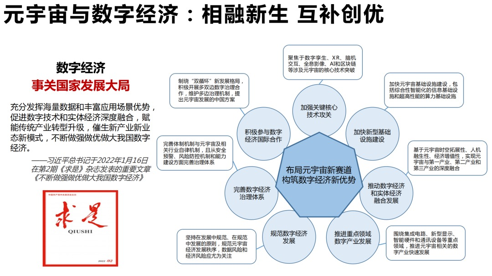
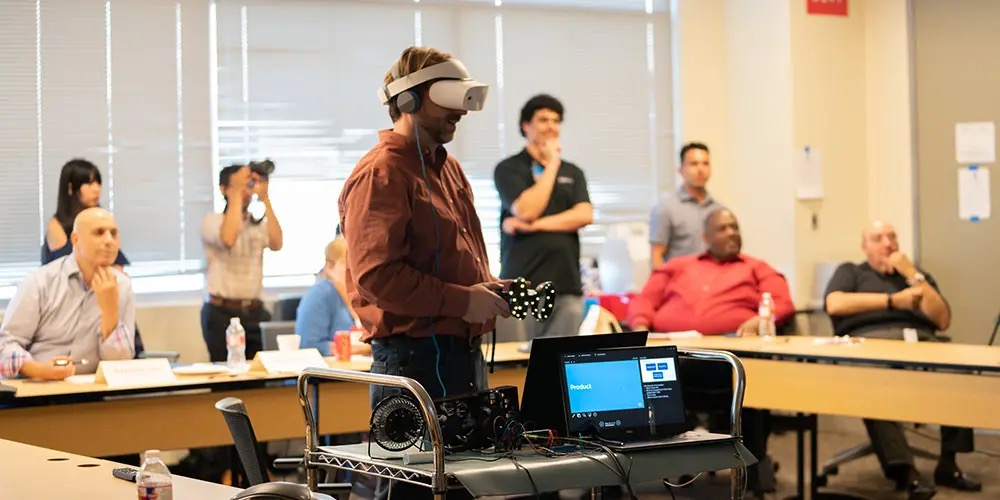

# 元宇宙的十大应用场景

### 一、元宇宙和六大新经济

·单身经济： 元宇宙提供了更多样化的交友方式和选择，独身群体或成重要消费力量； 

·适老经济: 2021年两会上，"适老化”引发热议，“老年人数字困境问题”被首次写入政府工作报告。元宇宙时代，高仿机器人、虚拟数字人在一定程度上将提升老年人生活品质

·焦虑经济：元宇宙的个性智能满足，或将降低用户焦虑 

·忙人经济：足不出户即可感知世界，为忙人提供职场与生活便利。 

·潮牌经济：潮牌企业加速布局元宇宙，开启虚拟潮牌交易新形态。 

·颜值经济：用户可以在元宇宙中定制形象或人设，虚拟人或将实现性别和颜值的平权。

### 二、元宇宙的应用场景

场景一：政务元宇宙

·提升智慧城市服务质量：将元宇宙的关键技术(AI、区块链物联网等)与“数字城市”“智慧城市”等理念结合，对实现住房、环境、交通、税务、健康、文旅等领域的可持续发展，增强市民生活的幸福感和便利感有极大助益。

·跨越线下公共服务障碍

元宇宙中的政务服务将以尖端数字技术为基础，可克服线下服务的时空制约和语言障碍等困难，能极大提升公务员的工作效率和沟通效果，降低公民的政务需求成本。

2021年，韩国首尔市政府发布了《元宇宙首尔五年计划》，以虚拟新年敲钟仪式为起点，未来将在市政府的各业务领域打造元宇宙行政服务生态。到2023年，首尔还将创设虚拟服务平台“元宇宙120中心”，市民可足不出户与虚拟公务员进行交流

场景二：历史元宇宙

·数字光年与知名古建建筑团队合作，一比一大小搭建唐长安城的数字建筑沙盘。早期体验用户可共同参与该城的规划和建设在虚实互动中感受更加全面立体的历史风貌。

·数字化技术让中国传统建筑在数字空间生动再现，联动虚拟世界与现实世界。未来，元宇宙将孕育大量新的消费场景，对线下实体经济具有辐射效应。 

未来还会有更多文创作品依托数字化技术进行传播。

场景三：教育元宇宙

·实景体验：虚拟教师进行实物展示和实操展示；

·跨地区资源共享：跨越地理限制，学生共享教育资源，感知并传承前人实践经验；

·云端教学场景：帮助解决残障人士教育问题。

场景四：艺术元宇宙

·创作的灵感推升:元宇宙中AI技术能实现个性化价值奖赏，从而激发艺术家创作灵感。虚实流动的艺术特质拓展人类的审美疆域，并丰富艺术创作生态。

·权益的多维保障:数字藏品更易确权且收益为累进制，使作者获得更坚实的权益保障与高速的财富积累。

·易用性的显著提升:艺术作品在元宇宙中更易获取和保藏。传统艺术收藏要经历复杂的流通环节，存在较高的流动风险和保养成本，而元宇宙的艺术藏品能即刻交易，永续存在，更有利于艺术藏品的传播和保值。

从艺术品到数字藏品，稀缺性的地位不仅没有下降，反而提高了。

场景五：工业元宇宙

工业元宇宙覆盖工业全产业链，联通产业链多环节。虚拟工业品和虚拟工业服务具有可存储、可交易、高安全性的特征。

·管理变革：模拟真实生产过程和供应链组织流程，从而进一步优化组织结构。加速变革企业领导层的管理与决策，传统IT系统将受到挑战；

·技术赋能：助力工业设计研发、制造模拟应用检测与维护、问题解决。性能改进创新等提升西格玛水平，生产合格率，推动精益化集约生产；

·融合增值：消费者通过APP参理体验虚拟工厂制造。构建工业元宇宙智库平台，实现专家与知识库、人工智能系统多方集成，促进工业能源资源、智源三大协同。

场景六：农业元宇宙

·虚拟联动：人机交互式农场管理，农业虚拟管家，结合AI对农业全数据准确分析并预警，终端全场景操控；

·唯一标识：农产品全流程品控溯源，一物一标识，农产品作为数字资产，全面信息追溯；

·拓展时间：缩短农业创新周期及成本，收集同步植物生长数据，大数据监控实体全生命周期，AI只能学习推理决策过程；

·拓展空间：消费者可体验农业生产全过程，观看产品实地实况及农场业态，购物后一站式追踪产品采摘到物流送货全过程；打造元宇宙农场休闲项目，深度体验从开垦到收获的乐趣。

场景七：医疗元宇宙

·构建全息数字人:将个体生命体征与健康状态以及其他反应机体的信息镜像映射，构建全息数字人。

·高精度虚拟模拟:利用VR，医生可以在复杂手术前，真实地全方位地模拟手术中的潜在困难，提前熟悉相关情况;也可进行远程治疗，合理化分配医疗资源。

·反馈与交互平台:

医生能够针对全息数字人进行连续、动态的高精度监测及实时操作。高拟真度让医生如置身真实手术室中，进行操作，感受人体机理。

·提升全面健康:

全面监测人体微生物营养、心理等更高层次的生命体征指标，为综合提高人体健康提供数据基础，由此寻找健康干预的生物学靶点。

场景八：汽车元宇宙

·随着更多信息与HUD系统打通，车HUD有望成为资讯、娱乐和广告的综合载体，融合出行与社交、生活、工作的边界。在自动驾驶技术逐渐成熟后，汽车可能成为家和办公场所之外的“第三空间”。

·AR HUD使得人类具有更强动态空间感知能力：基于AR的HUD(Head-up-Display，抬头显示系统)使虚拟信息与实景结合。在不干扰驾驶的前提下，呈现丰富信息。实时显示周边环境与车辆信息，辅助驾驶。

场景九：旅游元宇宙

·虚拟人：基于景区只能交互屏进行来宾接待、个性化讲解、精准营销揽客、塑造景区专属IP名片、人流监控引导、节日主题风格换装和旅游打卡拍照等；

·文化旅游资源数字化：包含对场景的建设和人的建设，以虚拟场景为依托，不断外拓IP边界，明确景区发展理念。

场景十：社交元宇宙

·用户能够依据自身需求，定制虚拟与实体形象，情感和行为体验更为丰富，获得数字归属感；

·用户可以选择进入不同的元宇宙场景，体验不同的人生，与古今中外不同领域的人社交。真假难辨的沉浸式体验是元宇宙最核心的特征，人们能够在真实世界和虚拟世界中交替穿梭；

·社交元宇宙由游戏、影音、办公会议等元素组成，甚至包括虚拟房地产和各类数字经济要素。