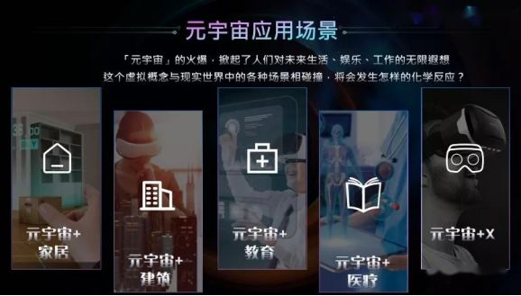

# 元宇宙在实际应用场景中的发展

元宇宙时代会有与现在完全不一样的产业图景和商业形态，它将会促进实体经济与数字经济实现更深层次的融合，为实体企业开辟全新的发展空间，让各行各业都能找到新发展空间，目前已经有商业、工业、娱乐、教育、医疗甚至是艺术等元宇宙相关的典型案例，在实际应用场景中落地。

在工业领域，元宇宙概念得以满足模拟运作、虚拟实境、智能制造等市场需求推动相关技术加速开发，有望推升全球市场规模，于2025年突破5400亿美元。元宇宙在于工业应用市场具备成立封闭性产业大厂，数字化程度普遍较高，且模拟技术可大幅降低人力、时间成本与资源浪费。如宝马公司在数字世界中搭建了真实工厂的数字原声场景，全球的工程师、设计师都可以直接与真实工厂环境一样的数字孪生工厂中进行协助，共同进行产品规划、设计、模拟等精密复杂的工作，加快研发与制造的速度。

如航空器制造商供应计划在元宇宙中打造虚拟三维数字孪生飞机，并开发一个能够运行模拟飞行环境的生产系统，工程师们可以在数字孪生系统中进行设计，也可以进行更为复杂和精细化的测试；再如鸿海集团将以平台方式打造涵盖穿戴式装置、云端与数据中心、半导体、MicroLED的显示器以及内容等领域的元宇宙，甚至于在国内已经有研究机构开发了无人矿山整体解决的方案，此方案的核心是虚拟矿山与现实矿山实时互动、协同工作，平行演进的平行矿山操作系统可以完成无人场下的各类任务。

在商业领域，数字人证成为引领商业史上的潮流。如数字人华智冰成为清华大学2021级数字新生，新华社数字记者跟随航天员搭乘神舟12号升空并发回实时报道的数字航天员小镇，再如元宇宙数字地产是未来数字生活空间搭建的基础，可以用于商贸、展览、娱乐、数字营销、举办会议等用途，甚至有些公司开始进行元宇宙地产交易、开发、管理等工作。

2021年的百度IA开发者大会在数字世界希壤中的数字场馆中成功举办，在娱乐领域资本和媒体成元宇宙为网络社交，2020年因受新冠疫情的影响，美国加州大学博科利分校、中国传媒大学动画与数字艺术学院都利用《我的世界》举办了线上教育领域，英国格拉斯哥大学法学院通过将法律教育和元宇宙相结合，降低法律教育成本，提高教育效率。

韩国青云大学提出元宇宙的语言学习平台，完善基于游戏的语言学习模式，提出了语言学习的新范式，最终完成一个包含AR、VR内容管理等基于元宇宙的游戏化语言学习平台。美国克拉克森大学和日本铃木国立理工学院将元宇宙通过游戏secondlife实现与PBL相结合，打破了PBL教学受时空限制的问题，降低了PBL教学所需要的成本，有助于开展跨国协作和比较学习。

在医疗领域，未来元宇宙中人工智能、大数据、数字本身机械制造等技术的发展和融合，未来医疗机器人将被应用诊断、治疗、手术、康复、护理等多个医疗领域，如医疗器械公司使用混合现实组装和设计手术室、手术工具。世界卫生组织正在使用基于增强现实技术和智能手机来追踪新冠疫情感染者的活动轨迹，精神病学家使用VR治疗创伤后应激，医学院正在使用VR技术对学生进行手术技能培训。在艺术领域，基于区块链和NFT技术、非同质化数字商品技术的数字藏品已经成为海内外收藏业的明星拍卖型巨头，苏富比2021年VR类别数字藏品拍卖成交额达1亿美元。