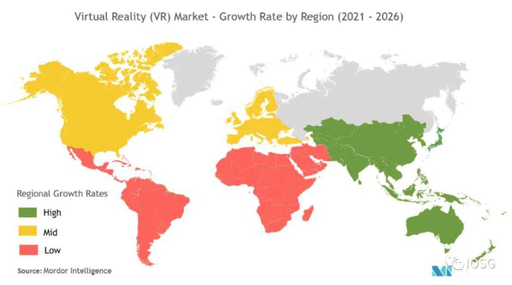

# 观点：元宇宙是社交互动的下一个应用层

> 随着更多的使用者越来越熟悉元宇宙尤其是区块链元宇宙，去中心化ID将会成为重要的一环。

### Part.1 Insight

元宇宙 (Metaverse) 是当前的流行词，它让世界兴奋不已。理所当然，虚拟世界的概念并不像看上去那么简单，为了成功地创造一个虚拟世界，我们需要整合一些不同的元素，如图像、游戏引擎、元宇宙中的经济模型、效用和 IPs，以及最终用于承载 AR/VR 的硬件解决方案。

​                                                             Google 关键词搜索 『Metaverse』

#### 虚拟世界的动力

我们认为元宇宙是社交互动的下一个应用层，Facebook(现在是 Meta) 正从一个平面的 2D 社交媒体平台转向全面的沉浸式体验。虚拟世界的主要吸引力在于，人们可以参与到与现实世界相比有一定自由度的模拟活动中。而自由度越高，设计的机会就越多。然而，更高程度的自由并不总是意味着更好：在游戏世界中，确保完整游戏体验的规则是必要的。

元宇宙这个概念滥觞于 2003 年由林登实验室主持的一个实验。他们将自己的虚拟世界称为「第二人生」，这个项目也获得了一定的知名度。今天，我们通过漫威和星球大战等电影，侠盗猎车手和地平线:黎明等游戏，以及 Roblox、我的世界和堡垒之夜等虚拟世界模拟游戏，不知不觉地消费了整个娱乐产业中的虚拟世界和元宇宙。

​                                        建设元宇宙的公司（仅做展示，不是投资建议）

#### 中心化元宇宙: Roblox

让我们从分析中心化元宇宙的进展和影响力开始。因为虽然区块链元宇宙可以提供很多东西，但中心化元宇宙在定价、商业模式和产品方面的一些创新很了不起，而且最容易转移到区块链元宇宙上。尽管堡垒之夜是最畅销的游戏之一，但 Roblox 的商业模式与区块链游戏/元宇宙的协同作用最强。Sandbox 已经在模仿 Roblox 的愿景和 GTM。

Roblox 为 940 万游戏开发者提供底层技术，让他们在 Roblox 平台上发行超过 4000 万款游戏，随后在手机、桌面和主机等所有游戏平台上发行。该平台和工具 (Roblox 的专有游戏引擎) 对开发者是免费的，一旦已发行的游戏盈利，他们就可以赚取 Robux(游戏内虚拟货币)——到 2021 年第二季度，Roblox 开发者已经赚到了 2.48 亿美元。从这个角度来说，Roblox 元宇宙是一个发行和分发平台。

Roblox 为用户提供了免费模式和付费模式，他们引入了$Robux 并允许父母预先设置钱包 (最大限度地降低未知银行交易的风险)，并在需要的时候将这些钱兑换成美元。Roblo 从所有的 Robux 购买交易中获得的收益约为 1.25%(每 1000 个 Robux 约为 12.50 美元)。

最后，品牌广告、授权和版税只占 Roblox 收益的一小部分。这些品牌广告协议/授权协议是与迪士尼的漫威、乐高、at&t 华纳兄弟、沃尔玛等公司签订的。Roblox 通过与开发者和品牌合作来扩大其业务规模：开发者保留 IP 的全部版权，但 Roblox 保留授权该 IP 的权利，并在 IP 出现在网站、论坛等时收取版税。

​                              声明：由于部分游戏活动非链上记录且非开源，部分数据为估算结果，供参考

#### 「四大」区块链元宇宙：Sandbox、Decentraland、Somnium Space & CryptoVoxels

在谷歌搜索中，与元宇宙关联度最高的词汇就是加密货币和区块链。值得注意的一点是，在区块链元宇宙中，人们购买土地之后，可以根据自己的喜好将土地进行定制，这一点是中心化系统做不到的。治理 Token，比如说$MANA, $SAND 可以允许用户参与平台治理。 

**1）Somnium Space** 

Somnium Space 是一个跨平台的元宇宙，主要特点是 VR 技术，目前正与 Tesla Suit 进行持续合作。尽管该平台在元宇宙领域获得了关注，但是其近期的发展方向是在推进研发 Somnium Space 的头戴式 VR，Somnium 钱包，以及孵化其元宇宙里的创作者。目前 Somnium 主要依靠 Opensea 去进行二级市场的交易。

Somnium Space 的主要产品如下：WORLDS, PARCELS, AVATARS 和 ITEMs.

在设计头像 SKD 以及 API 上部署了人力 - 帮助创作者创造、 Token 化、以及交易头像。头像在 2021 年为 Somnium Space 带来了超过 50 万美元的收益，而这是其仅仅上线的第一年。这体现了用户对于 UGC 的热爱。

WORLDS 是基于 Somnium SDK 建造的小型平行宇宙，按照大小可以分为三个类别 - 75MB, 200MB 和 500MB。用户可以在这些宇宙中随意穿梭。

Somnium PARCELS 是允许购买并进行定制化土地。每一个 PARCEL 都有一个永久的 URL 链接，允许用户随时通过 web 访问。

**2）Decentraland** 

Decentraland 在 2017 年左右出现，并为创作者提供一系列的工具。在 Decentraland 元宇宙中，社区可以建立一个区域性的管理系统（比如说 dragon city), 并且 Decentraland 也发布了一套框架来鼓励这样的想法。wMANA, LAND 和 ESTATE 是管理协议的手段。

Decentraland 的 LAND 和 ESTATE NFTs 作为生态系统的中的身份层，并帮助用户链接 ENS 地址到他们自己的土地上。MANA 是用于治理的 Token ，并分发给土地拥有者们。MANA Token 的用途如下，Decentraland marketplace 向每笔交易收取手续费，MANA Token 将用于购买 Decentraland marketplace 中的 NFT，从而创造一个通胀紧缩的经济体系。

另外一个有意思的特点是，该元宇宙的土地抵押是由 Ripio Credit Network 支持的，这就支持人们建立一个仓位，可以进行提前购买 Parcel。另外一点是，这并不代表这块土地被预定了，其他的用户依然可以从市场中购买土地。

最后，Decentraland 相当关注 UGC 与 Builder Mode 这两个方向的发展，并允许创作者和开发者设计场景、可穿戴品以及不同的体验。目前，可穿戴品方面，10.2k 的用户购买了 71k 的可穿戴品，交易金额已经达到了 85.5k 的 ETH。在物件方面，161k 的用户购买了 640k 的物件，达到了 152ETH 的交易量。

**3）Sandbox** 

Sandbox 聚焦于建立一个 UGC 的生态系统（类似于 Roblox), 并且为创作者提供类如 Voxel Editor, Game Marker 和 Marketplace modules 这些的工具。

Sandbox 的治理 Token SAND 获取了 5% 的二级市场交易费用，其中的一半反馈给$SAND 的质押者，另外一半则被分配给基金会作为研究开发。营销以及品牌合作收取的费用中的 25% 一样也会被反馈给$SAND 的质押者。最近，Sandbox 推出了一个叫 Alpha Pass 的玩法，可以让用户探索 18 种不同的元宇宙体验，并同时获得高达 1k 的SAND Token 。截至目前，200k 的 Alpha Hub 访问者共获得了 5k 的 Alpha Passes. Sandbox Assets 的活跃程度以及达到了 6.9k ETH，交易的物件都是在 Sandbox 元宇宙下的 NFT。

**4）Gamefi 宇宙**

像 Axie Infinity, Illuvium, Star Atlas 这样的虚拟世界/经济体，具有元宇宙的属性，并会衍生出其他的元宇宙，但是会诞生出不一样的玩法规则。

#### 进入元宇宙

你可以通过加入以上提到的任何公司的形式来参与到这个宇宙。如果你是一个资深玩家，那么你一定会享受于在游戏宇宙中畅游。如果你是一个热衷于社交的人那么你会对开放世界的概念感到兴趣，亦或者你可能是一个投机者，那么通过购买治理 Token 并投资于 Metaverse Index（元宇宙指数）会是一种方式。

#### 对于元宇宙的预测（中长期）

**1）用户创造的内容为王**

未来，会有越来越多的产品会往二维的交易市场试水，为创作者和品牌方提供共同创造和拍卖的机会。这可以延伸到元宇宙、头像、以及其他游戏内的产品。皮肤交易和赌博已经在游戏宇宙中存在，但未来游戏会将 UGC 融入进他们的原生宇宙。其他的 UGC 概念比如说 Twitch 直播和 Token 化视频播放会持续展现红利。随着元宇宙以及其内部的内容逐渐成熟，未来会诞生更多的原生直播服务以及电子竞技平台，为用户创造交互体验。

**2）头戴式 VR 的爆发需求**

在 2021 年 12，Oculus 见证了 5.3M-6.8M 级别数量的销售，在日均使用量上同比增长 90%。Playstation 宣布上线 PlayStation VR2。CES 2022 conference 也是围绕 AR/VR 设备展开了大量的讨论。

**3）可互操作的 DID 为沉浸式元宇宙体验创造条件**

随着更多的使用者越来越熟悉元宇宙并尤其是区块链元宇宙，去中心化 ID 将会成为重要的一环。以 Sismo, CyberConnect, DeSo 和 Mem Protocol 这些为例子，这些项目在为建造新一代的身份系统赋能。

**4）品牌元数据和元数据内容的增长**

随着消费者被闪亮的虚拟现实头盔所吸引，越来越多的品牌开始通过建立自己的元宇宙来吸引消费者的注意力，比如 H&M 和苏富比的沙盒。此前使用沙盒游戏的迪士尼漫威 (Disney ' Marvel) 为一个主题公园元宇宙申请了「虚拟世界模拟器」的专利。Snoop Dogg、Deadmau5 和 Travis Scott 等音乐家已经用元宇宙举办音乐会和举办派对。Recur 是另一个直接与品牌合作的项目，通过 NFT 和元宇宙领域的其他体验将他们的内容引入 Web3。

对于 VR 技术、内容以及元宇宙扩建来说 2022 年将会是不平凡的一年。很有可能未来一段时间的公司会以低调的姿态成长（因为当下高度竞争的环境），但是对于创作者和开发者来说他们会持续为现有的平台增值。

### Part.2 投融资事件

**流动性网络 WOO Network 获得 Binance Labs 1200 万美元战略投资**

*DeFi

流动性网络 WOO Network 宣布获得 Binance Labs 1200 万美元战略投资，并将在 BSC 上开展进一步合作。此前消息，WOO Network 于去年 11 完成 3000 万美元 A 轮融资，由 Three Arrows Capital、Crypto.com Capital、AscendEX、MEXC Global、分布式资本以及 BitTorrent 等参投。

 

**OpenSea 完成 3 亿美元 C 轮融资，Paradigm 和 Coatue Management 领投**

*NFT

OpenSea 宣布以 133 亿美元的投后估值完成 3 亿美元 C 轮融资，由 Paradigm 和 CoatueManagement 领投。该笔资金将用于包括加速产品开发、显著改善客户支持和客户安全、对更广泛的 NFT 和 Web3 社区进行有意义的投资，以及扩大安全团队规模。同时，OpenSea 还将很快启动一项资助计划，以支持 NFT 领域的创作者和区块链建设者。

此前报道，有知情人士称，OpenSea 正以 130 亿美元的估值寻求新一轮融资。同时，OpenSea 还计划以超过 1 亿美元的价格收购 Dharma。

**NFT 游戏 Starbots 完成 240 万美元私募轮融资**

*NFT

基于 Solana 的机器人对战 NFT 游戏 Starbots 宣布完成 240 万美元私募轮融资，Impossible Finance、Defi Alliance、Solar Eco Fund、Parsiq、OKEx Blockdream Ventures、TomoChain、Good Game Guilds、Real Deal Guild、Gamee Studio、LuaVentures、Kyber Network、Solscan、Kyros Ventures、BigCoin Capital、TK Ventures、Exnetwork Capital、Hub Capital、AU21 Capital、Basics Capital、Formless Capital 和 Quadhorn Guild 等参投。Starbots 是一个基于 Solana 的机器人对战 NFT 游戏，玩家可在游戏内使用不同战略任意组装自己的机器人、赢得战斗、完成任务、征服新土地并获得 GEAR Token 奖励。

 

**Livepeer 完成 2000 万美元 B+轮融资，总融资已突破 5000 万美元**

*Web3

基于以太坊的去中心化视频直播平台 Livepeer 完成 2000 万美元 B+轮融资，Alan Howard 和 Tiger Global 以及 Digital Currency Group、Northzone、Warburg Serres 等现有投资者参投。新一轮融资为股权融资，迄今为止 Livepeer 的总融资额约为 5100 万美元。Livepeer 计划利用新融资扩大市场份额，并计划支持视频 NFT。Livepeer 是一个去中心化的视频转码平台，去年 7 月，Livepeer 完成 2000 万美元的 B 轮融资，Digital Currency Group（DCG）领投，Coinbase Ventures、CoinFund、Northzone 参投。

 

**Nametag 以 3000 万美元估值完成种子轮融资，Continue Capital 等参投**

*Web3

Nametag 发文宣布以 3000 万美元估值完成种子轮融资，Continue Capital 等参投。资金用于在互联网传统 Web2 架构的基础上创建强大、标准的 Web3 社交层。在接下来的几个月中，Nametag 将支持更多链、发布 Nametag API、发布 NT Token 。

 

**Tribal Credit 完成 4000 万美元债务融资**

*加密支付

专注于加密技术的企业支付平台 Tribal Credit 完成 4000 万美元的债务融资，总部位于加利福尼亚的投资公司 Partners for Growth 和支持 Stellar 区块链发展的非营利组织 Stellar Development Foundation（SDF）参与了本次融资。新资金将用于该公司在拉丁美洲拓展业务。

**TDX Strategies 完成 250 万美元 A 轮融资，Transcend Capital Partners 领投**

*资产管理

数字资产机构衍生品平台 TDX Strategies 宣布在 A 轮融资中筹集了 250 万美元，由 Transcend Capital Partners 领投，戈壁创投、狒狒 VC、双峰集团、 Alameda Ventures、IWM Ventures 等参投。这笔融资将推动 TDX Strategies 开发数字资产创新投资解决方案，并扩大其产品分销的地域范围。

**NFT 数据聚合器 CryptoSlam 完成 900 万美元融资，Animoca Brands 领投**

*NFT

NFT 数据聚合器 CryptoSlam 获得 900 万美元融资，Animoca Brands 领投，Mark Cuban、Sound Ventures、Binance Smart Chain、Stocktwits、招聘网站 LinkedIn 创始人 Reid Hoffman、美国手游公司 Zynga 创始人 Mark Pincus 及 The Sandbox 联合创始人 Sebastien Borget 参投。

**Alto 完成 4000 万美元 B 轮融资，Advance Venture Partners 领投**

*资产管理

另类投资服务商 Alto 宣布完成 4000 万美元 B 轮融资，Advance Venture Partners 领投，Unusual Ventures、Acrew Capital、Alpha Edison、Foundation Capital、Gaingels 和 Coinbase Ventures 参投。Alto 将利用此轮资金扩大 Alto IRA（退休金账户）和 Alto CryptoIRA 平台的访问能力，加快所有内部团队的招聘，并继续开发新产品。

据了解，Alto 为用户提供自主投资平台，将其退休账户资金投资于另类资产。目前，Alto 拥有近 20,000 个资金账户，资产近 10 亿美元，其中 40% 的账户专门用于持有加密货币。去年 4 月，Alto 在 A 轮融资中获得 1700 万美元。

**数字资产银行 Sygnum 完成 9000 万美元融资，由新鸿基公司领投**

*资产管理

数字资产银行和交易平台 Sygnum 在新一轮融资中筹集了 9000 万美元，估值为 8 亿美元。该笔融资由新鸿基公司领投，Animoca Brands、Meta Investments 等参投。此前报道，今年 6 月，瑞士数字资产银行 Sygnum 启动一系列去中心化金融 (DeFi) Token 的托管和交易，包括 Aave、Aragon、Curve、MKR、Synthetix、Uniswap 和 1inch Network，Sygnum 还为 USDC 增加了银行服务。

 

**去中心化借贷协议 Goldfinch 完成 2500 万美元 A+轮融资，a16z 领投**

*DeFi

去中心化借贷协议 Goldfinch 宣布完成 2500 万美元 A+轮融资，a16z 领投，知名对冲基金经理 Bill Ackman、加密投资机构 BlockTower 和投资管理公司 Kingsway Capital 参投。据了解，Goldfinch 是一个开放的贷款市场，没有抵押，并使用去中心化的贷款承销过程。此前，Goldfinch 完成了 a16z 领投的 1100 万美元 A 轮融资，Mercy Corps Ventures、A Capital、Access Ventures 和 Divergence Ventures 等参投。

### Part.3 IOSG 投后项目进展

**Arbitrum 公告称网络定序器停机，系统内资金安全**

*Layer 2

采用 Optimistic Rollup 技术的以太坊 Layer2 网络 Arbitrum 公告称，遭遇网络定序器（Sequencer）停机，正在进行恢复，系统内的资金安全。Arbitrum 最近一个区块产生于北京时间 18:29，目前已超过 2 小时未产生新区块与新交易，同时 Matemask 钱包也无法连接到 Arbitrum One 网络。

 

**Polygon Gas 费上升至 500 Gwei，或受 NFT 游戏 Sunflower Farmers 影响**

*扩容

PolygonScan 数据显示，受 NFT 游戏 Sunflower Farmers 影响，Polygon Gas 费用上升至 500 Gwei。目前，Sunflower Farmers 占据 Polygon 网络 46.42% 的 Gas 消耗，而第二名仅占 4.79%。据了解，Sunflower Farmers 旨在激励游戏玩家，以获得尽可能多的 Token 奖励，游戏玩家通过智能合约获得 SFF Token 奖励。

 

**波卡已开启第 7 次平行链插槽拍卖**

*波卡

Polkadot 的第 7 次平行链插槽拍卖已于今日凌晨 2:46 开启。目前在所有活跃的 Crowdloan 活动中，Composable Finance 收集的 DOT 最多，排在后面的还有 Centrifuge、Interlay、Nodle 和 Litentry。预计第七次竞拍将在 1 月 13 日晚上结束。

 

**Moonbeam 将于 1 月 11 日在波卡主网全面启动**

*波卡

波卡生态智能合约平台 Moonbeam Network 宣布将于 1 月 11 日在波卡主网全面启动，届时，Sudo（超级账户密钥）将被移除，余额转账和 EVM 功能将启用。 Token 持有者可通过质押获取奖励，并可参与链上治理。网络全面启动后，众贷参与者还可获得其初始奖励，具体分配方案将于后续公布。同时，开发者可在 Moonbeam

 

**Celer cBridge 将与 Frax 合作建立开放的原生资产标准，以实现多链扩展**

*跨链

由二层扩容平台 Celer 推出的跨链桥 cBridge 宣布与混合算法稳定币协议 Frax 达成合作，通过建立开放的原生资产标准以实现多链扩展，拒绝供应商锁定。用户现可通过 cBridge 将 FRAX 在 BSC、Polygon、Avalanche、Fantom、Arbitrum 和 Boba 之间进行高速低成本的跨链桥接。

### Part.4 行业脉搏

**a16z 发布面向全球政府的 Web 3 政策提案**

*监管

a16z 周五发布了一份面向全球政府的政策议程，其中包含关于如何「构建一个更好的互联网」的 10 条指导原则。在该议程中，a16z 鼓励世界各国领导人积极思考 Web 3 政策，建立一个清晰的愿景，提供清晰和公平的数字资产税收规则，支持多方利益相关者的治理等等。此外，该政策议程还建议全球领导人「接受监管良好的稳定币」，并为私人稳定币项目提供明确的监管框架。去年 10 月，a16z 曾发布了一份面向美国立法者的类似报告，并建议参议院银行委员会澄清数字资产相关法律。

 

**PayPal 正在探索创建美元稳定币**

*稳定币

支付巨头 PayPal 公司发言人周五证实，随着公司加密业务的发展，PayPal 正在考虑推出自己的稳定币。PayPal 发言人在一份电子邮件表示：「我们正在探索一种稳定币。如果我们寻求前进，我们当然会与相关监管机构密切合作。

开发人员 Steve Moser 在 PayPal 的 iPhone 应用程序中发现了 PayPal 探索构建稳定币的证据并与彭博社分享，随后彭博社首次报道了这一消息。隐藏的代码和图像显示了「PayPal Coin」将由美元支持。据此前报道，PayPal 正在积极监控处理可扩展支付的第一层和第二层网络，其中包括以太坊、Polkadot、Solana 和 Algorand。

**数据：灰度资产管理总规模已达 434 亿美元**

*资产管理

灰度发推文称，灰度资产管理总规模已达 434 亿美元。其中，比特币信托基金 (GBTC) 交易价格为每份 43.28 美元，较前一日上涨 1.14%；以太坊信托基金 (ETHE) 交易价格为每份 38.27 美元，较前一日上涨 4.17%。

**BitDAO 新提案提议创建 zkSync 生态加速器并提供 2 亿美元资金**

*DAO

BitDAO 与 Matter Labs 联合发起关于「zkDAO Endowment」的新提案，提议创建并资助社区拥有的 zkSync 生态系统加速器，并提供 2 亿美元，帮助启动 zkSync 生态系统，赋能构建者，并助力 BitDAO 和所有 DAO 增长。

初始资金配置安排如下：grants 7.5%，安全/审计 7.5%，战略资本 70%，研发 5%，教育 5%，运营 5%。BitDAO 承诺在 5 个方面提供价值 2 亿美元的各种加密资产，分别是：资助公共产品和基础设施、支持开发强大的安全实践和框架、研发、利用行业知识配置战略资本、教育。

**数字人民币试点 APP 新增 3 个运营机构，四类钱包为匿名钱包**

*数字人民币

据华西都市报报道，与前期已亮相的数字人民币 APP 相比，试点数字人民币 APP 除工、农、中、建、交、邮储六大银行外，还多了招商银行、网商银行（支付宝）、微众银行（微信支付），用户可选择任意一家或几家开通数字人民币钱包，其中，四类钱包为匿名钱包，仅验证手机号码即可开立，无需绑定银行账户。值得注意的是，目前 APP 内已有近 50 个商户场景，包括京东、美团、饿了么、天猫超市、滴滴、携程、哔哩哔哩等。

**美国财政部计划本月发布有关加密货币经纪人定义的初步指南**

*监管

据彭博社报道，消息人士透露，美国财政部计划本月发布初步指南，将根据国会去年通过的立法，澄清加密货币经纪人的定义。知情人士表示，拜登政府准备规定哪些加密货币公司将被要求向美国国税局报告大量客户数据。初步指南发布后将提出更正式的规则提案，财政部官员拒绝置评。

据此前报道，2021 年通过的基础设施法案中包含了对加密经纪人的规定，包含一系列披露要求，例如向 IRS 和投资者报告客户的姓名和地址、销售收入总额以及任何资本收益或损失。加密行业人士表示，该法条中对经纪人的定义过于宽泛，很可能包括那些无法访问此类信息的矿工、利益相关者和软件提供商，这将扼杀美国的加密创新并将加密业务推向美国以外的市场。