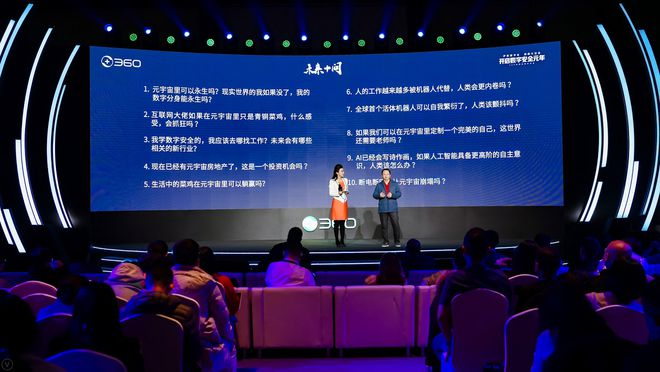

# 周鸿祎答“未来十问” 谈元宇宙发展前景

12月28日，360集团战略发布会在京举行，一群Z时代青年以特殊的方式见证了“数字元年”开启。不久前，有调研机构对大学生进行了街头采访，身处浪潮之巅的年轻人对数字未来提出了各种设想和疑问，涉及数据安全、人工智能、元宇宙和技术伦理等。发布会现场，360集团创始人周鸿祎对“未来十问”给出了自己的答案。

**“元宇宙里也别想‘躺赢’”**

最近“元宇宙”概念大热，也成为大学生关注热点。元宇宙被看作颠覆物理世界的新社会形态，有学生关心“以后是不是不用努力，可以直接在元宇宙里‘躺赢’。“

也有人提问周鸿祎：互联网大佬如果在元宇宙里只是“青铜”，会抓狂吗？周鸿祎笑答，”别说元宇宙了，这些大佬在现实世界也是白手起家的。“他认为，元宇宙和现实世界一样，都需要不断努力，发挥各自的天赋，通过勤奋学习和锻炼，才能超越别人，才能对推动社会进步有所贡献。

周鸿祎同时表示，元宇宙的内核是数字孪生，是用来改良物理世界的，而不是无中生有地创造一个虚拟世界。比如未来有医疗元宇宙，可以远程看诊，通过仿真机器人动手术；有工业元宇宙，真人去检查核电站会有危险，就请虚拟人去完成；还可能有城市元宇宙，在虚拟空间为市民提供服务……他认为，元宇宙是数字化的高阶场景，不是用来“躺赢”的，而是用来服务现实、创造价值。

周鸿祎开玩笑说，元宇宙是疫情期间“憋”出来的。“有人拿它炒币，有人炒股。我准备借这个概念炒热中国产业数字化的发展。”

**“电脑里的一堆文件不能说明你永生了”**

每一轮新技术爆发，对技术伦理的讨论都不可避免。大学生发出的“未来十问”就包括元宇宙里是否可以永生，“现实世界的我如果没了，我的数字分身能永生吗？”

对此，周鸿祎的回答是：毫无疑问不能。他认为，今天的人工智能只是存储数据，并没有产生意识。即使我们把大脑里的记忆都变成大数据，赋予我们的数字分身，它也不能自己思考。“所以你要是没了，那你真的就没了。电脑硬盘里一堆文件肯定不能代表你永生了。“

街采中也有学生对此表达过自己的观点，与周鸿祎不谋而合。他们认为，虚拟世界的“永生”听起来并不安全，容易被“黑”。

（街采视频中，学生关心数字安全相关专业未来就业）

周鸿祎同样认为，数字化程度越高，安全挑战就越大。不仅元宇宙存在安全风险，未来对虚拟世界的攻击甚至会伤害到现实世界。所以，未来中国有两大人才缺口。软件定义一切，就需要大量的工程师。还要有人去补漏洞，这需要大量的安全运营和服务人员。周鸿祎在发布会现场预测，数字安全会成为最吃香的专业之一，“未来无论你想去能源行业、信息行业，还是时尚行业，他们都需要安全人才。”

**“越先进越虚拟的东西也越脆弱”**

除了天马行空的畅想，街采中的年轻人们也非常关心新技术、新场景对现实生活的影响。

有学生把问题带到了发布会上，现场对话“红衣大叔”。今年研二的林嘉盈同学说，“这两年大家快被疫情憋疯了”，她很想知道，对普通人来说，太空旅行和元宇宙旅游哪个更靠谱。

周鸿祎的答案是：最好两者结合。他说，受能源制约，太空旅行短期内很难。“用元宇宙的虚拟分身或者VR去感受一下太空旅行，还算靠谱。”他同时建议这位同学，有机会还是要亲身去体验祖国的名山大川，“真实的感受和元宇宙里的计算机建模会很不一样。“

（学生在发布会现场向“红衣大叔”提问）

还有人关心“在元宇宙里炒房，是不是一个投资机会”。对此，周鸿祎的回答很干脆：房住不炒。但同时他也认为，元宇宙刚刚开始，”现在这里占一块地倒是可以试试。“

这个话题在360快资讯“不吐不快”栏目也引发了媒体和网民热议。乐观派认为，人在元宇宙里和现实中一样，都有”住“的需求，房产将成为重要数字资产，投资者可提前入局。保守派则认为，元宇宙目前不受监管，存在较大的不确定性和安全风险，容易”竹篮打水一场空。“ 360快资讯搜索”不吐不快“可参与讨论，与周鸿祎观点交锋。

“一万个人眼中，就有一万个元宇宙。”周鸿祎认为，元宇宙仍是一个不断发展、演变的概念，很难有定论。但越先进、越虚拟的东西，在未来也越脆弱，这符合万物发展的规律。“我们讲数字技术不安全，元宇宙不安全，不是说不要搞。恰恰相反，我们想的是如何解决才能跑得更快、走得更远。“他说，这都需要数字安全行业提供解决方案。