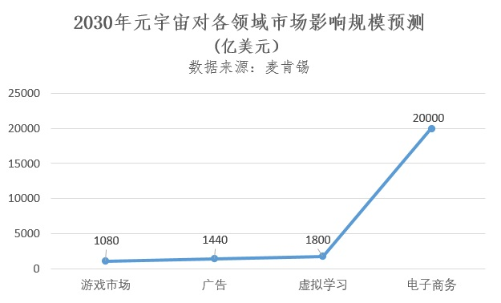
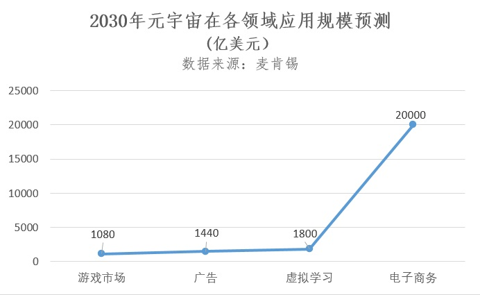
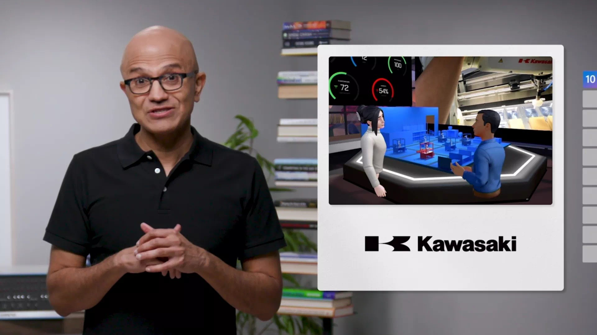

#                       元宇宙发展不能靠想象

​     今天，Meta、微软、Epic、英伟达、高通、索尼等36家公司宣布将联合制定元宇宙行业标准，受此消息影响，元宇宙板块今早开盘活跃。作为二级市场上的“明星”，受上海发起设立百亿级元宇宙新赛道产业基金、腾讯成立XR（扩展现实）部门消息带动，元宇宙概念股6月迎来几次飘红。截至目前，元宇宙板块近一周涨幅1.12%，近一月涨幅3.32%。

​     元宇宙是未来虚拟世界与现实社会交互的重要平台，是对现实的补偿、映射和超越，并非逃避现实。建设元宇宙亦如此，经历了将近一年的认知普及、思维碰撞、企业官宣、资本入场、政府出台规划，元宇宙真正到了打地基、垒高楼的阶段，光靠资本救济、空炒概念和远景规划无异于纸上谈兵。来元宇宙的风口吹吹风，不能只靠想象，而是要锻造“自我造血”能力。

**元宇宙需要资本理性输血**

​     当新的技术和商业范式出现时，人们对于未来的想象会在短时间内集中爆发，催生泡沫。但泡沫本身并不见得是坏事情，关键是泡沫之后是否有“金子”沉淀下来。

​     2021年3月，世界“元宇宙第一股”美国游戏公司Roblox上市首日股价盘中一度涨逾50%，估值急速膨胀至超450亿美元。同年11月，受Facebook改名Meta大举进军元宇宙带动，大型科技公司、风投公司、私募股权资金、初创公司都在寻求元宇宙机会。

​     美国科技公司频频牵头发布技术蓝图并做了大手笔并购，仅2021年，Meta花费了100亿美元来建设元宇宙项目。英伟达深耕GPU、AI、Omniverse底层硬件，布局自动驾驶、机器人、VR 等应用领域。微软瞄准游戏在元宇宙平台发挥关键作用收购头部游戏公司动视暴雪。谷歌从算力、AI领域切入元宇宙，并重新考虑进入消费级AR眼镜市场。在国内，腾讯通过投资Epic Games、Snap占据VR/AR生态的有利地位，近日腾讯成立扩展现实（XR）部门加注元宇宙发展。网易加大区块链、沉浸活动平台瑶台、AR、VR、虚拟人等元宇宙技术布局。阿里巴巴成立XR实验室，将元宇宙的应用推广到电商、支付等领域，并3.8亿元投资消费级AR眼镜制造商Nreal。百度在2021 年底上线希壤平台，今年6月刚刚在平台上举办了集度汽车发布会。字节跳动陆续投资和并购多家企业，包括AI芯片设计公司希姆计算、游戏公司代码乾坤、音乐短视频应用企业Musical.ly、国内头部VR硬件厂商Pico等。

​     截至目前，我国元宇宙概念板块企业有114家，主要集中在文化传媒、游戏、互联网服务、光学光电子、软件开发、消费电子和通信服务行业，总市值达到1.3万亿元。

全球咨询机构麦肯锡最新报告表示，2022年以来，已有超过1200亿美元的投资流入元宇宙，是2021年同期投资570亿美元的两倍还多。到2030年，元宇宙有望创造5万美元规模的新市场。

在元宇宙概念萌芽初期，上市企业凡宣布进入元宇宙领域，股票即上涨，也时常出现涨停行情，一度收到关注函或监管函。探究资本市场元宇宙出现短期过热迹象的背后，各公司业务实质上并无太多变化，股市震动多是由于外界消息助推而非公司业绩实际增长。纵然经过一年发展，各企业布局元宇宙的优势和路线已见分晓，但实际推出让B端C端可触达的产品和服务较少，远远未达预期。而从资本市场长线来看，元宇宙板块近一季度、近一年降幅分别为10.58%、26.78%。或许，一些伪元宇宙概念股在业绩不达标或突发性事件后泡沫破裂，挤出泡沫后将会迎来新一轮洗牌，资本市场趋于理性。

清华大学新闻与传播学院新媒体研究中心发布的《元宇宙发展研究报告2.0版》指出，企业扎堆涌入元宇宙领域，将自己包装成元宇宙企业，但元宇宙产业尚存在诸多风险和不确定性，过度迎合概念热潮可能产生偏离原有技术发展路径的行为，对产业格局和企业自身发展都无益处。因此，产业和资本都需回归理性。

**相关基础设施建设仍需时日**

要想避免元宇宙以“割韭菜”的闹剧收场，打地基、垒高楼必须提上日程。近年来我国ICT 产业快速发展，并逐步在VR/AR终端、通信网络设备、数通设备、显示面板、软件交互等领域取得显著进步，构筑起产业发展长板。然而，通信、算力、区块链、人工智能等基础设施还未能对元宇宙产生实际有效支撑作用。

涵盖了光纤通信、5G/6G 移动通信、Wi-Fi 6、工业互联网的通信基础设施作为支撑“元宇宙”运行的血液系统，为元宇宙海量元素互联、交互提供连接保障。中国电子信息产业发展研究院发布的《元宇宙产业链生态白皮书》指出，以“双千兆”网络为代表的通信网络基础设施部署完善尚需等待时日。5G基站面临能源消耗巨大的实际挑战，面向5G毫米波频率规划政策等需进一步明确，5G+元宇宙创新尚需进一步破题，5G芯片产业化程度尚不成熟，5G融合应用 VR、AR、AI 等新一代信息技术的行业应用能力开放、开发共性平台以及相关检测认证平台搭建处于起步阶段。

算力基础设施作为“元宇宙”虚拟世界中大规模数据要素挖掘和分析的算力底座，依托数据中心、智能计算中心等实现大数据、云计算、边缘计算、分布式存储等能力支撑。目前仍面临规模优势不明显，供需结构性失衡；数据中心能耗高，大数据中心建设标准尚不完善，运维管理能力相对滞后等问题。为应对“元宇宙”海量To C和To B应用不断提升的算力需求，未来还应加强数据中心绿色集约建设，提高数据中心效率，完善标准监管评价体系。

元宇宙内部需要一套完整并可独立运行的经济系统，区块链作为核心技术，目前已经发展至NFT阶段，开启了数字内容资产化时代，受到大量巨头追捧和资金注入，国内互联网大厂也开始尝试数字藏品，但一些NFT交易平台宣称“持牌经营”“合规交易”“人民币结算”等吸引投资者，存在监管缺失、商家炒作问题。

人工智能为元宇宙大量应用场景提供支持，但人工智能尚处于感知智能阶段，认知智能瓶颈未能突破，难以有效支撑元宇宙。人机智能交互能力和超大规模的数据集处理能力是推动元宇宙发展重要的突破点。

元宇宙搭建需要庞大的技术架构和产业融合，需要先有一波产业升级才能实现。

**应用场景尚处于初级探索阶段**

众多公司最先开始在社交、游戏领域划开元宇宙切口，却多还在基础阶段徘徊。Meta发布元宇宙社交平台Horizon Worlds，国内也有字节派对岛、SOUL、啫喱等基于虚拟形象的沉浸式社交APP。用户可以创建属于自己的虚拟立体形象，在多种互动场景下在线交友。

综合来看，这些社交APP本质上还是一些地图社交、体验社交等玩法的升级，包括个人形象和空间的立体化，打造交友、购物、健身等沉浸式交互体验。但APP使用体验上存在卡顿、闪退、画面粗糙、3D模型堆砌、内容不够丰富等问题。尚不论元宇宙是一个生态系统，它的构建需要硬件入口和软件支持，目前尚未成型。当前阶段的元宇宙社交App能做到的大概只有“沉浸世界的多人交友互动”要素，相比打造“虚拟人生”的目标而言还是“半成品”。

可喜的是，在元宇宙的风口中,已经开始有越来越多的厂商在工业、文娱、商业等场景大量投入。英伟达与宝马共建虚拟工厂，引入Omniverse平台协调 31 座工厂的生产，微软联合日本川崎重工让车间工人佩戴微软HoloLens头戴设备来辅助生产、维修和供应链管理。广东潮州工艺美术元宇宙精品馆正式在“Meta彼岸”APP上线，成为国内首个“元宇宙”地方工艺美术馆。网易伏羲旗下沉浸式活动平台网易瑶台携手青海省玉树藏族自治州称多县政协举办2022“生态守护映像”沉浸式公益生态摄影展。

从当下的进展来看，元宇宙构想的虚拟世界已经在部分功能和应用领域上得到了阶段性的实现，但“元宇宙”的星辰大海征途漫漫。按照业内研判，社交+游戏是奠基阶段，通过开发一系列独立虚拟载体，将游戏、社交、内容融合形成沉浸式泛娱乐平台，此阶段正在持续发酵。经过一定时间的铺垫，虚拟和现实概念逐步模糊，消费、金融、教育、工作及生活服务等现实生活元素将转移至虚拟世界，才迎来第二阶段。当各个场景融入元宇宙体系，虚拟和现实边界打通，形成完全开放、经济系统自洽、流畅社交等交互体验，就与目前人们认知边界的元宇宙终极形态无限接近。

全球咨询机构麦肯锡预计，到2030年，元宇宙对游戏市场的影响在1080亿~1250亿美元，对广告市场的影响为1440亿~2060亿美元，对虚拟学习市场的影响规模预计1800亿~2700亿美元，对电子商务领域的影响可能有2~2.6万亿美元规模。

**产业生态未形成集聚效应**

虚拟与现实高度互通，闭环经济体附着开源平台，元宇宙可以说是全球开源社区的产物，需要创作者和使用者共建去中心化未来，全球企业都会成为元宇宙生态的贡献者。但初级阶段我们所看到的元宇宙建设路径是相对分散的，大型互联网平台依托丰富的流量、数据和场景，建设基于自身生态的元宇宙。

正如Meta近日正式向英国18岁及以上Quest2用户开放VR社交平台Horizon Worlds。苹果推出的AR Kit、Reality Kit、Reality Composer、Reality Converter已经构成了比较完整的AR开发生态闭环。HTC已搭建开源元宇宙平台VIVERSE，支持智能手机、PC、平板和Vive Flow眼镜的跨平台用户，预计即将发布一款元宇宙手机，巩固HTC生态。英伟达预计在明年上线推出Omniverse Cloud服务，让数百万Mac和Chromebook 用户能够即时访问平台，以便在任意地点实现大型 3D 场景协作编辑。

科技企业在底层技术、流量入口、场景搭建等方面各有优势，只是此类基于“大互联网路线”的元宇宙系统过于中心化，一切服务和权益都与企业息息相关，背后也是国家利益的体现，元宇宙本质上沦为附庸。且此类生态还无法解决数据治理问题和互操作性问题，形成一个个元宇宙孤岛。数据、生态和价值割裂，导致完整的元宇宙体系难以形成。未来基于区块链路线构建若干个开源元宇宙，并通过跨链实现互联互通，或许更加接近元宇宙本质，也是发展的长远之道。

不过，今日Meta、微软、Epic、英伟达、高通、索尼等36家公司宣布已组建一个名为“元宇宙标准论坛”的组织，拟为元宇宙、AR/VR等建立行业标准，该组织计划在今年举行首次会议。其成员包含从芯片厂商到游戏公司等大型规模科技公司，以及现有的标准制定组织如W3C。只是元宇宙标准生态应该由谁来牵头构建，怎样界定维度和边界，还未可知。

**元宇宙培育初期要规避风险**

元宇宙不能恣意生长，需统筹时空拓展、人机融合、经济增值等系统问题。虽然Meta已经通过AI筛查快速识别和处理不同类型违规内容和行为，设置“安全区”保护工具，用户在遭遇威胁时可以激活“保护气泡”屏蔽用户交互等措施进行主动监管。但长远来看，元宇宙依旧面临多重风险，需要提前警惕。

需警惕经济失衡风险，元宇宙经济、货币体系将与现实经济产生联动，面临着经济秩序不稳定以及金融风险问题。且由于元宇宙要实现产业化落地和商业化盈利还需要很长时间，目前处于高成本、低收益阶段。市场热度虚高，投资热情暴涨，变相增长了去泡沫化进程，导致了市场中抢注元宇宙商标、非法集资、金融诈骗等乱象迭生。元宇宙容易发生垄断固化，导致低质量陷阱蔓延到虚拟和现实世界。平台之间的恶性竞争，虚拟平台的渠道、流量、价格竞争将导致实体产业举步维艰。

技术发展需避免木桶效应，当下元宇宙相关技术发展不均衡，对浅层技术簇拥、对深层核心技术挖掘程度不够，急需升级的硬件与难以快速迭代的软件之间的矛盾会形成产业泡沫。抵御产业风险的关键在于形成健康的产业链、生态链、价值链，避免某个环节缺失，导致“卡脖子”技术问题产生。

非同质化代币监管缺位，目前有些NFT交易平台宣称“持牌经营”“合规交易”“人民币结算”等吸引投资者，出于吸引用户、宣传等目的，平台会不定期向用户钱包“空投”NFT。对NFT监管缺失，容易导致商家炒作，最终成为“击鼓传花”骗局，无益于元宇宙建设。

社会伦理需要多加关注，元宇宙世界是高自由度、高包容度、开放的“乌托邦式”世界，个体关系、权力结构、资源分配、组织形成、冲突解决，这些现实世界存在的东西依旧需要明确规则。数字时代网络空间本就存在着用户隐私、诈骗、病毒、非法获取信息等安全监管问题，这在“元宇宙”中同样需要考虑。且元宇宙会带来混淆虚拟和现实、弱化人对现实世界的兴趣等大众心理挑战，需要合理疏解。

《元宇宙发展研究报告2.0版》指出，元宇宙应该以法治为基础，打造政产学研用联动的创新监管体系。政府引导，包容审慎、放管结合；产业核心技术、基础设施层面实现自主可控；市场驱动，以需求为导向，产品应用、场景入口层面百花齐放；构建平台主体责任机制和技术约束规范，打造行业自律公约和生态标准，并打通社会用户监督和反馈渠道。