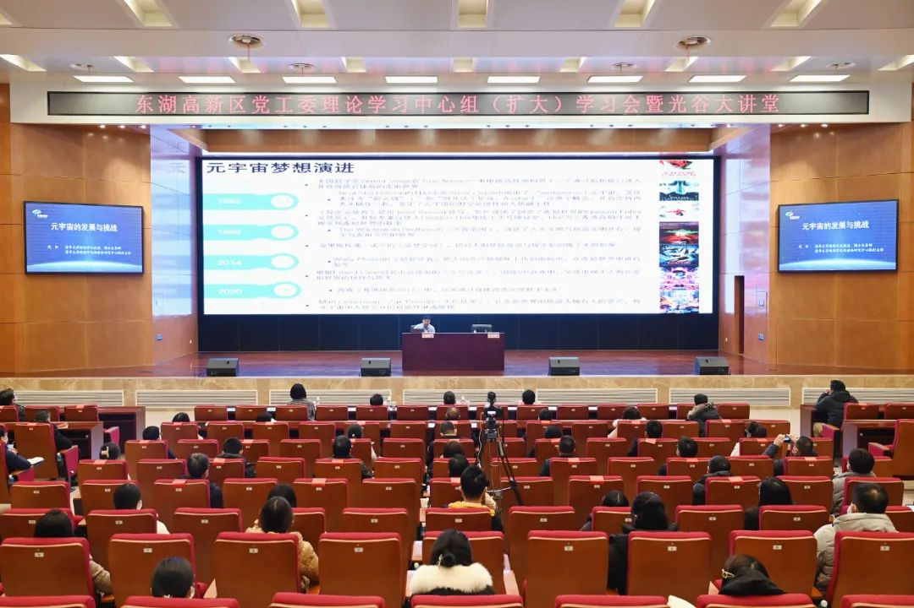
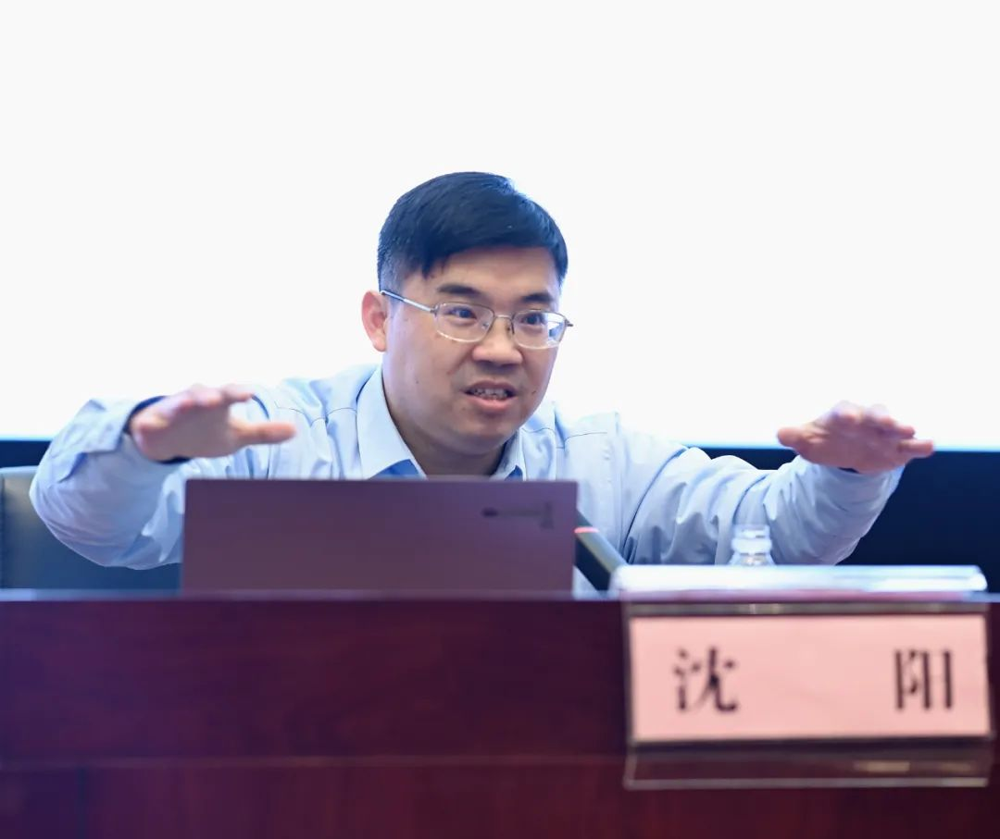
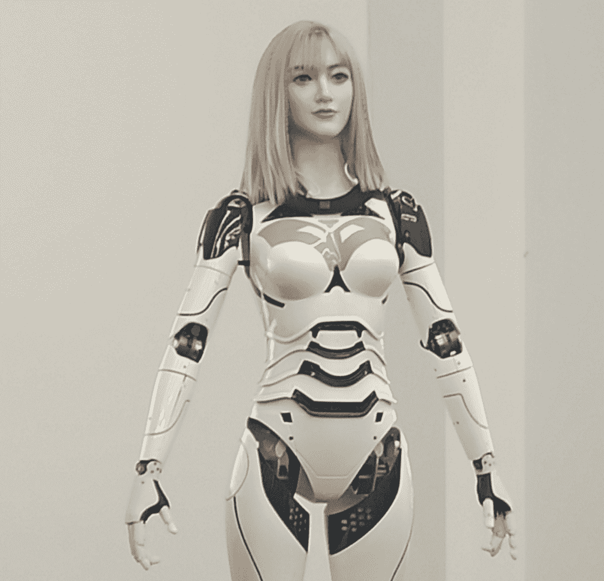

# 探讨元宇宙发展与挑战，清华大学教授沈阳做客光谷大讲堂

元宇宙是当前最受关注的科技概念之一。1月26日，东湖高新区党工委理论学习中心组（扩大）学习会暨光谷大讲堂举行，邀请清华大学教授、博导沈阳以《元宇宙的发展与挑战》为主题作报告。

东湖高新区工委委员、管委会副主任夏亚民、关维强，管委会总经济师李首文出席，工委委员罗霄凌主持。

沈阳是清华大学新闻学院新媒体研究中心执行主任，研究领域横跨新闻传播、计算机科学和信息管理三个专业，主要方向包括AI和大数据、新媒体、元宇宙、网络舆论、虚拟人和机器人，在元宇宙理论研究开拓上具有一定贡献，团队研发的机器人已应用于多个社会场景。

沈阳从元宇宙的缘起、概念与属性、技术与产业链、场景应用、风险点及治理、热点七问、未来展望等七个方面，对元宇宙发展进行了深入的研究与分析。他介绍，元宇宙是三维化的互联网，通过XR、数字孪生等技术实现，是下一代互联网应用和社会形态。在元宇宙中，社交系统、生产系统、经济系统虚实共生，每位用户都可进行世界编辑、内容生产，还拥有数字货币和数字资产。

元宇宙核心技术包括Web 3.0、人工智能、3D建模、数字孪生等，产业生态丰富，可与人类现有产业相融合，实现赋能、升级、一体化，市场前景广阔：与建筑业结合，可提供3D建筑空间；与制造业结合，可展示研发和生产场景；与零售业结合，可发展虚拟商城；与文化业相结合，可引发影视、次元、游戏变革……

​                                                                 沈阳团队研发的高仿机器人

业界认为，元宇宙将成为计算平台上一场史无前例的革命，其规模将超过移动革命、网络革命。Facebook、微软、苹果、谷歌、腾讯、阿里等巨头纷纷向元宇宙赛道进发。

当前，我国正大力发展数字经济，元宇宙与数字经济相融新生、互补创优。在全新的产业数智化革命中，产业元宇宙将成为实体经济的重要组成部分，带动国家整体产业进步。2022年，武汉市将“元宇宙”写进政府工作报告。

“谁能占据元宇宙制高点，谁就能赢得未来。”沈阳指出，元宇宙的市场前景可期，但受算力、虚拟现实技术等发展所限，全感官维度、高配版的目标需10年左右才能实现。产业化落地和商业化盈利还需要很长时间，存在经济、产业、企业、技术、群体认知、个人生理等多方面风险，应以法治为基础，打造政府引导下的多方共治体系，实现政产学研用联动的创新监管。

东湖高新区管委会各内设机构、园区办、街道办、国有企业、市直派驻单位负责人及部分干部代表参加讲座。