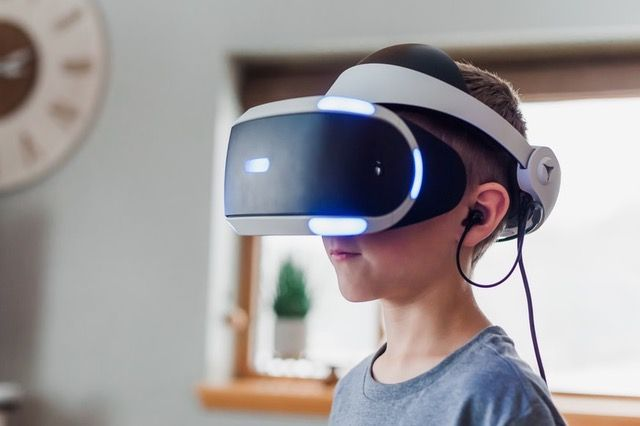

# 元宇宙科技逐步发展 旅游业可开拓新商机

> 元宇宙作为一种全新概念，预计会在未来十到十五年间逐渐成型。旅游产业可跟随趋势思考如何加入此全新的虚拟世界，并从中开拓商机、以此平台为游客提供新的灵感和独特产品。

元宇宙（Metaverse）作为与现实世界映射和交互的虚拟世界，除了能实现让个人或多人一同玩电脑游戏、参加体育竞赛、或组织会议等多种活动之外，对于旅游产业，Meta旅游业负责人Jan Starcke认为，随着旅游市场需求不断增长、虚拟科技也持续进展，元宇宙也有大量的应用潜力。从目前的科技来看，首先游客可以此扩展旅游体验。

比如，游客在安排旅游行程时，可以通过元宇宙提前了解目的地环境、酒店情况、各景区之间的距离等；行程结束归国后，游客还可以通过元宇宙将旅游体验持续延伸。其次，业者可以此来销售旅游产品。假设有亲子游客人想为来年暑假安排度假行程，却不知应选择什么样的目的地；业者可通过元宇宙让客人以虚拟实境的方式感受各种不同的目的地和活动体验，以此来判断哪些产品最适合全家大小同乐，甚至是通过元宇宙直接完成交易。

他解释，元宇宙并不只是单一一个大平台，而是人们可以透过多种接口进入多种环境进行多种活动的虚拟世界。随着元宇宙科技不断发展，将有越来越多企业跟着进入并拓展这个新世界，人们也可以以真实或者虚拟身份在现实与虚拟世界之间穿梭、消费并与他人从私人和商务等层面上进行交流。元宇宙作为一种仍在开发中的技术，并没有具体的上市日期，而是会在未来十到十五年间逐渐成型；旅游产业不应对此新概念感到惧怕或对未知的未来感到排斥，而应跟随趋势加入元宇宙，思考如何从中开发商机、如何为民众提供更多灵感和独特产品。