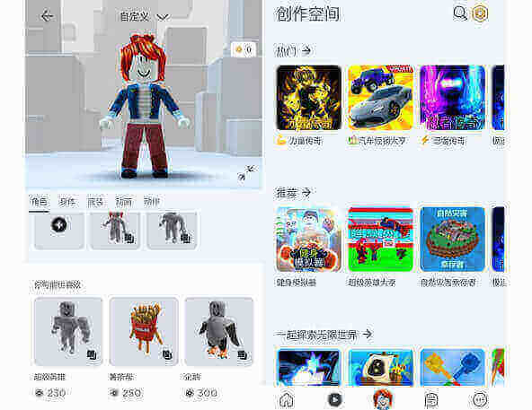
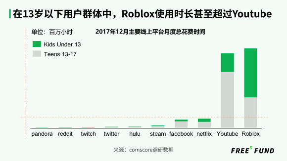
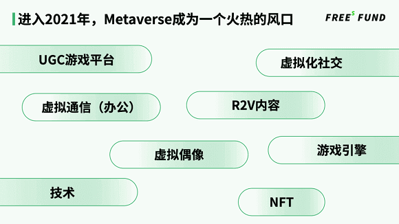
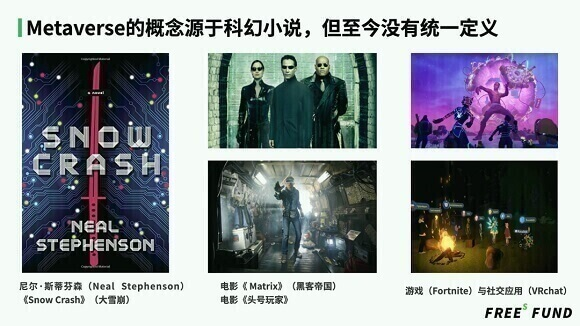
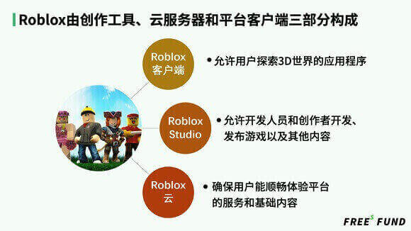
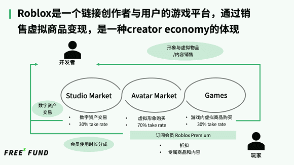
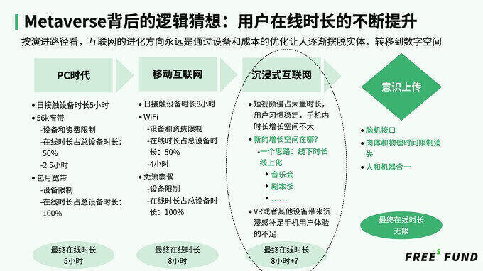
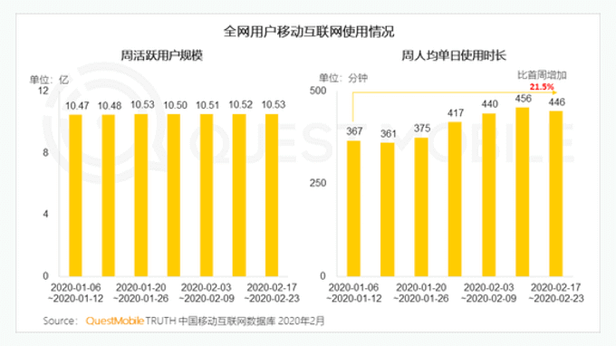
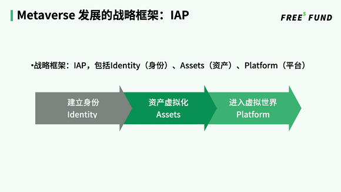

# 元宇宙发展猜想：起于社交，终于数字永生

“当阿弘进入元宇宙，纵览大街，当他看着楼宇和电子标志牌延伸到黑暗之中，消失在星球弯曲的地平线之外，他实际上正盯着一幕幕电脑图形表象，即一个个用户界面，出自各大公司设计的无数各不相同的软件……每个人的化身都可以做成自己喜欢的任何样子，这就要看你的电脑设备有多高的配置来支持了。哪怕你刚刚起床，可你的化身仍然能够穿着得体、装扮考究。在元宇宙里，你能以任何面目出现：一头大猩猩，一条喷火龙……”

这是1992年尼尔·斯蒂芬森在《大雪崩》这本科幻小说里关于Metaverse（元宇宙）的畅想。近30年后的今天，Metaverse似乎不再是一个超未来的事情。2021年3月在纽交所上市的Metaverse概念股Roblox，今年第一季度日活跃用户数已达到4210万。

​                                                     ▲ Roblox中国版罗布乐思游戏页面

虽然关于Metaverse至今没有统一定义，但它所在的领域繁荣热闹。包括Manticore Games、Epic Games、Unit2 Games等与Roblox类似的项目获得大笔融资。Facebook、腾讯、字节跳动等社交平台巨头已率先在Metaverse领域布局。Facebook先后收购Oculus VR与Unit 2 Games，并创建虚拟现实社交团队，从行动上看，Facebook比较看好metaverse可能发生在VR这类沉浸式的平台里。除了和Roblox合作发行Roblox中国版之外，在与Metaverse相关的游戏、VR、音乐等关键领域，腾讯都有涉足或参与投资。字节跳动投资了被称为“中国版Roblox”的代码乾坤。

市场火热背后，我们试着回到三个最根本的问题：Metaverse到底是什么，它从哪里来，又会到哪里去？在本文中，我们探讨了：

- 为什么说Roblox不一定是所谓的Metaverse？
- Metaverse的核心特质是什么？
- 当下如何把握Metaverse发展的机会？
- 什么是Metaverse发展的战略框架？
- 为什么说Metaverse起于社交，终于数字永生？

进入正文前，照例先分享几个主要结论：

- Metaverse是用来模拟现实世界的，它是和互联网同一层级的宏观概念，是一种更具沉浸式的互联网。Metaverse的终局，可能是用户把意识上传，整个人融入到虚拟互联网里，“永远在线”。
- Metaverse的核心特征包括持续演进、永远在线、闭环经济系统和互通性。Roblox具备Metaverse的基本属性，但它不完全是Metaverse。当下的Roblox更像是Creator Economy（创作者经济）。

- Metaverse的演进路径可能有两种：一是通过VR等新设备带来更具沉浸感的线上体验，带来新的增量时长，二是把传统意义上，人们会花在线下的时长转化到线上。
- 进入2021年，伴随着Roblox的上市，Metaverse成为一个火热的风口。不过，值得一提的是，Roblox不是一天炼成的。

### **01** **Roblox是所谓的Metaverse吗？不一定**

**Roblox上市，带动Metaverse概念爆火**

2021年，奇幻而又未被清晰定义的Metaverse（元宇宙）成为创投领域的风口。

​                                                        ▲ Roblox中国版罗布乐思APP端页面

目前在Metaverse领域，Roblox是公认的比较接近Metaverse概念的平台。2021年上市前，它经历了18年的迭代与进化。当下的Roblox既是在线游戏创作社区，也是社交游戏平台，用户可以在游戏中聊天互动。Roblox向游戏创作者提供制作工具，让用户在这个平台创造游戏。Roblox的收入主要来自于付费游戏和游戏内的虚拟商品。Roblox的招股书显示，16岁以下的用户占总用户的比例接近70%。在13岁以下儿童群体中，Roblox使用时长甚至超过Youtube。

​                                    ▲ 在13岁以下用户群体中Roblox使用时长甚至超过了Youtube

Roblox的CEO Dave Baszucki表示：“元宇宙是一个将所有人相互关联起来的3D虚拟世界，人们在元宇宙拥有自己的数字身份，可以在这个世界里尽情互动，并创造任何他们想要的东西。”

自Roblox于2021年3月上市之后，大量与Metaverse相关的项目获得融资，甚至被并购。

瞄准成年人市场，与Roblox类似的Manticore Games在4月获得软银、Benchmark等机构总计1亿美元的C轮融资。Epic Games也于4月宣布完成10亿美元巨额融资，用来打造Metaverse。6月，同样与Rolox产品形态相似，采用Unreal引擎打造的Unit2 Games被Facebook收购。

在中国，大量与Roblox产品形态相近的公司诞生。不论是UGC游戏平台、游戏引擎，还是虚拟偶像、虚拟通信、虚拟化社交，又或是R2V（Reality to Virtual，把现实变成虚拟）内容、技术相关，都在这大半年收获了前有未有的关注度与追捧。

Metaverse爆火背后还有待解的谜团：Metaverse源自哪里，究竟指的是什么？Roblox与Metaverse的关系是什么？

目前业内对于Metaverse还没有统一的定义，但对于Metaverse的起源则有共识。Metaverse最早起源于九十年代的一本科幻小说——尼尔·斯蒂芬森撰写的《大雪崩》。这本小说第一次使用Metaverse来描绘一个超脱于现实世界的数字空间。在这个数字空间，每个人都可以拥有自己的虚拟形象，可以在这个虚拟空间里做任何事情，比如社交、支配自己的收入。

之后，很多科幻小说、科幻电影都在畅想人如何脱离肉身，进入虚拟世界。非常有意思的是，《黑客帝国》和《头号玩家》指出了两条不同的进入虚拟世界的路线。《黑客帝国》本质上是关于脑机接口的畅想，《头号玩家》则更像是通过VR这种介质，让人进入虚拟世界。

从现有实践来看，目前的Metaverse实现形式以游戏（Fortnite）或社交（VRchat）应用为主。

**Roblox从何而来？**

经过长期的跟踪与研究，我们认为：Roblox既有与Metaverse相关的属性，但还不是完全意义上的Metaverse。打通了内容生产-消费闭环的Roblox，其实更接近于Creator Economy（创作者经济）。

先来看Roblox兴起的过程。

Roblox本质上是一个UGC游戏平台。UGC游戏平台这个概念最早可以追溯到《魔兽争霸3》这款非常经典的游戏。为了解决游戏内容生产速度跟不上用户的内容消费，2002年，《魔兽争霸3》开放了地图编辑器，利用这款编辑器，玩家可以任意设计地图与关卡玩法，更改游戏角色的技能。

DOTA这款游戏就是从《魔兽争霸3》的编辑器里“生长”出来的。如今游戏市场上《王者荣耀》和《英雄联盟》这类多人在线战术竞技游戏（MOBA），发端于《魔兽争霸3》与DOTA。

这款编辑器的限制在于，主要的美术资源和游戏逻辑只能来自《魔兽争霸》这款游戏，而用户希望获得更大的自由度，把不同主题和风格的东西放到游戏里，创造更多的玩法。

2009年，一种新的游戏类型——沙盒游戏出现了。以《Minecraft》（《我的世界》）为代表。这个游戏是由一个个像素方块构造的，用户可以通过搭方块或者结合一些简单的编程，完完全全构造一个自己的世界。

但沙盒游戏仍然会限制用户的自由度，玩家不能更改底层的游戏框架。

相较于沙盒游戏，正式发布于2006年的Roblox给了玩家更大的自由度。Roblox把游戏的生产环节分拆出来，变成一个独立的工具，提供给开发者。它有点类似于游戏引擎，但是门槛更低，编程更简单。开发者可以根据Roblox提供的工具，创作出不同的游戏，并且把它们放到Roblox平台上来分发。

**Roblox具有Metaverse的哪些属性？**

Roblox由创作者、云服务器和平台客户端三部分构成。其中，Roblox客服端允许用户探索3D数字世界；Roblox Studio允许开发人员和创作者开发、发布游戏及其他内容；Roblox云，则确保用户能顺畅体验平台的服务和基础内容。

为什么说Roblox具有Metaverse的属性？

因为它具备Metaverse中几个比较重要的基本要素，包括人、生产工具和虚拟经济系统。

先来看人这个部分。Roblox中的人包括玩家和游戏创作者，这两种角色可以互相切换。每一个玩家都拥有自己的社交身份（identity）。玩家可以自由进入两千多万款创作者开发的游戏中，还可以将现实的社交关系引入到游戏里，和好朋友同时进入一个游戏，“一起开黑”。

再来看生产工具。Roblox给创作者提供了游戏制作平台Roblox stuido，允许创作者开发、发布游戏以及其他内容。同时，Roblox还提供了云平台，保障用户能顺畅体验平台的服务和基础内容。

除了人和生产工具，Roblox还搭建了一套虚拟经济系统。在玩家这一端，Roblox出售名为Robux的虚拟货币，玩家可以用Robux购买游戏创作者设计的虚拟游戏道具。在创作者这一端，Roblox提供了Studio Marketplace这个平台，供创作者出售道具建模等数字资产。

**为什么Roblox不是完全意义上的Metaverse？**

虽然Roblox具有Metaverse的属性，但是，为什么说Roblox距离真正的Metaverse还有一段距离？

这就要说回Metaverse的三个核心特征：持续演进，永远在线，完全闭环的经济系统和互通性。这三个特质是环环相扣、循序渐进的。如果深入拆解，我们会发现当下的Roblox并不完全符合这三个特征。

Metaverse是一个无限存续的世界，你会一直在虚拟世界中，不存在所谓的暂停或者结束。持续演进意味着Metaverse的世界能够持续进化，可以像真实世界一样自我进化、自我发展，能够产生人在各个阶段所需要的内容。此外，在这个多方共建的平台上，内容的生产速度要能够赶得上内容消费的速度。

而目前Roblox的用户是受限的，主要以低龄用户为主，招股书显示，25岁以上的用户仅占总用户的14%。显然，Roblox还没有实现破圈。朝着真正的Metaverse的方向演化，Roblox需要拓展用户的年龄层，让成人和儿童都乐在其中，并努力拉长用户生命周期。

一个持续发展的世界建立起来之后，你还要保证用户能够永远在线。永远在线是指Metaverse提供了大量模拟现实世界的场景，能够让你把生活的更多部分纳入其中，包括工作、娱乐、社交等等。而目前Roblox只满足了用户部分娱乐、社交的需求，距离囊括一切真实世界里的“人、事、物”还有一段距离。

此外，永远在线需要更先进的技术支持。Metaverse必须要具备非常强大的基础设施，才能够保证足够多的人可以同时在同一个世界里互动。此外，为了确保永远在线，还要尽可能减少修复bug、更新等行为，因为这些行为会中断用户的在线。

理想中的Metaverse，像一个统一世界，能同时容纳百万级的人甚至千万级的人。这背后需要强大的高并发的实时基础设施。游戏公司在这方面的技术领先度是最强的。不过当下代表技术极高水平的“吃鸡”游戏，也仅能支持100人同时在同一个房间。Roblox里的单个游戏房间，能够容纳的用户也在十几个。

当你用各类工作、娱乐的场景把用户吸引进来之后，你还要有一套成体系的闭环经济系统，让人与人建立起联结，能够让人在Metaverse里谋生，即在交易市场里，完成交易闭环。

目前，Roblox仅仅打通了内容生产-消费这个闭环经济系统，也就是实现了creator economy。但创作者经济只是整个经济体系的一小部分，Metaverse应该容纳更加多元的经济形态。未来，电商、心理咨询、健身等等场景与关系，将可能被纳入到Metaverse生态里。

互通性则是指，在Metaverse里面，各种协议和格式是可以兼容的，且不同平台和系统之间能够互通。但是，Roblox目前只是单一的平台和系统，没有容纳更多的外部系统。

对于互通性，Epic Games创始人Tim Sweeney在接受Medium专栏作者采访时称：“Metaverse将成为一种我们尚未真正见过的大规模参与型媒体。Metaverse不是由某一家行业巨头建造的，它将是数以百万计的人的创意作品。”

整体而言，Metaverse是Roblox这类平台的远景。Metaverse最终可能是由多方共同建造的，可以兼容各类平台和系统、各种协议和格式，同时适配PC、手机等各种硬件。

听上去还是比较抽象，但我们可以试着从现实世界里找找参照物。Metaverse不是游戏，因为游戏的受众是受限的，且游戏的内容生产效率通常无法满足内容消费。它将不同于虚拟/数字经济，因为在把传统的经济形态搬到网上这件事上，移动互联网已经做得很好了。它显然也不是线上迪斯尼乐园，因为迪斯尼乐园是由一家公司主导所有的内容生产和服务，与Metaverse的多方共建相左。此外，它也不太可能是个新的应用商店。撇开我们未必需要一个新的应用打开的方式，应用商店底层的结构也不同于Metaverse。应用商店本质上是一部分人生产内容给另一部分人用，但在Metaverse的世界里，会是所有人参与创造，所有人参与消费。

### **02** **峰瑞观点：到底什么是Metaverse？**

我们认为，Metaverse是现实世界的模拟，它是和互联网同一层级的宏观概念，是一种更具沉浸式的互联网。Metaverse的终局，有可能是用户把意识上传，整个人融入到虚拟互联网里，“永远在线”。

这个终局可能听起来很遥远，很玄幻。不过，回看互联网的发展路径，我们发现，整个互联网的发展是由用户在线时长的不断提升来推动的。联网设备升级、联网成本降低之后，人们逐渐摆脱实体，转移到数字空间。Metaverse的发展路径可能与互联网类似。

在PC时代，受限于设备不便于移动和上网资费较贵，人们的在线时长有限，电脑中的应用软件也不丰富。后来，当PC端的联网方式从窄带变成包月宽带之后，人们上网的资费限制少了，只剩下设备限制。

伴随着智能手机的出现与普及，我们的设备从不可移动的PC变成可移动的手机，我们每天接触设备的时间无疑变长了。叠加4G、5G基础设施的建设以及手机流量资费的持续下降，人们的在线时长进一步提升。

根据QuestMobile发布的数据，2020年2月10日至2月16日这一周，中国全网用户移动互联网人均单日使用时长达到456分钟（7.6小时）。

一天近8小时的在线时长，对于用户来讲，已经很饱和了，增长空间不大。某种程度上，人们每天使用手机的时间分配开始变得相对固定，也就是会比较明确地知道，每天拿多少时间来用微信，拿多少时间刷抖音、逛淘宝。我们也越来越不愿意下载新的APP了。

因此，Metaverse想要迈向“永远在线”，摆在面前的最大的问题是：如何不断拉长用户的在线时长，寻找增量的用户时长？

### **03** **当下Metaverse发展的机会在哪儿？**

关于用户在线时长的增长，我们目前想到两个思路，一是VR等新设备创造更具沉浸感的线上体验，进而带来新的增量时长，二是把传统意义上，人们会花在线下的时长转化到线上。

给用户提供新的设备，意味着当用户不用手机的时候，他们可以在新的设备带来的新场景里投入时间。打个比方，假定手机使用时长不变，用户每周多花1分钟时间在游戏主机上或者在VR设备里，也就产生了1分钟的在线时间增量。并且，VR等新设备本身，贡献了感知世界的新维度，能够改善用户在线上的体验，提升用户的在线时长。

另一种演进路径是，寻找明确的线下场景线上化的机会。现在很多年轻人会在线下听live、玩剧本杀、唱K、逛展览，这些活动动辄占据4、5小时的时间，如果我们能够把这些线下的行为转移到线上，也会增加用户的在线时长。

美国有一款很火的游戏叫《堡垒之夜》，它在美国的地位相当于《王者荣耀》。在2020年疫情期间，美国知名嘻哈说唱歌手Travis Scott在《堡垒之夜》里开了一场演唱会。这场演唱会吸引了1230万观众，刷新了该游戏史上最多玩家同时在线的音乐Live成绩。

演唱会开始后，Travis Scott巨大的虚拟化身乘着飞船而来，表演过程中，游戏场景随着歌曲节奏不断变换。从陆地到海外，一个个奇妙的景象展现在玩家面前，Travis Scott的虚拟化身甚至随手抓住两颗星星，然后将其相互碰撞制造出了漫天的流星。

作为Metaverse的一种表达形式，这场演唱会成为一个具有标志性的事件，在整个欧美，甚至在中国也引起轰动。

除了在游戏里开一场演唱会，海外已经有不少公司开始沿着这条线下场景转到线上的路线演进，比如得到诸多好莱坞明星、音乐人和唱片公司支持的虚拟演唱会供应商Wave等。

最终，人们将进入沉浸式互联网的阶段。那时，用户的在线时长，可能是8个小时左右的手机在线时长，加上新增设备的在线时长，再加上把线下行为转移到线上的时长。

### **04** **Metaverse 发展的战略框架长什么样？分为哪几个阶段？**

分析了Metaverse的概念，探讨了Metaverse的发展机会之后，我们梳理出一个关于Metaverse的战略框架：IAP，包括Identity（身份）、Assets（资产）、Platform（平台）。

IAP框架也意味着Metaverse的三个发展阶段。

首先是建立个人身份（Identity），这需要借助虚拟偶像的技术及其所产生的内容。在Metaverse元宇宙的世界中，无论是虚拟偶像，还是普通用户的虚拟形象，所有用户都可以拥有一个虚拟的身份。

有了虚拟的身份之后，我们还要在虚拟世界里创造资产（Assets），并通过虚拟资产创造交易活动，形成经济闭环。例如Roblox的虚拟交易货币Robux，它就可以在Roblox内部链接创作者和玩家用户，在游戏交易上形成自己的经济闭环。

当你有了身份，形成经济闭环之后，成为一个平台（Platform）会是水到渠成的事。形成平台之后，我们就可以将线下的场景搬到线上，比如前文提到的演唱会、艺术展、国际旅行、剧本杀等等。

峰瑞资本调研了很多与Metaverse相关的项目，在个人身份领域以及平台这两个方向，布局了数家公司。Identity侧，我们关注如何用技术和内容赋予组织和个人创造虚拟身份的能力。平台端，我们关注能覆盖现实场景的线上产品。欢迎相关领域的创业者、行业专家与我们持续交流（chenzhe@freesvc.com）。

### **05** **Metaverse终局猜想：起于社交，终于数字永生？**

基于IAP这个发展战略框架，Metaverse将如何落地？如何满足用户的具体需求？

我们倾向于认为，Metaverse有可能起于社交，终于数字永生。

社交是用户的核心需求之一。2020年疫情期间，当大家都困在家里，现实世界的社交减少时，人们的社交需求被更真实、更充分地映射出来。根据腾讯公布的2020年第一季业绩：“微信及QQ让用户在居家防疫期间与亲友保持联系，两者各自的每日总消息数及使用时长同比均实现双位数增长。”

一条可能的破局之路是：为用户提供各类场景，并结合Metaverse的特点，推出一个全新的社交产品。在打磨产品的过程中，逐渐让产品接近Metaverse的核心本质。

市面上已经出现了一些通过搭建虚拟场景、虚拟形象，来满用户社交需求的产品。比如，在《VRChat》这个游戏中，玩家可以创建“房间”，并且可以通过虚构角色彼此交流，玩夺旗、抢银行等小游戏。玩家还可以通过软件开发工具包，开发出自己专属的角色模型。有的玩家甚至还通过外接的VR设备，在《VRChat》里展示太空漫步，跳钢管舞。

锚定了社交这个起点之后，Metaverse经过充分发展，终极目标也许能让人们摆脱肉身，和机器合一，最终实现永远在线的状态。当然，这个终局还很遥远，想要抵达终局，可能需要脑机接口、AR、VR、AI等技术发展到高度成熟并且能够交互协作。目前行业的出发点，还是在于寻找Metaverse能够增长发展的空间。