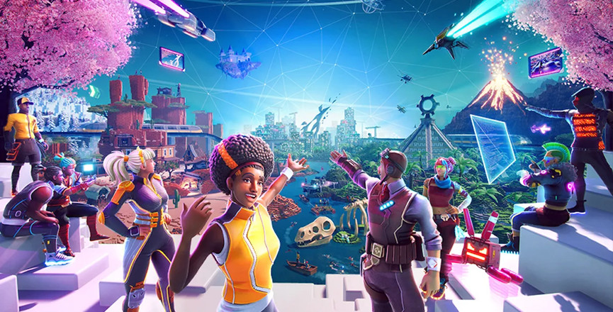
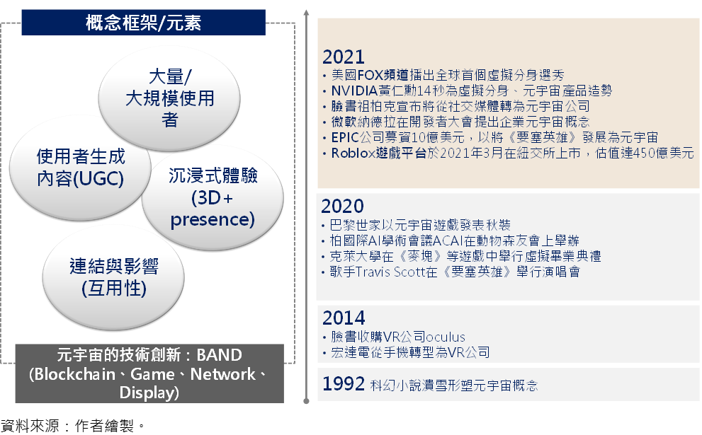
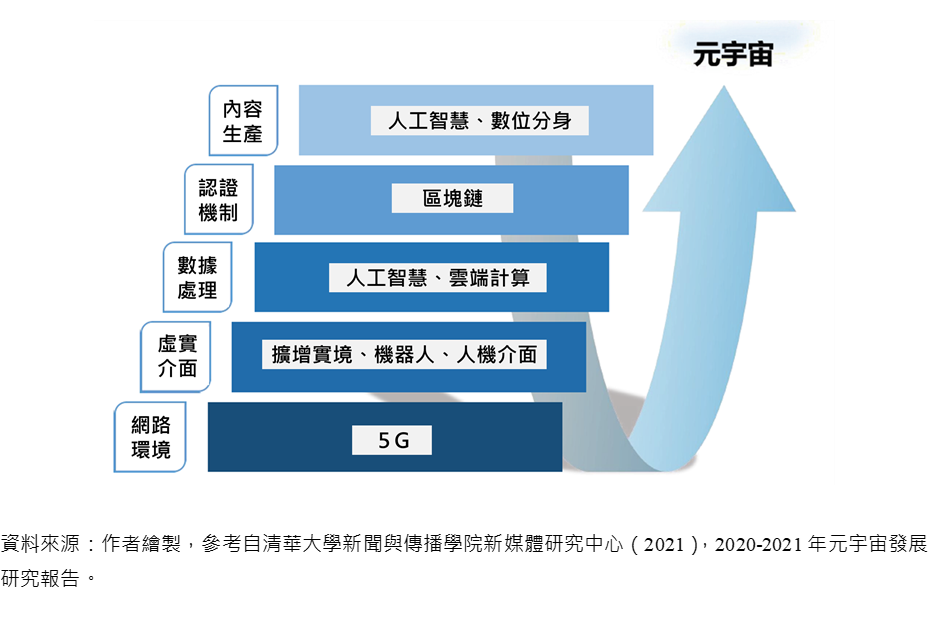
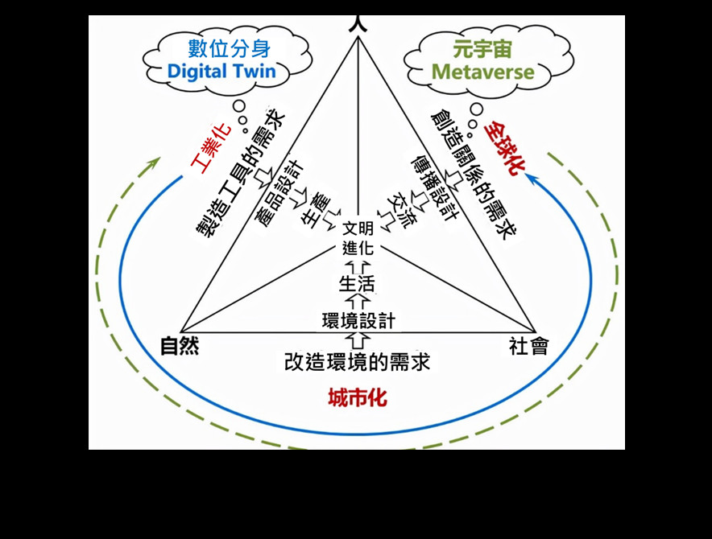
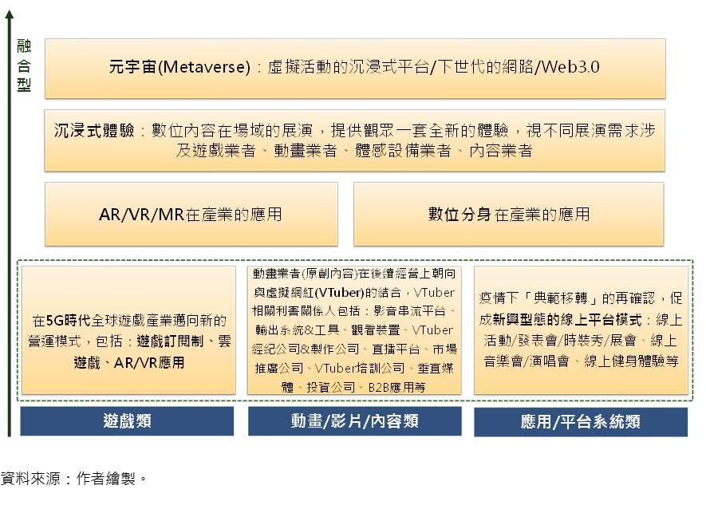
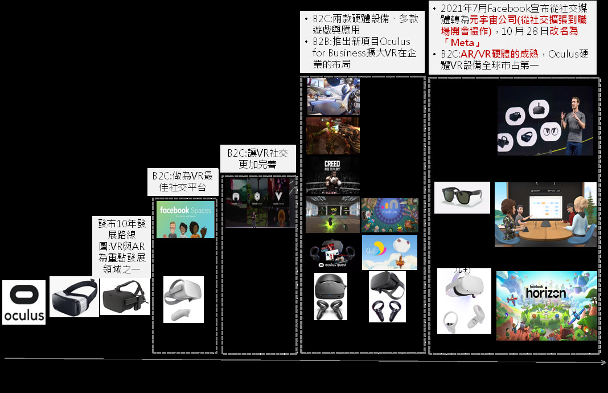
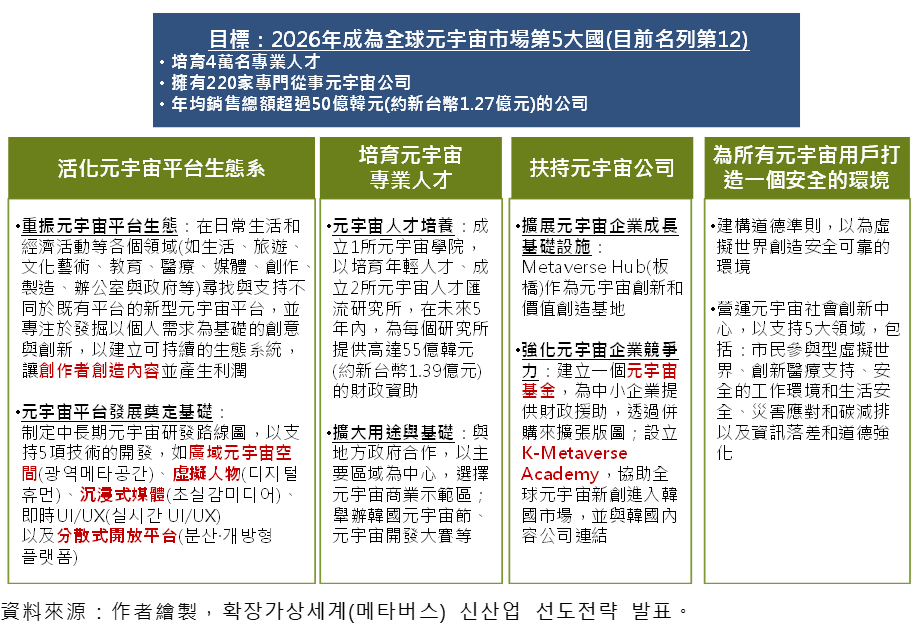

# 你必须知道的新潮流-全球元宇宙（Metaverse）发展趋势观察

> 元宇宙（Metaverse）只是旧瓶装新酒吗？或是下一世代网际网路？本文从以下三点展开对元宇宙发展的观察，第一、现有技术成熟发展与多元组合为元宇宙发展的基石。第二、美国游戏/科技平台大厂带头走向元宇宙。第三、亚洲国家中以韩国政府带头引领最为积极，包括成立元宇宙联盟、发布元宇宙策略蓝图等。

**前言、宇宙的发展脉络与重要元素**

​     最早谈论到「元宇宙」（metaverse）概念可回溯到1992年科幻小说《溃雪》（Snow Crash），而元宇宙议题在2021年受到关注，至今仍未有统一的定义。综合多方观点，元宇宙的概念/元素可从四个方面来诠释：1.大量/大规模使用者：支援无数使用者的多元宇宙；2.沉浸式体验：3D结合「临场感」（presence）；3.以使用者生成内容（user-generated content, UGC）为主；4.连结与影响（互用性）：元宇宙当中的各个世界之间具有互用性（interoperability），且与真实世界之间具有互用性。然而，跨平台的开放与连结/互动仍在发展中，亦是元宇宙发展的关键要点，其中统一数据标准、支付与身份认证是实现跨平台开发整合关键。

​     元宇宙的技术创新可归纳为「BAND」，包括：区块链（blockchain）、游戏（game）、网路通讯（network）、显示技术（display），共同打造一个可靠的经济系统、数位分身与数位资产、强社交性、沉浸式体验、开放内容创作的数位空间平台。元宇宙是以区块链为核心的Web3.0技术体系支撑下的新场景、新产业和新生态。数位经济发展下的新兴应用朝向元宇宙布局，以Web3.0和NFT建构数位交易与新型态网络，迈向创作者经济。综合而论，VR游戏不等于元宇宙，元宇宙不仅是AR/VR/MR，更奠基在物联网、AI、大数据、云端运算、数位分身、区块链等多元技术组合与叠加基础。

####                                                           **图1 元宇宙的发展脉络与重要元素**

**观察一：现有技术成熟发展与多元组合为元宇宙发展的基石**

**（一）从数位分身到元宇宙发展**

​     从广达董事长林百里的观点，元宇宙是实体世界的数位分身，涉及虚拟环境模拟、模拟的商场或会议、模拟的新房子，透过AR/VR装置，现实跟虚拟世界互动进而产生新机会、新应用与新商机。同样地，NVIDIA执行长黄仁勋表示，元宇宙是透过物联网（IoT）、人工智慧（AI）、数位分身等工具将虚实世界整合，戴上AR/VR装置或手机就可即时操作远方工具。换言之，元宇宙在2021年成为重要关注议题，端赖过去在网路环境、虚实介面、数据处理、认证机制和内容生产等构面的底层技术成熟，尤以在内容生产方面数位分身为其重要底层技术，可参见图2所示。

####                                                        **图2 数位分身为元宇宙的底层技术**

​     就两者的技术演进来看，元宇宙的系统相对于数位分身更为庞大与复杂，若数位分身是一套复杂的科技体系，那元宇宙则涉及复杂的「科技社会体系（technological-social system）」。两者最大的差异在于不同的技术发展和演化路径，数位分身源自于复杂产品开发的工业化，近期移转到都市化和全球化；相较之下，元宇宙源自于与人相关的游戏和娱乐产业，从全球化移转到都市化和工业化，可参见图3。即便元宇宙和数位分身皆聚焦于真实实体世界和虚拟数位世界的连结/互动，然而本质上两者的起始点截然不同，元宇宙直接与人相关，而数位分身则是源自于物件。

​     元宇宙（1992年）一词较数位分身（2002年）概念原型早出现十年，但数位分身技术体系的成熟度和国际标准化工作皆比元宇宙进展快。数位分身连续在2017~2019三年被顾能（Gartner）纳入十大技术趋势预测；2020年Gartner则将其融入超自动化（Hyperautomation）趋势中，超自动化也常常成为组织的数位分身（digital twin of the organization, DTO）；甚至是当前在谈的智联网（AIoT）的底层逻辑即是数位分身（彭昭，2019）。换言之，数位分身技术经历了技术准备期、概念产生期和应用探索期之后，目前进入领先应用期，而于2021受到关注的元宇宙仍处于技术准备期和概念量产期的早期。

####                                                           **图3 元宇宙和数位分身的不同技术演进**

**（二）既有数位内容业者迈向沉浸式体验、元宇宙发展**

​     从整体数位内容产业发展来看，游戏类、动画/影片/内容类、应用平台系统类等三个次产业近期的发展为迈向元宇宙奠定一定基石，可参见图4所示。游戏产业在5G时代全球游戏产业迈向新的营运模式，包括：游戏订阅制、云游戏、AR/VR应用，5G云游戏亦朝向与AR/VR、语音辨识、手势感应等技术结合运用。其次，动画业者（原创内容）在经营上朝向与VTuber的结合，VTuber相关利害关系人包括：影音串流平台、输出系统&工具、观看装置、VTuber经纪公司&制作公司、直播平台、市场推广公司、VTuber培训公司、垂直媒体、投资公司以及B2B应用等。再次，疫情下促成新兴型态的线上平台模式，例如线上活动/发表会/时装秀/展会、线上音乐会/演唱会、线上健身体验等。

​     随着新兴科技的演化与成熟，数位分身、AR/VR/MR等科技在数位内容产业的应用，以及走向沉浸式体验，即数位内容业者在场域的展演，提供观众一套全新的体验，视不同展演需求涉及游戏业者、动画业者、体感设备业者、内容业者等；最终迈向元宇宙/Web 3.0的发展。

####                                                                  **图4 数位内容业者迈向元宇宙发展**

​     在前述游戏类（AR/VR应用）、动画/影片/内容类（VTuber）、应用平台系统类（线上平台模式）等数位内容业者迈向元宇宙发展的基础上，综整元宇宙对数位内容产业的发展影响可以分就以下几点观察：第一、元宇宙与游戏业者息息相关，元宇宙为游戏产业发展的下一阶段—从游戏即服务到游戏即平台，塑造出新的商业模式，包括：虚拟活动、NFT、边玩边赚（Play-to-Earn, P2E）、收藏模式（Play-to-Collect）、付费社交（Play-to-Socialize）。第二、元宇宙游戏平台做为其他体验的载体，结合品牌元素和娱乐元素，一些新的服务模式包括：为音乐和娱乐提供新的参与形式（虚拟参与/虚拟演唱会）、影视合作吸引与创造新的粉丝社群与品牌合作创造新的商业化管道，其中尤以虚拟音乐会/演唱会为大宗。第三、日本为首的VTuber为元宇宙在虚拟世界发展的重要元素，而数位虚拟人和虚拟场景的应用目前已广泛化。第四、元宇宙主题公园为新兴沉浸式体验模式，迪士尼致力于将实体资产和数位资产融合到虚拟世界中。

 

**观察二：美国游戏/科技平台大厂带头走向元宇宙**

**（一）元宇宙应用以游戏和社群平台为优先体现领域**

​     近几年美国为主的元宇宙应用以游戏（Roblox、Epic Games）和社群平台（Facebook从社交媒体转为元宇宙公司Meta）为优先体现领域，因为这两者都是「用户花费长时间于虚拟世界中」的实证。同样地，TrendForce（2021）指出，元宇宙最主要的应用内容仍以游戏娱乐、影视、社群互动为主，并且会更加注重使用者生成内容（UGC）的概念。在形塑产业生态系上，虚拟世界的建设和应用内容的发展很难倚靠少数厂商独立建构完成，需要主导厂商和使用者共创。

​     在游戏产业，2021年3月游戏公司Roblox于纽交所上市，其招股书内就提到Metaverse一词，让Roblox成为Metaverse第一股，公司估值超过450亿美元；而2021年4月全球知名游戏《要塞英雄》的开发商Epic Games获得10亿美元融资，用于拓展元宇宙相关业务。再者2022年1月微软以687亿美元并购美国游戏开发商动视暴雪（Activision Blizzard），创下微软史上最大交易规模，亦是游戏产业史上最大并购案，对此微软表示游戏产业将在元宇宙平台的发展中发挥关键作用，透过并购强化未来微软游戏软硬体服务生态。

​     表1从美国科技大厂于AR/VR/MR发展重点来看，Facebook从AR与VR（VR游戏社交生态）为主轴到发展为Meta元宇宙公司，加值自身社交平台体验。Microsoft着重于MR布局与VR社交平台的转型，打造企业用元宇宙产品（主打能提供数位化身功能的新版聊天与会议程式Teams）。相较之下，Apple致力于打造AR生态系，而不用「元宇宙」词汇。

 

#### 	                                                    **表1** **美国科技大厂于AR/VR/MR发展重点**

| 企业                               | 发展重点                                                     | AR                                                           | VR                                                           | MR                                                           |
| ---------------------------------- | ------------------------------------------------------------ | ------------------------------------------------------------ | ------------------------------------------------------------ | ------------------------------------------------------------ |
| Meta软体公司 (社交平台)            | 从AR与VR(VR游戏社交生态)为主轴到元宇宙公司，加值自身社交平台体验：以社交平台为核心，透过并购头戴式显示设备新创Oculus，从生产硬体开始，逐渐进行软体开发，并强化社交体验的黏着度，同时扩大VR在企业的布局 | 【软体】-2017年推出AR Studio开发平台【硬体】-2018年推出智慧型萤幕Portal-2019年证实研发AR眼镜-2021年与太阳眼镜品牌雷朋(Ray-Ban)推出智慧眼镜Ray-Ban Stories | 【硬体】-2014年并购头戴式显示设备新创Oculus-2016年推出Oculus Rift-2018年推出Oculus Go-2019年推出Oculus Quest、Oculus Rift S-2020年推出Oculus Quest 2，造成热卖【软体】-2019年推出Facebook Horizon-2021年推出虚拟实境办公的平台「Horizon Workrooms」 | --                                                           |
| Apple硬体+服务公司(硬体产品与服务) | 打造AR生态系(不用「元宇宙」这词，就是AR)：以Apple设备(iPhone和iPad)作为基础，透过开发平台ARKit扩大采用并促使AR技术更为普及 | 【软体】-2017年推出ARkit开发平台，并持续更新升级-2018年推出的AR功能「Quick Look」 | --                                                           | 有可能于2022年推出高阶MR头盔                                 |
| Microsoft软体公司(软体开发)        | 着重于MR布局与VR社交平台的转型，打造企业用元宇宙产品(主打能提供数位化身功能的新版聊天与会议程式Teams)：MR发展以HoloLens为其主要和新产品，企业做为主要的销售对象，同时也可观察到VR社交平台的转型 | --                                                           | 【软体】-2015年推出AltspaceVR-2019年AltspaceVR转型活动主持   | 【硬体】-2016年推出HoloLens-2019年推出第二代HoloLens：已与美国陆军敲定12万套AR头戴装置采购合约(为期10年)-Mesh for Microsoft Teams |

 

资料来源：作者整理。

 

**（二）Facebook迈向Meta的发展路径**

​     2021年7月Facebook从社交媒体转为元宇宙公司，10月28日更名为「Meta」，并推出虚拟实境办公的平台「Horizon Workrooms」，图5呈现Facebook迈向Meta的发展路径。

​     Meta以Family of Apps（Facebook、Instagram、Messenger、WhatsApp以及其他服务）、Facebook Reality Lab（AR/VR硬体、软体以及内容）两项业务为主，其中Facebook Reality Lab作为元宇宙研发部门。从Meta元宇宙的布局方面，可观察到透过外部合作或投资并购的方式，包括购并Oculus（VR头盔）、Scape Technologies（视觉定位服务），提升底层技术能量，并强化硬体端以及内容开发。

​     2021年11月Meta宣布与微软合作，将线上协作软体Workplace与微软的团队通讯软体Microsoft Teams整合，未来用户使用Workplace的同时能进行Teams视讯会议，同样使用Teams也可同时使用Workplace的应用程式内容；2022年1月Meta宣布将与来自NVIDIA、Pure Storage以及Penguin Computing团队进行合作，共同致力打造全球最快的超级电脑AI Research SuperCluster（RSC）。

​                                                                                 **图5 2021年Facebook转为元宇宙公司**

**观察三：亚洲国家中以韩国政府带头引领最为积极：成立元宇宙联盟、发布元宇宙策略蓝图**

**（一）韩国、日本、中国的元宇宙发展特性**

​     韩国政府长期投入延展实境（extended reality, XR）的开发、奠定元宇宙新兴产业基础，而在2021年5月成立「元宇宙联盟」，并于2022年1月发布「元宇宙产业策略蓝图」，是全球最早提出政府层级的元宇宙发展策略国家。韩国科学技术情报通信部（Ministry of Science and ICT, MSIT）是韩国推展元宇宙发展的核心部会。相较之下，日本并无明确的政策或法律框架，日本经济产业省在2021年7月发布「关于虚拟空间行业未来可能性与课题的调查报告」，整理未来日本发展虚拟空间产业应用时可能面临的各项课题、对策、政府可采取的协助作为等。同样地，中国大陆针对元宇宙议题，并没有国家层级的元宇宙政策，对待科技新事物的态度较宽松，先提供一定的发展空间，但防止恶意炒作。

​     再者于产业的发展上，韩国大型跨国企业和网路领导企业扮演重要带头推动角色，例如入口/搜寻引擎网站Naver在2018年推出元宇宙平台Zepeto；移动通讯公司SKT于2021年7月推出metaverse社交平台ifland（结合虚拟聚会/共享文件）。相较之下，日本动漫游戏产业（Animation, Comics, and Games, ACG）扮演重要的带头角色。日本具备丰富的ACG产业基础与智慧财产权（IP），其应用已逐步由游戏向其他场景延展；日本新创公司Cluster提供VR空间多人聚会的虚拟活动服务，包括虚拟偶像大型VR演唱会、粉丝见面会、讲座等。中国大陆则是以平台业者为主要推动要角，较早布局元宇宙业务的公司包括腾讯、网易、字节跳动等，举例来看，腾讯数智人/虚拟人在北京冬奥的应用，以3D手语数智人「聆语」作为央视频AI手语。

 

**（二）韩国元宇宙发展模式：政府引领、民间主导**

​     2020年12月10日韩国科学技术情报通信部发布延展实境经济发展策略（Immersive Economy Development Strategy），该策略旨在2025年前创造30兆韩元经济价值，并跻升世界前5大延展实境（XR）经济体。2021年5月，韩国MSIT与XR相关企业、单位共同组成元宇宙联盟（Metaverse Alliance），约有200家企业共同参与。初始会员包括：三大电信巨头（SKT、KT、LG）、汽车制造商现代汽车、韩国网路巨头Naver旗下Naver Labs、Kakao旗下Kakao Entertainment等。该联盟是上述所提及延展实境经济发展策略的后续措施，主要是汇聚元宇宙相关设备、网络、平台、内容业者，共同讨论活化元宇宙生态系和合作的平台，致力于共享技术动向、探讨完善法律制度的方案、透过企业间合作挖掘和规划元宇宙平台等。

​     2021年7月韩国政府正式宣布韩国数位新政进入2.0阶段，新政2.0新增培育超连接（hyperconnected）新兴产业，例如元宇宙。针对元宇宙法规议题，韩国国会立法调查处提出「元宇宙现况与未来课题」报告，立法及政策的争议点涉及：使用者保护、确保资讯和经验的适当性、强化可接近性和法规整合性。该报告强调元宇宙与虚拟游戏概念不同，虚拟游戏的规范不适用元宇宙。元宇宙可与其他人的虚拟化身进行交流/协作，未来可能发展成各种型态（beyond虚拟游戏），在法律和制度上，必须创造一个安全可靠的元宇宙空间，并与现实社会的法律规范互相协调（元宇宙活动的现实效果）。

​     值得关注的是，2022年1月20日韩国科学技术情报通信部发布「元宇宙产业策略蓝图（메타버스신산업선도전략）」，目标是至2026年成为全球元宇宙市场第5大国（目前排名第12）、培育4万名专业人才、拥有220家专门从事元宇宙公司、年均销售总额超过50亿韩元（约新台币1.27亿元）的公司。在模式上，主要透过活化元宇宙平台生态系、培育元宇宙专业人才、扶持元宇宙公司，以及为所有元宇宙用户打造一个安全的环境等四大策略推动，如图6所示。就中长期元宇宙研发路线图制定上，韩国支持5项技术的开发，如广域元宇宙空间（광역메타공간）、虚拟人物（디지털휴먼）、沉浸式媒体（초실감미디어）、即时UI/UX（실시간UI/UX）以及分散式开放平台（분산·개방형플랫폼）等，这些是我国在发展元宇宙技术时可关注的标的。

####                                                **图6 韩国MSIT于2022年1月发布的「元宇宙产业策略蓝图」**

**小结：元宇宙发展机会与挑战**

​     2021年被视为元宇宙发展元年有其脉络，是在既有技术发展成熟与多元技术的组合下带动。相较于美国以游戏和科技大厂主导的元宇宙产业发展模式，韩国大型跨国企业和网路领导企业扮演重要带头推动角色。日本则奠基在ACG产业基础与IP，其应用已逐步由游戏向其他场景延展，而中国大陆则是以平台业者为主要推动要角。值得我国进一步借镜的是韩国元宇宙发展策略与布局，是以政府引领，民间主导的模式。韩国由中央政府发布元宇宙发展政策，包括韩国新政2.0之数位新政中，编列2.6兆韩元用于培育超连结新兴产业，如元宇宙等，更发布「元宇宙产业策略蓝图」，透过活化元宇宙平台生态系、培育元宇宙专业人才、扶持元宇宙公司，以及为所有元宇宙用户打造一个安全的环境等四大策略推动。

​     就其发展性来看，目前元宇宙在产业别的应用上，从游戏、社交、娱乐等to C端应用为主，延展到制造、工作和教育学习等领域，已渐渐进入到一般消费者日常甚至是工作场域。同样地，Gartner预测2026年全球25%的消费者每天将投入至少1小时在元宇宙中工作、购物、学习、社交或娱乐。就元宇宙产业生态系观点，美国科技/游戏大厂多打造场景内容入口平台；中日韩元宇宙业者致力于从游戏社交端发展元宇宙平台，而台湾业者多以前端设备平台为主，可能的机会点在串接国外平台，或是发展垂直领域的元宇宙平台。韩国「元宇宙产业策略蓝图」试图从各个领域（如生活、旅游、文化艺术、教育、医疗、媒体、创作、制造、办公室与政府等）寻找新型态的元宇宙平台。

​     元宇宙涉及的法规议题（包括知识财产权、使用者保护/个人隐私保护、网路匿名、刑事案件等）为我国政府在规划元宇宙发展策略建议纳入讨论的构面。尤以元宇宙发展的法规议题涉及国际共同参与，反映的是元宇宙平台无国界特性。美国作为元宇宙发展的先行者，关注数据安全和隐私保护问题；韩国、日本政府积极探讨法律法规议题；中国大陆企业密集布局元宇宙（商标注册申请），炒作风险成监管重点。创造一个安全可靠的元宇宙空间，并与现实社会的法律规范互相协调，涉及元宇宙活动的现实效果与法规整合性。

