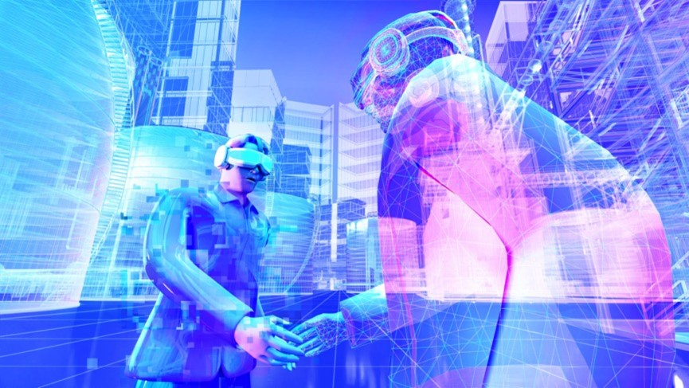
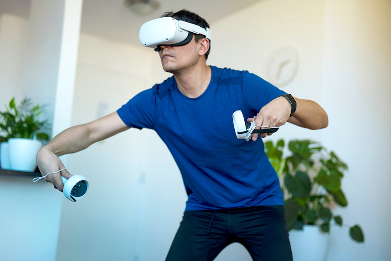
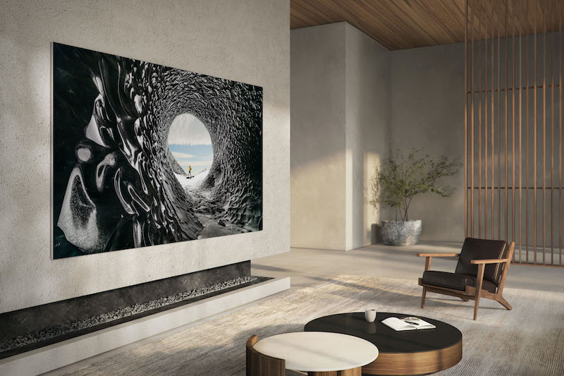
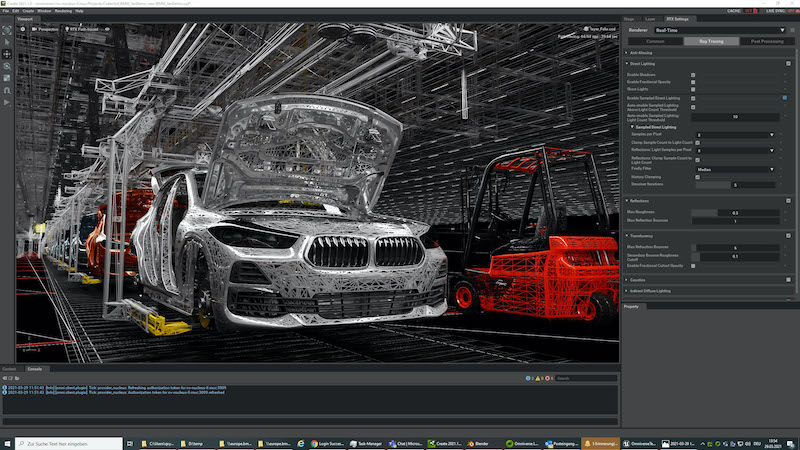
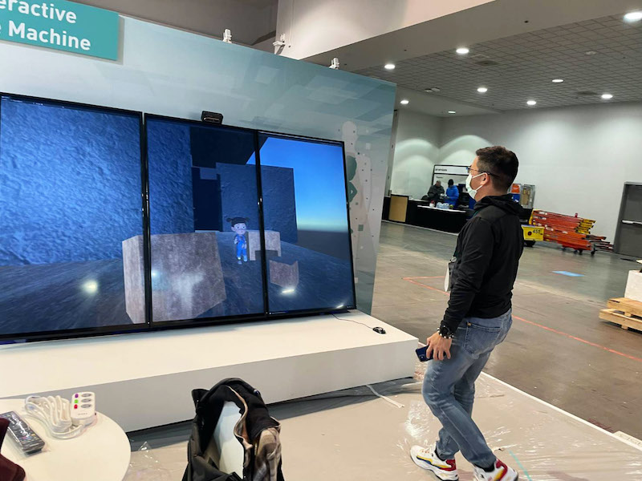
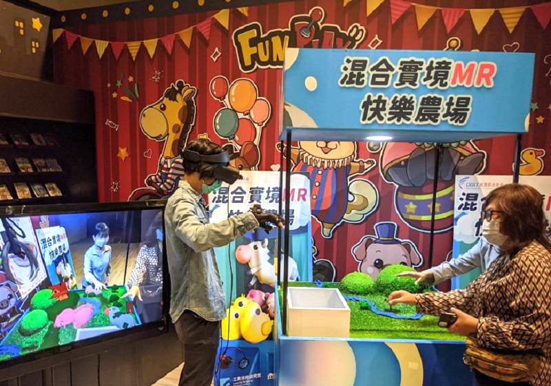
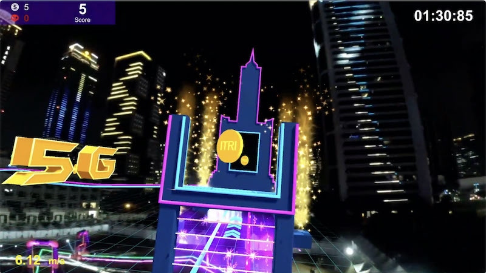
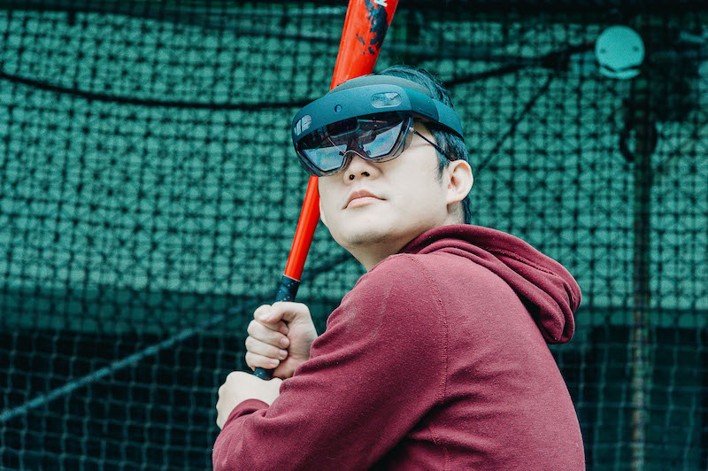

# 欢迎来到下一站：元宇宙技术

> 「元宇宙」一词于去年底倏地窜红，然此概念盛行于影视已近30年。从1993年的《超级战警》、1999年的《骇客任务》，到2018年的《一级玩家》，我们从网路萌芽期即揣想的虚拟世界，在科技与疫情催化下，已逐步实现。这必然是一场人类的全新冒险，而我们是否已迈向新的未知而一去不回头？科技又将如何型塑这个美丽新世界？

## **搞定传输、互动、数位资产**

## **元宇宙美丽新世界诞生**

​           **在元宇宙的世界里，我们是否能更方便的满足想要与需要，甚至逆转现实世界的遗憾呢？**

​     大爆炸（Big Bang）造就真实宇宙的诞生，亿万年后的今天，代表虚拟世界的「元宇宙」（Metaverse）一词，也在近期横空出世：在虚拟空间参加演唱会、与地球另一端的伙伴协作开发新产品、不具实体的数位艺术创作以天价卖出、抢先在虚拟世界置产、投资⋯⋯在既有人生之外，开启自己的「第二人生」，按照自己的想法过生活，听起来很棒，但元宇宙究竟是什么？在元宇宙的世界里，我们是否能更方便的满足想要与需要，甚至逆转现实世界的遗憾呢？

 

## **元宇宙大爆炸平台百花齐放**

 

​     研究机构Gartner预测，2026年全球四分之一消费者每日将投入1小时在元宇宙，从事购物、社交、学习、工作等活动。元宇宙看似近在眼前，不过，元宇宙的确切定义，目前仍众说纷纭，各有不同重点和切入角度。脸书（Facebook）创建了针对一般大众的Horizon的VR社群服务、辉达（NVIDIA）则有工程师热爱的Omniverse工业协作平台、Roblox游戏为儿童玩家打造可体验不同探险和角色的花花世界，创下每日活跃用户近5,000万人的纪录。在国内，非同质化代币（NFT）蔚为风潮，影视、网红，甚至电视节目纷纷发行自己的NFT，艺术博览会也跃上Decentraland网路虚拟平台。

 

​     综上所述，工研院产业科技国际策略发展所给予元宇宙一个概括性的定义：是「数位共感的世界，以网实融合、数位经济、数位科技为三大要件，而且受到下世代网路web 3.0、后疫新常态的网实融合需求、Z世代的数位原生特性、以及科技大厂致力打造新应用及新商业模式等推力而生。」

​                   **非同质化代币（**NFT **）蔚为风潮，**艺术博览会也跃上Decentraland网路虚拟平台。图为虚拟艺术博物馆。

## **未来已来？传输、互动、数位资产先搞定**

 

​     工研院资讯与通讯研究所副所长花凯龙则从技术角度切入，他指出，元宇宙的定义与界线相当模糊，究竟是全新的概念？或是集各种既有技术的旧酒装新瓶？无论如何，在脸书创办人祖克柏登高一呼下，元宇宙能见度陡然暴增，可将2021年视为「元宇宙元年」，「但若要架构出完整的元宇宙，恐怕还有许多任务必须完成。」

 

​     花凯龙表示，在元宇宙发展初期，必须到位的基础建设包括：网路通连、人工智慧的运算能力、大数据（BigData）的处理能力、物联网、虚拟实境及区块链技术等。「就目前科技发展的程度，这些技术已经为元宇宙垫铺了不错的发展基础，」他也坦言，若要进阶到终极的元宇宙体验，还需要进一步的生化技术，例如脑机介面，用来解读人体动作时的脑波变化，让人脑与装置直接互动，才有办法实现如电影《一级玩家》一般，华丽缤纷、感官拟真，且可任意切换的虚拟境界。」

 

​     以科技层次来看，元宇宙目前仍有许多门槛必须跨越。花凯龙说，首先是理想的传输环境，「电影场景中的元宇宙可瞬间移动，一眨眼就可以从台湾到美国，总不能等个10秒才让画面慢慢成形，」所以从现在的5G到未来的6G、7G等无线通讯，都必须承载巨量的图像、演算等资料、确保低延迟传输。

 

## **从人机互动到脑机互动达成终极沉浸**

 

​     「第二是人机互动，人的姿态及感官如何被掌握的更理想，虚拟世界的感受才能忠实地传达，」花凯龙指出，动作及五感是科技大厂和新创致力研发的方向，例如脸书先前收购的Oculus，就开发出手部追踪功能，据称能够辨识手语手势，并支援抓握功能，提供更具沉浸感的体验；同时，以纯熟的AI进行人体骨架分析也是必要，才能拆解举手投足的动作及行为，并即时应对。

 

​     至于眼耳鼻舌等感官，理论上也能用科技做到对应，但是迄今发展较为成熟的，仅有视觉和听觉。触觉还在发展初期，虽有压力手套等技术，但要区分出轻抚及重击，还有很大空间。现阶段的人工嗅觉选择，也相当有限，已有新创公司及先进实验室打造出电子鼻及数位香气，但受限于多元性与真实世界仍有落差；至于味觉的拟真，未来则可能透过刺激脑部，让人以为吃到特定食物。

​                         **Oculus**开发出手部追踪功能，据称可辨识手语手势，并支援抓握功能，提供更具沉浸感的体验。

## **数位资产技术促进新商模**

 

​     元宇宙的第三个要素是数位资产技术，包括区块链、NFT、智慧合约及版税自动分润机制等，才能促成数位文化及数位资产的发展，增加价值并促进交易。

 

​     工研院产科国际所分析师林研诗指出，「新型态的数位交易必须创建开放、公平、安全的创作者经济，才能打造Z世代追求的稀缺体验。」她举例，不论是艺术界、消费品牌或科技软硬体厂，都在积极抢进元宇宙的数位资产商机。以天价卖出虚拟球鞋的新创公司RTFKT Studios在去年底被Nike收购；2021年度，佳士德拍卖公司售出的NFT加密艺术品已超过100件，成交总额达1.5亿美元，其中75%买家都是首次参与佳士德拍卖；而佳士德去年拍出的最高价单件NFT艺术品也创下6,900万美元的天价。

 

​     数位资产活络了元宇宙经济，大厂也抢进。今年美国消费性电子展（CES 2022）中，以软硬体模组作为元宇宙入口的新创公司Atomic Form，便展示了可直接连结区块链及NFT服务的显示器，标榜「From Wallet to Wall，无缝整合你的NFT资产」；三星推出具备NFT浏览器及市场整合器的电视机，让消费者欣赏数位创作的同时，可立即下单购买。

 

​     有资产便有流通问题，未来跨宇宙的互通，也是必须克服的障碍。林研诗进一步说明，目前已有多重元宇宙出现，未来若牵涉资产或商业行为，必须在各宇宙间达到一定程度的通用，开放资料库的共通结构及标准、共用服务都是未来待解决的议题。

​                 **三星推出具备**NFT浏览器及市场整合器的电视机，让消费者欣赏数位创作的同时，可立即下单购买。（三星提供）

## **元宇宙应用大厂抢结盟**

 

​     影视作品里的元宇宙固然还有不短的距离，但相关应用早已在你我身边。例如：美国游戏大厂Linden Lab的「第二人生」游戏，从2003发行PC版迄今，让玩家创造分身在虚拟世界活出另一种人生，被视为「元祖级的元宇宙」。迄今已实现的元宇宙应用，包括游戏、医疗、工厂数位分身、智慧城市及各种沉浸式体验，运用了既有软硬体技术如：显示、感测、高速运算晶片、建模软体、渲染引擎、人机互动软体、3D扫瞄、影像及语音运算法则、自然语言处理等。以这些软硬技术为底，再透过既有社群如脸书、Roblox、虚拟娱乐平台Wave等借力使力，想体验元宇宙现在就可以办到。

 

​     由于软硬技术及社群均已粗具基础，脸书一喊出元宇宙，资源丰沛的科技巨擘立刻跟上脚步，展开元宇宙相关的结盟，像是三星就与亚洲最大元宇宙平台Naver Z合作推出ZEPETO，使用者可在其中以创新家电布置专属虚拟空间；通讯大厂高通（Qualcomm）则与微软合作开发AR晶片，用于微软AR智慧眼镜，优化元宇宙的视觉体验；韩国现代汽车则挟生产制造专业，与游戏引擎大厂Unity合作「元宇宙数位分身工厂」。

 

## **工研院多年耕耘元宇宙基础建设**

 

​     在台湾，和元宇宙相关的研发也在持续进行。花凯龙表示，工研院在元宇宙的基础建设，如底层网路通讯、VR显示解析度、人工智慧、虚拟训练等，均已耕耘多年。近期工研院在高雄亚湾园区举办全球首创的「5G＋MR无人机电竞赛」，参与竞技的飞手，戴上头盔即能在混合实境（MR）一较高下；再如「5G＋4K沉浸式展演」技术，则可透过演算法分析，撷取赛事直播的最佳视角，让远距观赛宛如亲临，还可在赛事场地空旷处，建构虚拟广告或提供即时赛事资讯，提升转播的附加价值。

 

​     元宇宙科技仍处现在进行式，相关商机已经浮出台面，台湾厂商应如何掌握？花凯龙指出，国内产业擅长科技硬体及整合，在制造业的元宇宙应用，如数位双生技术，已有相当程度的进展，反而是行销、品牌、互动等，是元宇宙更值得开发的领域。当下一波科技浪潮走向网实融合的「Phygital」（Physical＋Digital）世界，演化出由数位与实体共感所建构的全新生态系时，更多价值将来自「软商机」，除了资通讯的软硬整合外，应用服务、内容产制、数位汇流平台等，会是更庞大的发展空间，美丽新世界将就此展开。

 

## **工业级元宇宙**

## **数位双生、远距协作应用最夯**

​         **随着数位双生技术日益成熟，元宇宙的沉浸式体验，对制造业及供应链管理效能提升极具价值。图为**BMW以辉达的Omniverse模拟平台，打造出全数位的虚拟工厂。（BMW提供）

 

​     尽管元宇宙欲达成的虚拟互动体验仍近乎科幻场景，但在工业应用上却已取得真实进展。随着数位双生技术日益成熟，元宇宙的沉浸式体验，对制造业及供应链管理效能提升极具价值；而工业场域因数位化程度高、场域封闭，基础建设条件更佳，元宇宙已先在工业应用上发热发光。

 

​     元宇宙在消费应用尚未全面爆发，工业应用已经先行；集邦科技（TrendForce）预估，工业元宇宙将带动全球智慧制造大幅成长，2025年市场规模可望突破5,400亿美元，2021至2025年平均复合成长率为15.35%。

 

​     事实上，工业元宇宙的应用已存在多年，例如工业4.0提出的「数位双生」（Digital Twin）概念，打造实体工厂的虚拟分身，用于新产品开发、预防性维修、布建新产线前的优化模拟等，相关案例不胜枚举：包括西门子的数位双生平台协助机械业改善零件损耗、波音公司打造客机的「模拟分身」来验证新引擎效能、疫情期间半导体设备业者透过混合实境（MR）技术，协助客户远端装机，还能远端排除障碍⋯产业已累积不少元宇宙经验。

 

## **架构完整工业元宇宙仍需创新研发**

 

​     更近期的案例则包括，韩国现代汽车于今年1月宣布与游戏引擎公司Unity合作，共同开发元宇宙工厂的应用平台，是工业界向游戏产业取经的典范；BMW以辉达的Omniverse模拟平台，打造出全数位的虚拟工厂，从研发到生产都可以先模拟，估计可提升30%生产规画的效率；百威英博集团（AB InBev）为酿酒厂及供应链开发了完整的数位模型，甚至建立虚拟的「数位人员」来测试工作流程是否合乎人体工学，规画最具效率的配置。

 

​     工业元宇宙的前景看好，不过，要架构出完整的工业元宇宙仍需更多的创新研发，例如5G、Wi-Fi 6等先进通讯技术；机器视觉、3D建模、人机互动系统等软体能量；协作机器人、无人巡检机、混合实境装置等硬体；此外，工业元宇宙让企业有更多资料曝露在数位环境下，因此对资安要求更为严格，进一步将带动工业级资安技术的发展。

 

​     国内针对工业元宇宙的研发仍在积极进行中，工研院于2022年工具机展中也发表相关成果，其中以「AR加工助手」及「零信任智慧机上盒」（ZT SMB）最受嘱目。

 

## **AR加工助手宛如专家亲临**

 

​     工程师远端协作，是元宇宙最快实现的应用之一。受到疫情冲击，国内机械厂商的交机验收成了一大难题，人员无法前往客户端确保机台运作正常，并进行教育训练。工研院开发的「AR加工助手」，透过扩增实境（AR）可视化，让现场人员透过平板或AR穿戴装置，取得机台的数位资料，即时寻求远端专家的协助。

 

​     工研院智慧机械科技中心组长罗佐良指出，「AR加工助手」真正达到远距协同工程，让机台虚拟影像与现场实体画面叠合，同时提供相关资讯，在「云端」快速运算分析后，透过5G通讯串流到「地端」，资讯传输顺畅不延迟。目前已有国内工具机厂导入电脑数值控制（CNC）设备，让远端客户能与台湾原厂同步串流资讯；另有面板大厂导入组装线，做为教育训练之用，新进人员在现场操作机台时，也可在「AR加工助手」上看到每个工作细节的相关数据，例如工件夹取角度、加工轴的负载及温度等，教育训练成效大大加分。

 

## **零信任智慧机上盒为资安层层把关**

 

​     无论通讯网路如何发达，资安问题始终是魔道斗法，相生相克。现在进入元宇宙时代，人们工作、生活与网路更密不可分，资安认证将更形重要。工研院取得美国专利公司授权「资安零信任（ZT）机制」，并将其导入既有资安机上盒，形成防护匣道，使用者进入工厂的任一设备或单位，都须层层把关，每次都要重新认证。

 

​     罗佐良表示，现行资安防护架构是在内外网之间做出区隔，缺点是只要通过虚拟私有网路（VPN）认证进入内网，即畅通无阻，换言之，一旦员工帐密遭窃，即出现资安破口。工研院的「安全联网零信任智慧机上盒」，扮演内网的资安匣道口，建构多重认证的元宇宙资安环境。企业可依据自身需求，弹性规画宽松至严谨的资安政策，例如每个厂房仅设置一个匣道口，这适合仅收集单纯生产数据的环境；若须整合感测资料，传输速率较高，即可在每部机台上设置零信任机上盒。采用零信任智慧机上盒，存取任何资料均须认证且留下纪录，可增加骇客的破解门槛，减少营业秘密损害。

 

​     工业元宇宙未来要进一步发展，除软硬体及维运成本外，供应链伙伴接受度、厂商间的数位落差等障碍也有待克服，好消息是随着疫后弹性生产与分散制造趋势，将驱动更多新服务与新解决方案，工业元宇宙势必将为制造业，树立全新里程碑。

​                **工研院的「安全联网零信任智慧机上盒」，扮演内网的资安匣道口，建构多重认证的元宇宙资安环境。（示意图仅供参考）**

 

## **打开虚拟世界大门**

## **元宇宙应用发威！**

 

就像智慧手机彻底改变了传统的行动电话，元宇宙的出现，也将颠覆现在的网路世界。登入元宇宙大门，迎接你的是多采多姿的虚拟国度，使用者在里面工作、运动、看表演，打破空间阻隔与朋友欢聚，犹如第二人生。工研院结合MR、5G、AI等技术，紧扣元宇宙概念，提前为产业布局元宇宙商机。

 

## **虚拟替身现身！打造个人元宇宙**

​     「这是我吗？」站在萤幕前，惊喜发现年轻版的自己，以3D虚拟人物的形象现身，对着他挥挥手，萤幕中的「小人」也对着自己挥挥手。工研院研发的「互动时光机」，运用即时感测和肢体辨识等技术，打造出个人元宇宙，使用者可在虚拟世界中与3D虚拟人物互动，体验过往美好时光。

 

​     现在的元宇宙技术，往往都需要配戴AR、VR装置，才能进入虚拟世界，「有没有可能不需要任何装置，就能直接进入虚拟世界？」透过三大技术能量，研发实现了这个愿望。首先在显示器上装设3D感测器，即时辨识使用者的肢体、骨架，找出33个关节点座标，再和虚拟替身相互连结，使用者只要变换动作，虚拟人物也随之改变。

 

​     而虚拟人物的脸部表情，则透过AI影像处理，将真实人物的脸部特征做转换，可变老、变年轻甚至变形，达到跨时、跨域改变人物特征的效果。在成像上，团队希望虚拟人物呈现3D立体效果，而不只是在显示器上的平面图像，因此透过数学运算的方式，让成像有3D立体效果，看来更加拟真。

 

​     这项技术最大的价值，就是不需透过任何穿戴式装置，就能进入元宇宙世界，有助未来元宇宙的发展和创新。预计在今年下半年，「互动时光机」的核心技术将于高雄卫武营中化身其他互动装置，让民众实际体验。

 

​     除了消费应用外，这项技术也能应用在产业上，像是设备维修的教育训练。有些产业因为危险性跟特定地域性，或是因为疫情关系无法亲临现场时，就能透过这项技术再搭配感测手套，使用者在虚拟世界中抓取物品，也有真实回馈的感觉，好像真的在组装或维修东西，工研院已和半导体、钢铁、机械、轨道业合作，延伸元宇宙的产业价值。

 

## **虚实结合开创娱乐五感新体验**

​     操控夹爪、夹取娃娃，如此熟悉的夹娃娃体验，背景却不是夹娃娃机台，而是在一片虚拟农场中上演。这是工研院与资策会合作推出的「MR夹娃娃机—快乐农场」，将混合实境（MR）技术与实体夹娃娃机结合，民众只要戴上MR眼镜，就能进入元宇宙虚实物件的游戏世界中，自由互动体验、挑战闯关任务。

 

​     「MR夹娃娃机—快乐农场」是研发团队与游戏业者共同建立的虚实混合示范验证，以及MR互动娱乐的游戏，去年底于高雄驳二展出。为了连结虚实世界，团队一开始先在夹娃娃机内放置实体标记，再运用六自由度空间定位，让虚拟娃娃对应至实体标记，透过结合虚实物件，增强虚拟场域的真实沉浸感。

 

​     在游戏中，玩家可依照难易度，选择3种不同关卡，愈快完成任务就获胜。玩家戴上MR眼镜，看到虚拟农场的草地、树木、小屋与流水等景色，接着透过3D虚实叠合定位，利用手套感测与手指弯曲侦测，控制虚拟娃娃机夹爪的移动与开合，利用震动回馈来模拟抓取物体的碰撞，拟真度可达90%以上，更利用声源与摄影机间的相对位置与距离，模拟或合成出虚拟融合的3D空间声响，创造更逼真的闯关效果。

 

​     受疫情冲击，这两年许多展会取消或延期，不少业者顺势整合线下与线上的AR、VR、MR沉浸式体验，带动产业跨域整合从上到下游的关键技术。像是此次研发的触觉感测与回馈手套，以及协助厂商开发出下世代MR眼镜，不但让民众体验创新应用技术的乐趣及便利，也为未来的消费娱乐市场开拓更多商机。

 

## **全球首创！**5G MR无人机电竞飙速登场

​     「三、二、一，比赛开始！」一架架透着萤光色的无人机，灵敏穿梭在色彩夺目的赛道中，急速转弯、穿越障碍，展现最酷炫华丽的飞行特技，你来我往、战况激烈。这是2021年于高雄亚湾AIoT创新园区登场的「5G MR夜光LED无人机竞速高手挑战赛」，完美示范精彩刺激的虚实整合视觉体验。

 

​     不管是高空拍摄、紧急救灾，无人机早已被广泛使用，但在5G时代中，「竞技无人机」（Drone Race）已被视为下一个热门运动赛事，在电竞娱乐领域大展身手。在经济部技术处科专计画支持下，工研院携手仁宝、飞竞斗士开发全球首创的5G MR无人机电竞系统，此次竞技无人机的创新应用，除仰赖5G专网系统外，也需搭配高速定位、低延迟传输、即时渲染运算等软硬整合技术，展现商业潜力。

 

​     与过去无人机竞速比赛不同的是，选手配戴「第一人称视角（First Person View；FPV）智慧眼镜」，宛如坐在驾驶舱内开飞机，可提供选手更好的沉浸感；赛道上除了有实物关卡外，还有在MR眼镜中才看得见的虚拟障碍物，增加比赛刺激度。透过5G高速、低延迟的即时传输，在超过百公里时速下，观众也能看到超清晰的画质转播，享受零秒差的精彩赛事。

 

## **4D环景随选随换解锁世界铁马地图**

.jpg)

​     在元宇宙的世界中，科技让运动变得更有趣。工研院研发的「沉浸式骑训技术」，将4D环景技术融入骑踏运动中，藉由模拟不同景观，使用者可从日月潭环湖转换至日本樱花大道，再骑到绿意盎然的欧洲森林公园，完成许多破风手解锁世界各地铁马地图的心愿。

 

​     不同于目前市面上类似的虚拟骑乘训练，「沉浸式骑训技术」运用全视觉辨识技术，不须穿戴任何装置，骑乘体验更加舒服，不受实体世界天气影响，也没有竞速的安全疑虑。系统同时会详细记录健康资讯，让使用者即刻观看健身成果，目前这项技术同样也和YYsports和救国团合作，导入健身场域。

 

​     工研院紧扣元宇宙的概念，以科技加值，将枯燥运动变得活泼生动，除了激发大众对健康与运动的兴趣之外，也期盼透过科技及数据的帮助，达到更好的健身效果，以创新应用引导运动产业快速发展，带动新一波的活力健身潮。

 

## **虚拟投手陪练挥棒打击更有临场感**

​     喜欢打棒球的人对打击场的发球机都不陌生，但如果想随时随地都有人陪练该怎么办？工研院开发的「智慧棒球训练系统」，就透过360度沉浸式虚拟场景的方式，模拟投手投球多变球路，让挥棒练习更有临场感。

 

​     这项技术由一群爱好打棒球的工程师共同发想，透过虚实整合技术，当使用者戴上MR头戴装置后，就能看见虚拟世界中的投手投球而来，此时真实的球体也在同时投出，让使用者挥棒打击；这项技术也结合人体姿态深度摄影技术，即时提供挥棒姿势等调整资讯，提供专业球员的培训服务。

 

​     本技术最大特色在于，研发团队导入物联网技术，改善发球机机构，只需在平板电脑上点选，就能模拟曲球、滑球、伸卡球等球路、球速，无须手动来调整发球机，有效提升操练效率，补足传统训练的临场感。目前「智慧棒球训练系统」已更成功吸引宝成国际集团旗下的运动服务平台YYsports和救国团，导入健身场域，为打击运动增添乐趣。

 

## **VR 360营造崭新沉浸式剧场展演**

​     在未来的元宇宙时代中，艺术展演也有更独特的沉浸式体验。早在2020年底，经济部技术处便率先携手工研院和国家两厅院，发表台湾第一出导入5G、VR 360摄影及多视角即时随选互动技术的示范展演剧《万花镜》。

 

​     从观众戴上VR装置观看8K 360度动画开始，接着利用视讯串流技术将4K高画质直播到第二现场，观众可用平板任意选择剧中角色观赏，共感主角的心境变化，以及那种心中有话却说不出口的矛盾情结；最后再将观众拉回真实剧场内，演员穿梭其中，大结局就在剧场内上演。

 

​     这是科技与剧场艺术跨领域的新尝试，由两厅院负责专案整合、舞台设计与表演艺术；工研院汇集明泰、仁宝、广达等台湾厂商，建置全国产化的5G专网，为需要大频宽传输的8K VR 360影片，提供稳定的网路品质，同时也备妥VR头盔等软硬体设备；剧本则由对科技素有涉猎的新锐导演庄知耕，运用5G、VR、多视角等特性量身设计。

 

​     在5G加持下，即使如8K高画质影像，也能做到仅0.4秒的低延迟，打造身历其境的感受。互动科技让展演跳脱过往的设计思维，产生新的观演模式，观众可切换观赏视角，不再受制于导演单一视角，打破观剧的时间与空间限制，运用科技与表演者互动，创造数位时代中崭新的剧场叙事语汇。