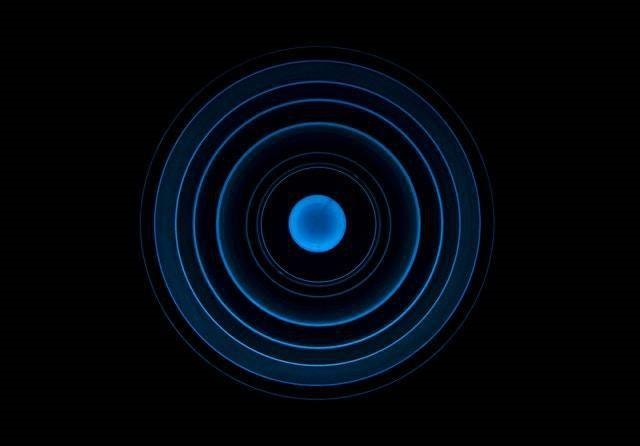
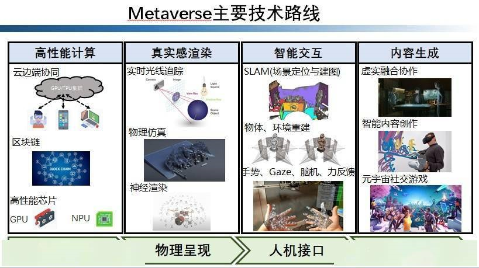

# 巨头争相布局！引爆全球的“元宇宙”是什么？核心技术有哪些？

“元宇宙（Metaverse）”无疑是2021年最热门科技话题之一。从脸书的扎克伯格全面转向元宇宙产业，到国内各大互联网公司纷纷布局元宇宙板块，再到游戏、社交、AR/VR、区块链等只要跟元宇宙沾上一点边的上市公司在股票市场一路高歌猛进……2021年，“元宇宙”可谓火遍全球。

那么，元宇宙究竟是一种什么样的技术?云宇宙的到来会对我们普通大众的生活产生什么样的影响?元宇宙是否最终能够实现？它到底离我们有多远?带着这些问题，今天一起来聊一聊。

**实际上，元宇宙并非一项单一的新技术。“元宇宙”这个词，更多地代表一种新的技术概念与方向。**

**虚实联动的交互体验，将引爆什么？**

简单来说，元宇宙可以被认为是一种新的互联网技术框架，强调面向虚实融合的沉浸式交互体验。

目前的互联网体系，基本上是“虚”、“实”二元性的。

互联网上的某个数字化的元素，实际上是现实世界中某个实体元素的简单抽象。如何理解这句话？举个例子，大家都已习惯线上购物。当我们在滑动智能手机上的购物页面时，实际上，每个商品的图标就是现实中供货商货架上所对应的实体货品的符号表示。当然，这只是一种简单的表示，它并不具备现实世界中所对应商品的丰富的物理属性，如3D形状、表面质感、气味、重量等。所以说，虚拟、现实这二元世界是被割裂的。

这种二元性，带来了人们在交互体验上的极大不适。

假设我想买个书桌，如果去实体店挑选，我一定会从各个角度好好观察这个书桌是否满足自己的审美，我会拉开抽屉看看里面是什么样子，摸一摸桌面是光滑还是粗糙，甚至想看看它如果放在我的书房，会是什么样的感觉。然而，这些基本而重要的用户感官体验，在当前的互联网应用中多数无法实现。文字、图片等符号信息并不能很好地代表用户对背后的物理实体的具体感知与理解。从这个角度讲，元宇宙技术，其实就是在虚拟世界中“再造”一个物理世界实体的深度拷贝，使其尽可能地具备现实世界中所对应实物的具体属性，比如3D形状、颜色、纹理、行为等（如果未来技术成熟，可能连触感、嗅感都可以真实复现）。

**更重要的是，在元宇宙中，同一个实例在现实与虚拟世界中是高度联动的。**

比如，作为用户的你可以在虚拟世界建立你的3D人物形象，包括容貌、体型、语言习惯、动作习惯等；你在真实世界做出什么动作、说什么话，在元宇宙中，你的虚拟形象也会同步做一样的动作、说一样的话。换言之，作为主体的你，不再是以一个“旁观者”的角色，而是作为一个主角（在游戏中，我们称为“第一人称”）“代入”到虚拟世界的各种交互之中。

更进一步，虚拟世界中的各种人物、物品、场所等，可以无缝地与真实世界中的对应实体融合在一起，达到虚实融合、沉浸交互的效果。

元宇宙作为这样一种新型互联网的运营者，在管理形式上也不再区分实体与虚体，而是“二元合一”的运行模式，其所能带来的体验提升确实能给人类带来无限遐想。

试想，如果能够将大多数物理世界的实体复制一个在虚拟世界中可以被交互的虚拟拷贝，那么，目前人类大多数的生产生活活动，都可以在元宇宙的世界中毫无障碍地运行。因此，元宇宙也可以被认为是一种新的支持社交、娱乐、交易、办公、生产、创作、生活的虚拟平台。

**真实世界的小明，如何在元宇宙中度过一天？**

现在，我们可以大胆构想一下一个普通上班族在元宇宙中的一天。

小明是一家跨国汽车公司的产品设计经理。早上，小明来到公司会议室，召开每天例行的工作进度交流会。当他带上AR眼镜后，在全世界其他办公地点的同事已经把小小的会议室“挤得满满的”（与会者的3D虚拟形象已经和会议室场景融合）。大家热烈讨论，不时通过语言、肢体动作表达自己的立场、观点、主意。在会议室中间的工作台上，正展示着3D设计方案，设计师们通过简单的手势交互，不断调整着产品的设计细节——从颜色到局部的形状，不断被优化且设计结果能实时呈现在虚拟世界中。终于，方案敲定了，只要一键传输，就能发送至加工单位进行打样。

散会后，稍感疲惫的小明来到自己的办公室，接着带上一个VR头盔，选择了一个秘密花园的场景，想让自己放松一下。瞬间，他“来到”了一个阳光明媚、草绿花红的寂静花园中。环顾四周，看看这些美丽的花朵，毫无疑问，他的心情得到了些许治愈。很多人都幻想过这样的情景，就是从现在的世界“跳”出去，来到一个世外桃源去清静一下，哪怕1分钟也好。元宇宙的技术，就给每个人打开了平行宇宙的大门，在单一物理宇宙中受限的种种可能，在平行宇宙中都可以找到相应的可以飞翔的翅膀。

当然，元宇宙世界的想象力是不受物理世界约束的。

可以想象，在小明的寂静花园中，在高高低低的各色植物枝头所挂着的，可能不是果实，而是各种各样的商品；小明可以在花园中，随意“选购”今天晚上要吃的东西、零食，一键支付。甚至，小明可以在某个枝头，取下并“试穿”自己喜爱的衣服，一键切换到第三人称视角观赏自己穿上新衣服的样子，决定买不买。当然，晚上小明下班时，所有在元宇宙中购买的商品，其实体产品早已快递至家中了。

作为大众，我们可以期待元宇宙即将给生活生产方式带来的深远影响。

沉浸式的体验，将大大降低人与人、人与社群之间的沟通交流成本，缩短时空的距离。试想，如果人类绝大多数工作、会议可以在虚拟的、沉浸式的会场进行、那么全世界每年可以节省多少汽车和飞机的燃料使用与碳排放？！

由于万物皆可在元宇宙找到对应的数字拷贝，沟通的边界也因此被打破。在虚拟世界中，你可以跟你的宠物，甚至是毫无生命的物品进行拟人式的互动，生命的形式或许也能得到外延。对于设计、创造类的工作来说，在虚拟世界中，创作和生产效能也将得到极大提升，并且由于信息发布效率提升以及创作门槛的降低，使得人人都是元宇宙的内容提供者。即使是传统的制造业与农业，也将得益于虚拟化的“需求-设计-生产-物流”一揽子平台支撑，真正做到定制化的生产。

**“3D的互联网”涉及哪些前端技术？**

再从技术角度看，有业内人士认为，元宇宙技术应该被理解为现有各种技术的组合升级，可以说是“3D的互联网”。到目前为止，这仍是十分恰当和精妙的总结。元宇宙中所涉及的前端技术主要包括感知模块、内容创作模块、以及真实感渲染模块。

其中，感知技术主要包括对于环境和用户主体的态势感知。

前者主要是指对于场景进行三维重建，同时恢复颜色、纹理、光照、材质等细节，并且对于场景中所有的对象进行语义的理解，包括各对象的标签属性、场景中动态的人和物的动作行为等；后者主要针对用户进行建模，实时恢复出用户的位置、动作姿态、运动状态等。目前高端的AR/VR眼镜都带有此类功能，经常被称为“6-DOF估计”，主流的SLAM技术可以同时恢复观察者的姿态以及场景三维结构。不过，这些技术目前的精度和稳定性都还不够理想。

元宇宙的一个主要特点在于虚实融合。因此，虚拟内容的生产技术是元宇宙的核心，不受制于物理世界约束的天量虚拟内容的产生是价值创造的源泉。

由于交互实时性、高通量的要求，人工的内容生产，比如传统的游戏、电影等，远远满足不了元宇宙应用的需求。而基于人工智能的内容生成技术是目前最炙手可热的方向，基于深度学习，尤其是对抗生成（StyleGAN），BERT-Transformer（VQ）等技术。

目前计算机已经能够“无中生有”出人物与景色图片、动作视频、3D物品和建筑等数据，不过，对于实时以及虚实融合的要求，目前的内容生成技术在保真性、可编辑性方面还有相当长的路要走。

当然，作为元宇宙最终输出端，渲染技术直接决定了使用者的沉浸式体验质量，而真实感渲染技术是元宇宙技术栈上的皇冠。真实感渲染技术目前多见于好莱坞顶级电影制作（如《复仇者联盟》系列）以及大型3A游戏中，其核心技术要点就是通过光线追踪等方法，对物理规则进行高精度仿真。

目前的光线追踪技术已可做到以假乱真的全局光照，使得用户感觉不到虚拟物品和周围环境中的真实物体的光照违和感，而物理仿真则使虚拟的空间也符合近似真实世界的物理规则（流体、碰撞、运动等）。不过，受限于算力功耗等约束，目前这些技术尚未大规模运用于终端设备。另一方面，深度学习与传统的光线追踪、物理仿真技术的结合应运而生（例如：NERF、AI光场重建等），旨在减少仿真的复杂度从而实现端侧落地。

除了上述描述的主要前端技术，在后台支撑平台运行的大规模超级计算技术，以及维持虚拟世界中高可靠信用体系的区块链技术等也是元宇宙的重要技术支柱。

**搭建元宇宙，有哪些技术难题有待突破？**

不过，罗马不是一天建成的。要想最终实现我们所期待的元宇宙，还有一系列技术难题有待突破。至少，目前以下几个关键技术始终困扰着相关领域的科学家与技术开发人员。

**１、新型显示技术**

沉浸式的体验必然要求沉浸式的显示技术，目前在AR/VR显示领域，无论是显示器件还是图像处理与渲染算法，尚不能完全满足元宇宙应用的技术指标要求。市面上主流的AR/VR显示器件（主要是光学波导片）大多存在着重量大，功耗大，解析度差，色偏严重，常伴有眩晕感等问题，要获得一款又轻又好的显示模组，需要材料学与光学的重大突破。

**２、算力约束**

从计算架构角度看，元宇宙必然是一种“云-边-端”协同的模式。然而，目前无论是云端还是终端，主流芯片的算力储备远远满足不了元宇宙应用的要求。特别是端侧算力瓶颈巨大，这是因为端侧不仅承担了部分智能感知算法，且更重要的是承担了最核心的虚实融合的真实感图像渲染算法，这类算法算力要求巨大且要求超低功耗，目前主流的端侧计算芯片均不满足如此严苛的技术指标。

**3、低时延通讯**

元宇宙的核心在于无处不在、无时不在的交互，这些交互了产生天量的实时数据通讯需求。目前5G技术是否能够完全满足如此高带宽、高并发的实时通讯，依然是一个未知数，也许我们要等到6G甚至7G时代的到来才能圆满解决这些问题。

**4、新型传感器技术**

元宇宙应用对于用户态势感知的需求是前所未有的，对于用户全维度的信息感知（例如外观、位置、姿态、运动、各种生命体征、甚至心情、意图等）需要轻便而高可靠的全系列新型可穿戴传感器。

元宇宙将给我们带来无限的可能，大众可以准备拥抱它所带来的生活和工作方式的改变，期待生活更加美好，人生更加精彩。

而对于相关的企业与投资机构，笔者在这里想说的是，与其热衷于概念炒作，不如沉下心来积极投入到元宇宙相关支撑技术的研发投入中来。毕竟，如果能突破芯片、显示器件、传感器、计算架构等“卡脖子”的关键核心技术，未来才真正无可限量。