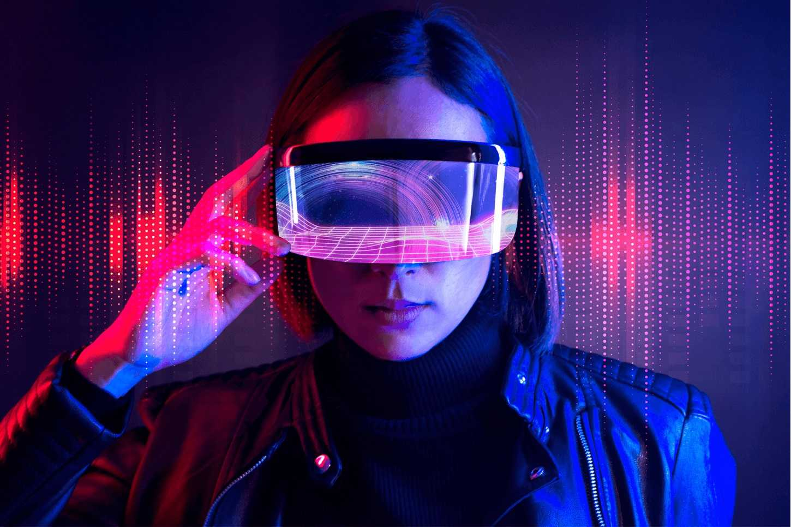

# 元宇宙是什么？运用了哪些技术？

行动装置的普及与网路速度的提升，在消费、产品购买、社交或玩游戏等，都以无法想像的数字在突飞猛进，加上近几年疫情肆虐，有许多从未接触过网路的人，也不得已开始学习如何使用。在这些条件的推波助澜下，虚拟世界的环境开始兴起，大众不再刻意区分真实存在与数据化的虚拟存在，并开始希望朋友、个人所有物与体验都能在虚拟世界中实现，而「元宇宙」就是这样的存在。

####  元宇宙是什么？

##### 

「元宇宙」是由＂Meta（超越）＂与＂Verse（宇宙）＂组成，描述互联网未来迭代的概念，在一个共享并持久的3D虚拟空间中组成可感知的虚拟宇宙，其中包含硬体、使用者、用户产生的内容与用户之间的互动关系，这将会是未来网路社群的型态。

简单来说，元宇宙其实就是一个虚拟空间的集合，由AR、VR与互联网等技术建构而成，为平行于现实世界且高度互通的虚拟世界，这样的概念最早起源于尼尔·史蒂芬森在1992 年的科幻小说《雪崩》，描绘一个虚拟世界中，使用者可以拥有自己的虚拟替身，并根据自身想法做任何想做的事情，从此之后，「元宇宙」的概念也随之在科幻电影中出现，到「一级玩家」的虚拟世界，已普遍被认为是元宇宙的最终型态代表。

#### 元宇宙的特性

##### 

- 社交性：与其他人能共享同一个虚拟场景，并在虚拟世界中有真实的存在感。

- 无硬体限制：能利用不同的硬体来进入虚拟世界，可以通过眼镜、手机、平板、电脑或穿戴式的装备与虚拟世界进行连结。

- 用户产生的内容：元宇宙有很大一部分是创作者驱动的，并由用户们自行制作或增强的内容与体验来丰富整个虚拟世界。

- 经济活动：在虚拟世界中拥有加密货币功能齐全的经济体系，也提供交易、投资与真实的所有权。

- 连结性：用户可在虚拟世界中无缝跳转，并通过接入点将虚拟与真实的产品混合权的形式与真实世界交互作用。

#### 元宇宙的技术

##### 

随着疫情爆发，远端办公变成许多人的生活常态，也让「元宇宙」的概念重新被提起，而这之中关键的技术就是人工智慧、物联网、虚拟实境（VR）、通讯技术（5G）、脑机介面与区块链等。

- 人工智慧：在元宇宙中包含大量的图像资料与用户的活动纪录，透过这些资料能训练人工智慧，打造良好的体验，像是NPC虚拟角色的互动，或不同场景提供的资讯等。

- 物联网：物联网能作为现实世界与元宇宙的桥梁，透过从现实生活中收集用户的使用行为数据，能进行运算后并协助做出决策，进一步提供更好的用户体验。

- 通讯技术（5G）：5G能带来更高的传输速率，更低的延迟与数台设备连接等特性，并提升扩增实境的泛用性，紧密连结线实与元宇宙。

- 脑机介面：这项技术对于元宇宙有加强沉浸式体验的潜力，藉由外部刺激让大脑产生对应的感觉，虽然目前要实际运用到大众生活中还有一段距离，但若成熟后，将会为元宇宙带来更大的影响。

- 区块链：区块链能保有资产交易纪录，并有不可逆、高安全性与效率提升的优点，像是虚拟货币就是区块链的一种应用，而这项技术能让元宇宙中金融服务更加具有效力，也能提升用户的信赖程度。

#### 制造业要如何运用「元宇宙」？

##### 

元宇宙会如何在制造业中实现呢？很多业务因疫情的关系被迫暂停，在协助操作、装配、检修或巡检等，也无法仅透过语音或文字的方式远端进行指导，若是特地过去，又会花费太多时间在通勤与隔离，甚至会有染疫的风险，因此「元宇宙」的实现显得十分重要，综合运用了5G、空间计算、AR等技术，以第一视角的方式进行跨国的设备安装调试、产线巡检、远程运维、产品售后及员工培训等，不仅能提高效率，也能降低成本，对制造业来说是非常有影响力的。

#### 结语

元宇宙的概念虽在很早就被提出，但这个庞大的技术概念需要许多技术的协助才能完整，在疫情的肆虐下，让许多人对于元宇宙的概念有了更多的想像，从现有的虚拟会议室，相较于过往的语音通话，更有面对面沟通的氛围，而这样的构想可被视为元宇宙的小开端，虽然元宇宙的概念还需要一段时间才能更加成熟，但对于未来的发展我们可以满怀期待，一起见证新科技时代的来临。