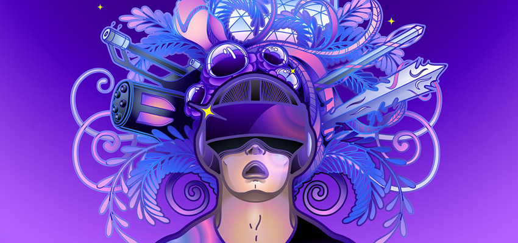
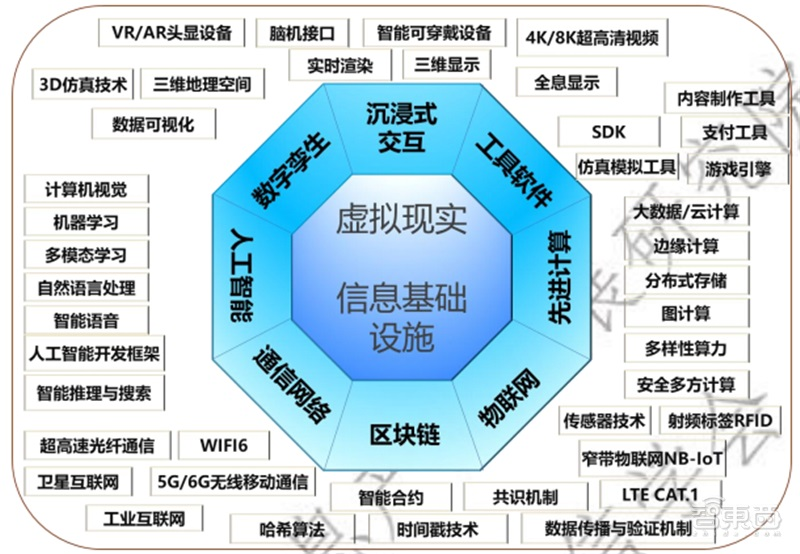

# 元宇宙产业链生态白皮书出炉！技术体系、投融资一文看懂

元宇宙（Metaverse）的概念最早由美国作家于 1992 年提出。2021年 3 月，美国 Roblox 公司首次将“元宇宙”写进招股说明书，引发了社会各界的关注。2021 年 10 月，Facebook 更名为 Meta，引发了“元宇宙”概念第二波热潮。国内外巨头企业纷纷布局元宇宙领域。我国一些地方政府也积极布局元宇宙，上海、武汉、合肥、无锡、杭州、南昌、厦门等地先后提出重点发展元宇宙相关产业。元宇宙成为各界关注热点，新模式新业态不断涌现。

**《元宇宙产业链生态白皮书》**

# 一、元宇宙发展情况

## 1、**全球元宇宙发展现状及特点**

美国率先推出元宇宙概念，拥抱创新的同时积极关注数据安全与加密货币监管。对于加密货币实行牌照化管理，因州而异，但框架逐步完善，可执行性强，有效遏制了初期区块链和数字货币领域出现的乱象。

韩国表现出对元宇宙强烈的紧迫感，已出现从用户群体到平台搭建者共同营造的元宇宙热潮，政企合作共同布局该领域，2021 年 11 月 3 日，首尔市政府制定了全球第一个中长期元宇宙政策文件“元宇宙首尔基本计划（Basic Plan for Metaverse Seoul）”，宣布建立名为“元宇宙首尔（Metaverse Seoul）”的元宇宙平台。

2021年 7 月，日本经济产业省发布了《关于虚拟空间行业未来可能性与课题的调查报告》，归纳总结日本虚拟空间行业亟须解决的问题，以期能在全球虚拟空间行业中占据主导地位。11 月，日本成立“一般社团法人日本元宇宙协会”，将与金融厅等行政机关相互配合，启动市场构建，力争使日本成为元宇宙发达国家。

美国作为元宇宙开拓者，底层技术领先，产业布局全面。Meta、微软的 XR 头显设备占据 XR 半壁江山，占据了元宇宙的硬件接入口；Amazon、微软、Google、IBM 等科技巨头在云计算领域的市占率排在全球前列，目前全球 90％以上大型游戏公司依托 Amazon 云在线托管。此外，在算法方面，Google、Mate、亚马逊、微软等科技巨头纷纷布局基础算法框架，开发 TensorFlow、MXNet、CNTK、Caffe 等一批主流人工智能算法框架；底层工具方面，Unity 开发的游戏引擎、Epic Games 的虚幻引擎、Decentraland 的经济系统等，为元宇宙世界创作者提供了强大的创作工具。

**社交与游戏方面**，典型的入局者为 Meta，目前已形成了相对全面的业务布局，莉莉丝、罗布乐思等游戏公司相继推出元宇宙相关游戏，索尼依托日本 ACG 产业积累及丰富的IP 资源，旗下 PlayStation VR 在全球销量排名前三。**虚拟数** **字人方面**，目前已有众多公司或机构入局虚拟数字人，且技术的仿真效果更加成熟，如入学清华的首个 AI 虚拟学生“华智冰”、阿里的 AYAYI、抖音 UP 主柳夜熙等。此外，从娱乐等应用场景向外延伸相应的技术应用已应用在演出及会议等领域，2021 年 11 月，贾斯汀·比伯与虚拟音乐会公司 WaveVR 合作，向全球歌迷献上了一场 30 分钟的“元宇宙演唱会”。

**在工业制造方面**，美国已将元宇宙成果应用于工业制造领域，宝马使用 Omniverse 设计整个工厂的数字孪生体系，在真实生产新产品前，完成设计、模拟、优化等一系列复杂的过程。

**生态层面，**韩国科学技术和信息通信部在 2021 年 5 月发起成立了由政府领导、囊括 200 多家公司和机构包括 SK 电讯、现代汽车、韩国移动互联网商业协会等的“元宇宙联盟”，合作进行元宇宙层面的道德与文化实践，分享技术趋势及见解，并启动联合开发项目。

中国在各地政府、企业的助推下，相继成立了长三角元宇宙联盟、广州元宇宙创新联盟等产业联盟，致力于协同上下游推进元宇宙发展。三星等巨头也积极为元宇宙搭建资本基础，推出元宇宙基金并大受欢迎。2021 年11 月，英伟达、Roblox 等四家知名科技巨头高管围绕“元宇宙愿景”举行大型讨论会。国内互联网企业抢先布局，通过并购等方式不断完善产业链体系，形成了以龙头企业为核心，版图不断扩展的生态。

## 2、**我国元宇宙发展现状及特点**

**各地相继出台支持元宇宙相关政策，抢占元宇宙先发优势。**部分城市在规划、政府工作报告中先后提及元宇宙。目前，杭州未来科技城发布 XR 产业发展计划，布局元宇宙，推动产业升级；无锡发布了《太湖湾科创带引领区元宇宙生态产业发展规划》，提出打造国内元宇宙生态产业示范区；北京表示将推动组建元宇宙新型创新联合体，探索建设元宇宙产业聚集区；成都布局成立元宇宙产业联盟，将构建交子大道元宇宙中心；上海市经信委印发的《上海市电子信息产业发展“十四五”规划》中提到对元宇宙的产业布局；厦门市工业和信息化局、厦门市大数据管理局联合发布《厦门市元宇宙产业发展三年行动计划(2022-2024 年)》(以下简称《计划》)，力争到 2024 年，元宇宙产业生态初具雏形。

近年来我国 ICT 产业快速发展，并逐步在虚拟现实/增强现实（VR/AR）终端、通信网络设备、数通设备、液晶显示面板、软件交互等领域取得显著进步，构筑起产业发展长板。一方面，我国 ICT 行业领域，消费市场规模庞大、行业级应用场景种类繁多、企业应用创新活跃，为“元宇宙”技术蜂巢爆发创新提供有力的市场与智力支撑基础。另一方面，底层技术的缺失也带来了重大的挑战。一是 VR/AR 头显设备，手机、电脑、电视等消费终端提供“元宇宙”现实世界与数字世界交互的接口或界面，扩大我国终端整机既有制造优势与加速推动“元宇宙”新型智能硬件普及与应用推广爆发，将形成有力互推作用，带来广阔的发展前景。二是缺少 XR 专业芯片，缺少 XR 底层开发平台及工具，在“中美贸易”摩擦的今天，给“元宇宙”的发展带来了重大挑战。

# 二、**元宇宙的技术体系与产业链**

元宇宙的“元”具备创新、创造的特征，“宇宙”代表时间、空间和人的概念。元宇宙是以信息基础设施为载体，以虚拟现实（VR/AR/ MR /XR）为核心技术支撑，以数据为基础性战略资源，构建而成的数字化时空域。元宇宙具有虚实融合、去中心化、多元开放、持续演进等特点。伴随新技术的迭代升级和新应用的融合创新，“元宇宙”的内涵外延将不断拓展延伸。

技术演变为“元宇宙”构建平台载体。现实世界技术发展日新月异，为“元宇宙”发展带来契机。以物联网、互联网、5G/6G 网络、Wifi6 等通信设施及技术为基础，构建“元宇宙”基础设施，为虚实融合及交互提供平台载体。运用云计算、人工智能、区块链等为代表的数字化新技术，将真实宇宙数字化，生成虚拟宇宙，虚拟宇宙具备真实宇宙的所有特性。最后在大数据中心、智能计算中心、边缘计算中心等算力基础设施上，对虚拟宇宙进行再创造，达到虚实融合。

以虚拟现实为核心的信息技术构成“元宇宙”技术主干，推动多类型新兴技术融合创新发展。“元宇宙”以虚拟现实（VR/AR/ MR /XR）头显、智能可穿戴、脑机接口等打通与现实世界沉浸式交互的接口，以数字孪生、三维仿真等建模仿真工具、内容制作工具构筑虚实交互体验，以实时渲染、4K/8K 超高清视频、三维/全息显示等实现真实、顺畅的交互呈现，最终在基础芯片、元器件、操作系统等软硬件技术基础上构成“元宇宙”终端入口。

▲元宇宙技术体系

“元宇宙”产业链分为基础设施层、核心层和应用服务层。

.jpg)

▲元宇宙产业链全景图

**基础设施层**包含通信网络基础设施、算力基础设施和新技术基础设施，主要负责数据的实时传输与分发、存储计算与处理、挖掘与分析决策。

**核心层**由终端入口、时空生成、交互体验、产业平台、虚拟社会架构组成。其中终端入口包含接入“元宇宙”的各类终端以及这些终端所需的基础软硬件；时空生成包含将真实物体数字化所需的技术工具；交互体验包含“元宇宙”中的各类交互技术；产业平台包括游戏平台、社交平台等；虚拟社会架构包括安全体系、信用体系等。

**应用服务层**包含消费端应用服务、行业应用端服务、政府端应用。完整的“元宇宙”形成后，其将赋能工业生产、医疗健康、教育培训、文化娱乐等传统行业，创造信息消费新业态新模式，对人类的生产生活方式带来颠覆式变革。

按产业链各环节划分，元宇宙重点企业可以归纳为下图所示。

.jpg)

▲元宇宙产业链全景图

# 三、**元宇宙基础设施层发展情况**

## 1、**通信网络基础设施**

通信基础设施作为支撑“元宇宙”运行的血液系统，涵盖了光纤通信、5G/6G 移动通信、WIFI6、工业互联网等多类型系统设施，为元宇宙海量元素互联、交互提供连接保障。尤其以 5G、千兆光网为代表的“双千兆”网络是当前“元宇宙”建设发展的重要基础设施，基于 5G 技术增强型移动宽带、超可靠低时延和海量物联三大特性，为元宇宙应用爆发提供坚实连接基础。下面，以“双千兆”网络建设应用和技术走势为例，分析元宇宙网络通信基础设施发展特点。

**“双千兆”网络顶层设计持续强化。**2021 年和 2022 年政府工作报告提出加大 5G 网络和千兆光网建设力度，推动 5G规模化应用；各部委也相继印发《“双千兆”网络协同发展行动 计 划 （ 2021-2023 年 ）》、《 5G 应 用 “ 扬 帆 ” 行 动 计 划（2021-2023 年）》等行业指导性文件，为我国网络基础设施建设和产业创新发展提供了支撑保障环境。在国家相关顶层规划指导下，各省、市、自治区加快布局，相继印发 5G 网络基础设施、产业应用创新、行业融合应用等方面的实施方案或行动计划，有力推动国内“双千兆”网络广泛部署。

**5G标准化工作持续推进。**5G 作为支撑经济社会数字化、智能化转型的关键新型基础设施，相关标准、专利布局对产业发展具有重要意义。全球疫情蔓延掣肘 5G 技术标准时间冻结。2018 年主要面向 eMBB 应用场景的 5G Rel-15 NSA 和SA 组网标准冻结，受新冠疫情影响，重点面向工业 IoT 和uRLLC 等领域的 Rel-16 标准推迟至 2020 年 7 月冻结，原定于2021年底冻结的Rel-17标准又进一步迟滞至2022年6月，Rel-17 标准潜在方向将包括增强覆盖、毫米波通信、面向应急通信和垂直行业应用的终端通信等方向。

**网络新基建快速部署筑牢数字底座。**我国自 5G 商用以来基建部署持续加速，各省市从站址规划、资源开放、用电优惠等方面给予有力支持，截至 2022 年 2 月末，我国 5G 基站建设总数达 150.6 万，覆盖范围不断扩大，且有望在 2022年底建成 200 万座，为“元宇宙”等创新应用提供基础支撑。我国各省市“双千兆”网络将持续展开部署完善，根据《“十四五”信息通信行业发展规划》，到 2025 年每万人拥有 5G 基站数量达到 26 个，各省市在网络基础设施建设方面相继做出规划，将为“元宇宙”高速、海量链接等需求奠定网络底座。

**“双千兆”网络赋能“元宇宙”创新应用百花绽放**。据工信部《“十四五”信息通信行业发展规划》新闻发布数据显示，截至 2021 年 11 月，我国 5G 应用创新案例已超过 1 万个，覆盖 22 个国民经济重要行业。其中，空中课堂、虚拟实验室、智慧校园等应用初具规模，超过 600 家三甲医院开展了5G+急诊急救、远程诊断、健康管理等应用，增强现实导游、4K/8K 直播等应用在信息消费领域快速发展。此外，电信运营商加速整合数字新媒体业务，提升网络承载能力支持 XR应用发展。2021 年 11 月 11 日，中国移动通信联合会成立元宇宙产业委员会，宣告国内首家元宇宙行业协会正式成立。

## 2、**算力基础设施**

算力基础设施，作为“元宇宙”虚拟人、虚拟课堂、虚拟搬动等应用中大规模数据要素挖掘、分析、应用的算力底座，依托数据中心、智能计算中心等实现大数据、云计算、边缘计算、分布式存储等能力支撑。

**经济生产生活方式变革加速数据中心数字化进程。**疫情常态化防控影响下，远程办公、在线娱乐等需求激增，社会治理数字化进程加快，信息处理、存储量急剧增长，为满足数字化建设需求，全球各地对数据中心 IT 基础设施的投资持续并进一步扩大。数据中心数字化进程的推进不仅保障远程办公、电商消费等平台经济新业态新模式发展，也为“元宇宙”To C、To B 全模式业务创新提供算力保障支撑。

**国外科技巨头引领“元宇宙算”力基础设施布局。**英伟达加快卡位元宇宙 GPU、AI、Omniverse 底层硬件，提出“GPU+CPU+DPU”3U 一体的数据中心新计算架构，构建Omniverse 服务器和 Omniverse 数据中心，布局自动驾驶、机器人、VR 等应用领域。谷歌数据中心主要用于搜索、Gmail、YouTube 等业务服务，不断强化数据中心设施能源效率，2021年 PUE 约为 1.1，显著优于行业平均值 1.59，并计划于 2030年实现全部数据中心无碳能源运行。英特尔 2022 年投资者会议发布新版数据中心路线图，提出客户端能效核与性能核并存，基于首款采用 10nm 制程的第三代至强可扩展处理器构筑全新数据中心平台，并搭配傲腾持久内存与存储产品组合、FPGA 等方案，可提供数据中心、云、5G 和智能边缘等领域中计算性能与工作负载优化。

**国内政策利好驱动，算力基础设施布局日趋优化。**2020年以来，《加快构建全国一体化大数据中心协同创新体系的指导意见》《全国一体化大数据中心协同创新体系算力枢纽实施方案》等新一轮政策推动下，数据中心区域分布由北上广深超一线城市集中分布，逐渐向一线周边城市以及中西部地区转移，截至 2020 年末，河北、天津、江苏等一线城市周边地区分散部署的数据中心在建机架数位列全国前三。基于政策引导、冷凉气候条件以及能源禀赋等条件，中西部城市也在加速数据中心建设，数据中心网络、运维质量不断完善，冷存储业务、离线计算业务逐步上线。

**数据中心云计算能力持续向边缘计算能力下沉。**物联网、5G、工业互联网等应用持续发展以及超高清、虚拟现实等边缘刚需场景涌现，将云计算能力由中心下沉到边缘，以云边协同满足多业务场景需求。未来超大规模及企业级数据中心将持续关注运营能力下沉边缘计算站点，包括更强的智能化及控制能力、更加重视可用性及热管理，更多关注各系统的能效表现。

## 3、**新技术基础设施**

**区块链技术是元宇宙运行的核心技术，并塑造元宇宙内部经济系统。**不可篡改、不可复制的唯一性、智能合约、去中心化作为区块链的四大基本特征，有效助力元宇宙内部经济系统搭建。元宇宙不是简单的虚拟世界，而是类现实的平行世界，这意味着元宇宙内部需要一套完整并可独立运行的经济系统，且元宇宙内部产生的数字资 产能在现实世界自由流通，而区块链的不可篡改、不可复制、智能合约、去中心化的特点能让这种想法真正落地。区块链技术目前已经发展至 NFT 阶段，开启了数字内容资产化时代，受到大量巨头追捧和资金注入，国内互联网大厂也开始尝试数字藏品。

**人工智能技术是元宇宙重要的驱动引擎，为元宇宙大量应用场景提供了支持。**围绕海量数据分析处理需求而产生的分布式计算、高性能计算、云计算、雾计算、图计算、智能计算、边缘计算、量子计算等“算力”体系将成为元宇宙发展的重要引擎。人工智能、深度学习等“算法”为元宇宙提供智能化支撑，而以 5G、NB-IoT、TSN 为代表的现代通讯网络将数据、算力与算法紧密地连接在一起，实现了协同作业和价值挖掘。而对大数据的充分挖掘而形成的智慧支撑系统，将成为未来元宇宙高质量发展的强大动力。

# 四、**元宇宙核心层发展情况**

## 1、**终端入口**

相较于其他终端入口，虚拟现实（VR/AR/MR/XR）头显的感知体验和交互特性直接决定了元宇宙对于用户的吸引力，其也是实现计算、感知、交互、融合等功能的重要载体。下文以虚拟现实头显为主要对象，在以下几方面进行分析：

**全球虚拟现实头显市场迎来高速增长，Meta及微软分别居于VR及AR终端市场龙头地位。**IDC 数据显示，2021年全球 VR/AR 头显出货量达到 1123 万台，市场同比增长92.1%。其中 VR 头显出货量达 1095 万台，2C 端 VR 头显出货量首次超过 2B 端，VR 头显开启消费级市场之路。预计2022 年全球 VR 头显出货量将突破 1573 万台，同比增长43.6%。Meta 旗下 Oculus Quest 2 出货量约 880 万台，市场占有率 80%，已成为全球 VR 头显市场的代表性产品。AR眼镜市场龙头地位被微软占据。国内品牌方面，字节跳动旗下 VR 头显品牌 Pico 市场占有率为 6%，全球第二。我国 VR头显设备市场较小，2021 年出货量不足百万台，其中 Pico、爱奇艺瓜分了过半市场份额。虚拟现实头显设备持续发展及迭代，离不开芯片、光学、显示等核心器件的有力支撑。

**芯片：高通骁龙XR2成为主流选择，本土化产品实现初步应用。**处理器芯片方面，2018 年全球首个 XR 专用芯片高通骁龙 XR1 平台改变了整个虚拟现实头显的格局，2019年高通推出全球首款支持 5G 的 XR 平台——骁龙 XR2，其支持 3K 单眼分辨率、8K 360°全景视频、七路并行摄像头，目前已成为2000-4000元消费级产品VR/AR头显的主流选择。

**光学器件：VR与AR头显采用的光学方案明显不同。VR光学器件主要以菲涅尔透镜方案为主，pancake方案市场逐步扩大。**目前 Meta、Pico 等主流 VR 设备均采用菲涅尔透镜方案，但由于焦距问题头显相对笨重；pancake 方案可将整机厚度减少 48%、模组厚度减少 56%、整机重量 40%。

**AR光学器件主要分为棱镜、自由曲面、BB（BirdBath）和光波导等方案，**其中棱镜方案主要用于骑行头盔等辅助产品，但存在视场角小的问题，典型产品为 Google Glass；自由曲面方案采用具备一定反射/透射（R/T）值的自由曲面反射镜，可全覆盖佩戴者的眼睛，给用户带来较好的成像质量，但存在重量大、光机透过率较低的问题，代表性产品有日本爱普生公司的 BT-200，美国梦境视觉公司的 Meta2 系列 AR 眼镜；BB 方案则是将来自显示源的光线投射至 45 度角的分光镜上，分光镜具有反射和透射值（R/T），允许光线以 R 的百分比进行部分反射，其余部分则以 T 值传输，用户可同时看到现实世界的物理对象，以及由显示器生成的虚拟影像。目前市面上的消费级 AR 眼镜多采用 BB 方案，如 ODG R8 和 R9，其中 ODG 有 50 度的视场角，其光机厚度则超过 20mm，透过率较低。

光波导方案分为几何光波导和衍射光波导，其中几何光波导又称阵列光波导，其采用半透半反镜阵列作为出瞳扩展器，服从的是入射角等于反射镜的反射定律，对构成全彩显示的三原色的入射光无色散作用，从而可以保证画面无明显的色彩偏差，但由于目前生产工艺及制造的瓶颈，几何光波导显示有明显的光栅条纹，影响可视性。衍射光波导采用的是衍射光栅作为耦入耦出器件，目前使用较多的衍射光栅方案有 Hololens 的倾斜光栅、Magic Leap 的二元光栅以及 WaveOptics 的圆柱光栅，但无论何种形式光栅，均会出现色散效应，所以无法做到较好的色彩表现，同时衍射光波导的光效相比几何光波导也较差。

**近眼显示器件：VR 与 AR头显对显示器件需求差别较 大。VR 头显追求高分辨率、大视场角，**目前主流产品采用TFT-LCD（快速响应液晶），其存在显示颗粒感严重、重量大问题。苹果预计 2022 年第四季度发布 VR 眼镜，将搭载索尼 4K Micro OLED 显示屏，相对于 TFT-LCD 而言，其像素尺寸及屏幕大小均能得到稳步进步。

**AR** **头显则追求轻量型、** **低功耗和高亮度，**目前 AR 头显主要有 4 种显示器件，分别是硅基 LCoS 显示器、硅基 Micro OLED 显示器、硅基 MicroLED 显示器以及 DLP 显示器。硅基 LCoS 显示器的优点是分辨率高，亮度随光源亮度变化，缺点是成像系统复杂，对比度较低；硅基 Micro OLED 显示器的优点是自发光，成像系统简单，缺点是亮度低，寿命较短；硅基 Micro LED 显示器的优点是自发光，成像系统简单，亮度与对比度高，缺点是目前彩色技术方案不够成熟，整体良率较低；DLP 显示器的优点是光效高，缺点是成像系统复杂，分辨率较低。目前业界普遍认为 3-5 年内 AR 头显采用的技术方案为硅基 LCoS显示器与单色硅基 Micro LED 显示器，而 5 年后则基本采用彩色硅基 Micro LED 显示器。

.jpg)

▲虚拟现实头显当前痛点、相关硬件配置及未来趋势

## 2、**时空生成**

**国外企业已建立深厚的技术壁垒，我国企业未推出市场主流产品。**我国在此方面起步晚于国外优质同行 15 年以上，国外领先企业已建立深厚的技术壁垒，当前我国尚无与全球领先企业抗衡的企业。现阶段较为知名的企业为美国的 Unity Technology 和 Epic Games，两家企业均有 15-25 年的发展历程，主流软件开源且历经多轮迭代功能完善，在动画效果、影视渲染、物理及光影效果明显优于其他产品。国内相关软件存在商用成熟度不高、可扩展性有限、应用范围较窄、市场渗透率较低等问题。

**3D** **建模：静态扫描广泛应用，动态光场指引未来。**3D建模技术目前主要包含静态扫描技术与动态光场重建两类。静态扫描技术仍为主流，其中相机阵列扫描重建快速发展，目前可实现毫秒级高速拍照扫描（高性能的相机阵列精度可达到亚毫米级），该技术在国际上已成功商业化，广泛应用于电影、游戏创作。相比静态扫描技术，动态光场重建在搭建精细几何模型之外，还可获得动态数据，高品质呈现光影效果。Microsoft、Google、Intel、Meta 等巨头公司都在积极展开相关研究。

**实时渲染：硬件与算法突破，渲染真实性与实时性大幅提升。**渲染指对三维物体或虚拟场景加入几何、视点、纹理、照明和阴影等信息从而达成从模型到图像的转变，渲染决定了最终作品的质量与风格。渲染技术分为离线渲染和实时渲染，由于“元宇宙”更加注重实时的沉浸式交互，因此实时渲染技术更适用于“元宇宙”。实时渲染指图形数据的实时计算与输出，其每一帧都是针对当时实际的环境光源、相机位置和材质参数计算得出的图像。与离线渲染相比，实时渲染面临可渲染时长短、计算资源有限的问题。随着图形处理器及算法的升级，渲染的真实性和实时性均有明显提升。

**开发引擎：第三方商业引擎占比持续提升，Unity 与Unreal 形成双寡头格局。**动视暴雪（无尽引擎）、EA（寒霜引擎）、Take-Two（Rage 引擎）等游戏巨头组建庞大的研发团队独立开发自研引擎，国内头部游戏厂商均有自研引擎，但仅限于内部游戏使用。但由于中小厂商或新工作室受制于开发周期与投入预算，同时开发引擎所需技术与其能力不匹配，第三方商业引擎占比持续提升，2021 年 Unity 全球市占率达 49.5%，Unreal 全球市占率达 9.68%，行业双寡头格局基本稳定。越来越多的游戏厂商在商用引擎 Unity 和 Unreal基础上，针对开发特性对引擎进行深度定制化，以适配特定项目的开发。

## 3、**交互体验**

元宇宙中的交互方式包括语音交互、手势交互、嗅觉、触感、脑机接口等，但单一交互方式只可实现部分沉浸，多模态融合交互方式保障全场景交互体验。多模态交互核心是将物理人 100%投射到元宇宙中，形成虚拟化的感官交互，增强交互体验，为元宇宙全场景落地提供技术基础。

**SLAM：提供了三维数字世界的空间定位功能，决定虚拟现实终端交互自由度。**即时定位与地图构建（Simultaneous Localization and Mapping，简称 SLAM）可帮助虚拟物体空间定位，让虚拟物体获取自己的位置信息，理解真实环境中的高低起伏、障碍物、遮挡关系。SLAM 在虚拟现实中最主要的应用就是位置追踪，其主要影响虚拟现实终端的交互自由度——3DoF 和 6DoF。目前，虚拟现实终端以内向外追踪技术（Inside-out Tracking）为主实现头手 6DoF。Inside-out依靠计算机的视觉算法实现对目标的追踪。通过在虚拟现实终端上安装摄像头，以实现检测外部环境变化，借助计算机或算法芯片计算虚拟现实终端的空间位置。

**语音交互：已实现标准化场景的成熟落地，非标场景仍依赖算法和数据支撑。**语音交互包括语音激活、前端处理、语音预处理、语音识别、自然语言处理、语音合成等，消除物理世界与元宇宙之间的数字屏障，使元宇宙交互能够更加实时、自然、真实，语音交互也是元宇宙中数字人所具备的基础能力之一。目前语音交互已在金融、教育、医疗、政务、电商、家居、汽车等场景中得到应用。语音交互高度依赖算法和数据支撑，受开发周期和人力成本高昂的影响，缺乏有效、足够量级的数据支撑模型算法，语音交互在非标准化场景中难以建模。未来随着机器学习技术发展，语音交互将扩大应用范围，最终实现物理世界与元宇宙的自然对话。

**动作捕捉：动捕技术侧重明显，逐步形成互补体系。**元宇宙中“虚拟人”的肢体动作主要的生成方式是动作捕捉，具体实现方式是光学式、惯性式、电磁式及基于计算机视觉的动作捕捉。**光学动作捕捉**原理是首先跟踪、识别并命名目标身上各反光标记点，得出目标的基本骨架，再通过空间中多个镜头对标记点位置进行持续跟踪，完成对运动的记录。

光学动作捕捉精度较高，但需通过相机的位置角度建立三维空间坐标，对环境要求高，软硬件造价高昂。**惯性动作捕捉**主要把集成了加速度计、陀螺仪和磁力计的惯性测量单元（Inertial Measurement Unit，IMU）绑在人体的特定骨骼节点上，收集运动目标的各部位速度、姿态、方位等数据，最后建立运动的三维模型。惯性动作捕捉技术高度适应不同的环境，成本相对较低，使用便捷，能在某种程度上弥补光学动作捕捉的缺点，但精度较低，随着连续使用时间的增加产生累积误差，发生位置漂移。

**基于计算机视觉的动作捕捉技术**使用多个不同角度的高速相机对目标进行拍摄，计算机视觉基于拍摄到的二维图像、三维形状特征还原各关节点运动信息。此类动捕技术主要使用光学高速相机，动捕对象通常不需穿着设备，精确度高，成本相对低廉，近些年兴起后获得青睐并在不同行业逐步推广；但计算量庞大、受环境影响大。

**眼动追踪：眼动追踪成为** **VR** **头显新标配，实现注视点**渲染、瞳距自调节、虹膜解锁等功能。基于眼动追踪的注视点渲染技术是优化虚拟现实设备系统资源的高效手段和核心功能，能更有效地维持高帧率和优化系统资源。例如新一代 Pico Neo 3 一体机应用了眼动追踪技术，该技术将帧率提高了 78%，进一步提升用户的沉浸式体验。根据 VR 陀螺消息，索尼 PS VR 2，以及 Meta 下一代头显 Cambria，不仅在性能规格上有所迭代，同时具备眼动追踪功能。苹果近年来曝光大量头戴式显示器的相关眼动追踪专利，例如结合近红外光源、反射镜、摄像头来对眼球活动进行捕捉和识别的专利，眼动追踪或将搭载在苹果 MR 产品。其他大厂也在眼动追踪方面进行布局并发售相关产品，HTC 推出眼球追踪版Vive Pro Eye，采用 Tobii 的相关技术；Meta 收购初创企业The Eye Tribe，发布光场摄像机眼球追踪专利。

**力反馈：使交互体验更加丰富、自然、真实。**力反馈技术是一种新型的人机交互技术，它允许用户借助力反馈设备触碰、操纵计算机生成的虚拟物体，并感知物体的运动和相应的力反馈信息，实现人机力觉交互。力反馈系统的实现过程中涉及到以下关键问题： 力反馈计算模型设计、碰撞检测、视觉与力觉的同步渲染，相应地产生了针对解决上述问题的一系列算法和接口。**力反馈计算模型**用于计算元宇宙中物体间交互时产生的力，并由力反馈设备传递给用户。目前，力反馈算法主要采用基于物理建模方法的有限元模型和弹簧—质点模型。

有限元模型能够较好地满足交互的真实性需求，但是运算量大、求解过程复杂，难以满足交互的实时性需求；而弹簧—质点模型具有建模过程简单、计算量较小、交互实时性较好的特点。**碰撞检测**用于实时检测虚拟环境中物体间的碰撞情况，为之后图形信息的绘制及力反馈信息的计算奠定基础。当前的碰撞检测算法主要采用包围盒技术。**视觉与力觉的同步渲染**用于保持较低刷新频率的视觉信息（30fps-60fps）和较高刷新频率的力觉信息（1000fps）的一致性。目前，主流的力反馈接口 OpenHaptics、CHAI3D 等都支持视觉与力觉融合的应用开发。

其中，OpenHaptics 是SenseAble 公司针对 Phantom 系列力反馈设备研发的开发工具包，包括 QuickHaptics API、Haptic Device API、Haptic Library API 三个不同层次的接口库，能够满足不同用户的设计需求；CHAI3D（Computer Haptics and Active Interface）是由斯坦福大学人工智能实验室研发的支持多种力反馈设备的开源开发工具包，它具有较好的可扩展性，允许用户在已有视觉、力觉渲染算法的基础上根据自己的需要设计新的渲染算法，也可以通过添加驱动的方法支持新的力反馈设备。

**脑机接口：已可实现听觉、视觉和前庭感觉，距离实现**全场景交互还有较长研发周期。脑机接口（BCI）是在人脑与计算机或其他电子设备之间建立直接交流和控制通路，用户可通过大脑直接表达想法或操纵设备，无需借助语言、手势或其他工具直接进行神经感知，带来超现实、完全沉浸的元宇宙体验。应用于人体的脑机，目前已可用于恢复损伤的听觉、视觉和肢体运动能力。其研究的主线是大脑不同寻常的皮层可塑性，通过脑机接口可以像自然肢体那样控制植入的假肢。目前脑机交互可以实现听觉、视觉和前庭感觉，甚至编码肢体运动。当前，Meta、Valve、Neuralink、BrainCo.等企业均有涉足脑机交互领域，但脑机接口技术的实现及应用场景落地难度较大，成熟周期预计将在 10 年以上。

.jpg)

▲元宇宙沉浸感交互要求

## 5、**产业平台**

**元宇宙助力社交平台场景化，游戏化社交体验增强元宇**宙社交沉浸感。相较于目前普及率较高的即时通讯，沉浸式社交更追求交互体验，用户将在社交平台上共享时空，进行即时互动。日本社交网站巨头 GREE 公司认为，社交元宇宙并不只是虚拟世界，让用户感受到社交性的机制更为重要，例如其旗下子公司 REALITY 为进军元宇宙，首先通过打造八个不同的虚拟空间，融入个人房间、宠物等元素，从而实现元宇宙与日常生活场景的结合。社交元宇宙不仅仅是一个网络社交空间，而是在构建一个社交生态，不同的社交生态将由不同的社交场景进行支撑。元宇宙社交多样化的玩法将充分激活社交场景，提升陌生人社交的积极性。例如 Soul 将游戏化社交体验作为其核心特征之一，通过脸基尼、3D 捏脸、多样化的群聊派对房间、Soul 狼人等游戏玩法让用户更容易建立关系。

**元宇宙助力社交平台商业变现加速。**从长期来看，元宇宙的核心在于经济体系的形成，未来的元宇宙将不仅是用户获得更好的娱乐和体验的地方，同时也会成为创造价值、实现价值和分享价值的平台，而社交元宇宙作为其中一部分，也将催生出不同的商业模式，从而进一步放大社交平台的商业化价值。在元宇宙社交平台中，用户可以在社交空间中打造“创造者经济”模式，利用元宇宙较强的 UGC 属性，创造和扩大自己的虚拟空间，并通过创造和销售原创物品赚取收入。元宇宙社交平台将拥有自己的虚拟数字货币从而形成专属的经济体系，例如 Soul 推出的 Soul 币，用户可以通过 Soul币享受虚拟世界、装饰虚拟形象、增加用户之间匹配次数、赠送虚拟礼物等各种服务。

# 五、**元宇宙服务层发展情况**

## 1、**消费端应用服务**

**虚拟人迅速发展，在各个场景加速落地**。2021 年国内数字人发展势头迅猛，打造数字人无疑是文娱产业的潮流趋势之一，伴随着各大互联网巨头对数字人市场的布局,一条较为完善的数字人商业途径已经形成。一类是通过代言、商演等营销活动变现的偶像型数字人,比如柳夜熙、A-soul、AYAYI等;另一类则是品牌主或企业主为提升目标人群用户体验而打造的功能型数字人，比如央视网虚拟主持人小 C、花西子同名代言人花西子等。在这些“成名”数字人背后,是绝大多数原创数字人面临的“投入大于收益”、“出圈难”、“变现难”“产能低”等一系列现实问题。

**文娱产业快速入局，游戏打开元宇宙新局面**。2021 年 3月，全球最大的互动社区之一及大型多人游戏创作平台Roblox 在纽交所上市，其招股书中提及的元宇宙很快掀起了一阵热潮。同月，美国游戏公司 Epic Games 也表达了其对于元宇宙领域的关注。这股热潮不仅仅席卷了海外，国内互联网大厂也加入其中，自此元宇宙开始逐步受到关注。

## 2、**行业端应用服务**

**工业元宇宙：数字孪生与智能工厂助力工业元宇宙先行**一步。工业 4.0 的概念最早出现在德国，指利用物联信息系统（Cyber Physical System 简称 CPS），将生产中的供应、制造、销售信息数据化、智慧化，最后达到快速、有效、个人化的产品供应。工业 4.0 与前三次工业革命有本质区别，其核心是 CPS 的深度融合，即把传感器等智能装置嵌入到各种物体和环境中，并且通过网络加以连接，形成物联网，再通过超级计算机和云计算将物联网和互联网整合起来，实现人类社会活动与物理系统的整合。而数字孪生技术是 CPS 的技术核心。工业 4.0 提出的智能制造是面向产品全生命周期，实现泛在感知条件下的信息化制造。基于工业 4.0 构思的智能工厂将由物理系统和虚拟的信息系统组成，称之为信息物理生产系统(Cyber Physics Production System, CPPS)。

**工业元宇宙：庞大体系带来硬件层面存储、运算、传输、** **感知等多方面新需求。**工业元宇宙相当于在元宇宙中新建了整个工业生产体系，模拟物体和人在现实中各类特征，抽象出软件层面的接口，包括行业应用层、共性应用层、模型构建层等架构。软件抽象层之下的是包括大数据、云计算、人工智能、区块链、5G 通信等在内的基础技术。而这一切技术框架的搭建都离不开底层硬件的支持，海量数据需要足够的存储空间，大量而频繁的需求需要性能更强大的处理器进行处理，快速通信需要更高级的射频器件等等。

**医疗云宇宙：**VR**、**AR**、**MR **等技术在医学成像、手术**辅助、医学教育、远程医疗、康复训练、药物研发等方面彰**显价值。**在医学影像方面，借助全息/虚拟现实显示的影像数据，可以全面观察病灶细节、深度挖掘影像信息，有助于医生削减读片时间，降低误诊率，同时患者能更直观了解病灶情况和治疗方案，促进医生和患者沟通。在手术方面，通过VR、AR、MR 等技术可提高外科手术效率，如全息影像技术可全息显示效果，全貌显示弥补微创手术视野受限等问题，减少术中风险，降低术后并发症。

**教育云宇宙：打破空间阻隔为线下教育与线上教育带来**革新。教育元宇宙可以实现云端智慧教育的统合，教师和学生以数字身份参与课堂，在虚拟教学场所中进行互动。元宇宙课堂下，VR 设备的引入能够充分重塑教学内容的展现形式，让学生“沉浸”在知识中。此外，虚拟空间的可塑性也催生了如虚拟实验室、虚拟集会等场景，将元宇宙从课堂延伸至课后活动。元宇宙和教育之间，具有天然的平行性和覆盖率，元宇宙时代人类进入到“生活就是学习，学习就是生活”的历史阶段，学习变成了终生的、全天候的内容。

## 3、**政府端应用服务**

**元宇宙进军政务服务，其核心是政务数字化转型。**当前应用于政务服务中比较普遍的可视化大屏、一网通办等技术，为政务服务带来了极大便利，但交互感不强，人性化服务程度不高。元宇宙政务服务，将打破时空界限，打造全新的交互模式，增强政务服务的体验感。引入“数字人”，结合沉浸式数字城市和数字政务大厅建设，以具体的城市文旅、城市政务服务等元宇宙场景应用，进一步提升城市治理水平、城市服务能力，同时也为市民办事来到更好的便利性和体验感。当下，元宇宙+政务仍处在发展早期阶段，政府牵头元宇宙相关布局，应加强监管力度，并尽可能地做好配套措施，比如技术研究、政策法规以及相关标准的制定等，保障其健康有序发展。

# 六、**元宇宙资源集聚情况**

## 1、**产业联盟**

自 2021 年 10 月，移动公司宣布成立元宇宙产业委员会后，各地逐步开始在政府、龙头企业的主导下成立产业联盟，充分聚合当地资源，协调产业链上下游，推动元宇宙发展。如江苏省、广州市集合省内、区内主要企业发起成立元宇宙联盟，四川成都、无锡等地以区为中心，打造产业联盟。

.jpg)

▲元宇宙相关协会、联盟

## 2、专利池

2022 年 1 月 IPwe 和 Open Meta 基金会联合宣布成立元宇宙智能专利池，第一个创始成员为 SDK Co。IPwe 元宇宙智能专利池将通过指数型技术为创新者赋能，并通过共享对元宇宙生态系统的发展至关重要的关键技术，鼓励创新技术的采用，最大限度地增加商业机会，并带来投资回报，同时保持最大的灵活性，可以根据未来商业和市场条件的要求及时改变方向。该专利池为专利持有人（创始成员）和实施者（普通成员）提供了专利管理工具，希望能够帮助专利池成员实现专利组合的价值。利用 IPwe 平台的专利许可费率提供标准化的许可条款，实现专利池的会员的收益。SDK Co的元宇宙智能专利池创新计划的首批六个商业成员包括Streambed Media、Open Index Protocol、Alexandria Labs、TrueReply、Reblika、Victory Productions 和 Worre Studios。

从专利申请数量来看，排名靠前的相关专利的申请人均为大型互联网科技企业，包括微软、三星、英特尔、索尼、LG、高通、谷歌以及 IBM，此外较为靠前的申请人还包括苹果、Meta、亚马逊等。意料之中，元宇宙技术从出现之初，即与互联网存在着不可分割的联系，其存在依托于互联网技术的支撑，其实现可以看作是互联网技术应用环节的一个前景光明的方向。

# **七、地方元宇宙产业发展情况**

近年来，国内多地政府纷纷提出建设元宇宙产业基地或产业园，出台的电子信息产业发展十四五规划提到“元宇宙”。基于元宇宙的拓展现实、虚实交互、数字孪生等特性，且其与 XR、大数据、人工智能等前沿技术和数字经济息息相关，元宇宙技术和理念被各地政府看作发展数字经济的切入点，被写入到多地政府工作报告中，元宇宙成为重要的产业发展方向。

## 1、上海

**率先将**“**元宇宙**”**纳入“十四五”规划。**上海经信委出台《上海市电子信息产业发展“十四五”规划》，提到“要加强元宇宙底层核心技术基础能力的前瞻研发”，这是元宇宙首次被写入地方“十四五”产业规划。

**生态集群形成。**上海以产业和技术“虚实融合”方式，促进形成“由软带硬”产业格局，通过“由平台到生态”推进方式，逐渐形成具有国际竞争力的元宇宙产业生态集群。

**企业布局加速。**在元宇宙新赛道，上海集聚全国约 50%的 5G 人才、40%的芯片人才及 30%的 AI 人才，元宇宙相关产业生态繁荣，产业链布局完善，一批企业加快产业“元宇宙化”布局。

## 2、北京

**北京城市副中心率先入局元宇宙。**2021 年 1 月 7 日，北京市经济和信息化局党组成员、副局长王磊在北京市十五届人大五次会议“推动新时代首都发展”新闻发布会上表示，北京将启动城市超级算力中心建设，探索建设元宇宙产业聚集区。下一步，北京市将做好元宇宙顶层设计和技术标准，探索建立“元宇宙”产业园区和示范区，为市民体验元宇宙打造落地场景。

**元产委成立推动产业健康持续发展。**2021 年 11 月 11日，中国移动通信联合会元宇宙产业委员会在京揭牌，这是国内首家获批的元宇宙行业协会，致力于推动元宇宙产业健康持续发展。中国移动通信联合会是中国移动通信领域唯一一家全国性的社会团体。

## 3、杭州

**元宇宙创新资源好。**浙江在“元宇宙”产业发展上具备得天独厚的条件，在 AR 引擎、虚拟人像、3D 空间与虚拟场景建设、新型人机交互、5G 云网、边缘计算、服装 3D 工具、工业 XR 交互引擎、心理健康与医疗以及游戏场景等各领域已有一定的研究和储备，很多企业已进入上市 IPO 和资本通道。浙江拥有浙江大学、之江实验室、阿里巴巴达摩院等高能级研发机构和高层次研发人才。

**政策助力产业发展**。2022 年 1 月 5 日，浙江省数字经济发展领导小组办公室发布了《关于浙江省未来产业先导区建设的指导意见》，元宇宙与人工智能、区块链、第三代半导体并列，是浙江到 2023 年重点未来产业先导区的布局领域之一；浙江将在先导区重点建设任务中明确加快在脑机协作、虚拟现实、区块链等领域搭建开放创新平台，促进产业技术赋能、集成创新。2022 年 3 月 29 日，杭州余杭区未来科技城发布扩展现实（XR）产业发展计划。

**论坛平台相继落地。**2021 年 10 月 17 日，“2021 数智乡村振兴发展论坛”在杭州隆重举办，会议期间启动杭州元宇宙加速基地落成的揭牌仪式。2021 年 11 月，浙江省经信厅组织召开“元宇宙”产业发展座谈会。同年 12 月底，杭州宣布成立元宇宙专委会。

## 4、青岛

**产业发展环境逐渐优化。**2022 年 3 月 24 日，山东省工业和信息化厅等七部门联合发布《山东省推动 VR 产业高质量发展三年行动计划（2022-2024 年）》，揭晓山东省虚拟现实产业的发展近况和未来方向。青岛打造了国际 VR 产业园，总投资约 50 亿，规划产业聚集区与主题体验区两大组团，致力于打造元宇宙创作研发、VR+全产业链、元宇宙多元体验的聚集示范区。青岛市虚拟现实产业以崂山区为核心，引进 70 余家优质企业，集聚了虚拟现实相关高端创新平台。

## 5、**南昌**

**丰富的**VR**资源助推发展。**南昌从2018年就开始举办“世界 VR 产业大会”，以此为契机，连接相关 VR/AR 企业，打造产业集群。从 2018 年到 2021 年，南昌在世界 VR 产业大会上，共签约项目 435 个，投资总额达到 2650.11 亿元。南昌聚集了微软、高通、联想等国外 VR 领域的头部玩家。

**政策环境不断优化。**江西省科技厅宣布将 2022 年定位为 VR 产业发展质量突破年，聚集省内现有科创平台、龙头企业等创新力量，探索成立元宇宙联盟，打造国内一流的元宇宙研发平台，重点布局元宇宙硬件入口、底层架构、人工智能、内容与场景四个方向的规范标准制定和开发工具监制重新梳理完善虚拟现实关键核心技术和“卡脖子”技术目录，开展元宇宙发展重点和发展路径探索；支持南昌规划建设元宇宙试验区，打造数字经济产业集聚区，重点发展 VR/AR、人工智能与 5G、数字文创等数字经济重点产业。

**政府扶持力度加大。**江西省市区三级资助金额高达 6000万元。企业选择入驻南昌的背后离不开政府的扶持。江西省政府专门为 VR 产业出台了相关措施，并给出了省市区三级政策扶持。省级政府明确表示要将南昌打造成“世界级 VR 中心”，当地元宇宙产业发展前途光明。

**人才培养逐步完善。**全国共有 18 所高校获教育部批准开设“VR 技术”本科专业，其中有五所都在江西省。南昌泰豪动漫学院和江西科技师范大学软件动漫学院两所院校的VR 专业学生达万人，其中近 6 成学生正成为本地 VR 产业发展人才的储备力量。

## 6、**无锡**

**打造生态产业示范区。**2022 年 1 月 5 日，无锡市滨湖区发布《太湖湾科创带引领区元宇宙生态产业发展规划》，提出将培育、引进一批区块链、人工智能等元宇宙生态链企业，到 2025 年基本形成技术引领、企业集聚、示范应用、标准完备的元宇宙产业生态，打造元宇宙的“滨湖名片”。

**顶层设计助力产业发展。**2022 年 1 月 1 日，在江苏省无锡市滨湖区正式推出《太湖湾科创带引领区元宇宙生态产业发展规划》，以及相配套的科技创新服务体系、科创载体建设、人才安置工程三年行动计划等，**旨在打造国际创新高地** **和国内元宇宙生态产业示范区。**下阶段，滨湖将以打造元宇宙核心产业区、元宇宙创新孵化园、元宇宙先进智造地，构建元宇宙空间布局；以引入一批元宇宙领军企业、培育一批元宇宙新兴企业、带动一批传统企业转型升级，加快元宇宙集聚发展；以推动元宇宙核心技术攻关、设立元宇宙新型研发机构、推进元宇宙标准体系建设、建设元宇宙产业协会联盟，优化元宇宙发展生态。

**以重大赛事、基地建设推动产业发展。**2022 年 1 月 11日，无锡市元宇宙创新联盟成立，无锡市元宇宙产业园挂牌；14 日，首届长三角元宇宙创新创业大赛总决赛在无锡滨湖区举行，长三角元宇宙联盟、无锡市元宇宙创新创业基地也宣布落户滨湖区。

## 7、合肥

**前瞻布局元宇宙产业。**合肥市第十七届人民代表大会第一次会议上，政府工作报告提及，前瞻布局未来产业，瞄准量子信息、核能技术、**元宇宙、**超导技术、精准医疗等前沿领域，打造一批领航企业、尖端技术、高端产品，用未来产业赢得城市未来。2022 年 1 月 10 日，合肥市市长罗云峰代表市政府向合肥市第十七届人民代表大会第一次会议所作的《政府工作报告》中也提到了“元宇宙”。

**企业加快培育，产业协同发展。**未来 5 年，合肥将前瞻布局未来产业，瞄准**元宇宙、**超导技术、精准医疗等前沿领域，打造一批领航企业、尖端技术、高端产品。合肥将培育3 个千亿企业、300 个专精特新企业，加快建成具有国际竞争力的先进制造业高地。

## 8、成都

**顶层设计出台抢占赛道。**2022 年 1 月 23 日，成都市第十七届人民代表大会第六次会议开幕，政府工作报告在推动新经济新赛道加快布局方面指出，成都将大力发展数字经济，主动抢占量子通信，元宇宙等未来赛道，打造数字化制造“灯塔工厂”。

**成立专委会推动元宇宙创新发展。**2021 年 12 月 23 日，四川省网络文化协会元宇宙专业工作委员会在成都成立，这是川内社会组织成立的首家元宇宙专业机构。该专委会是四川省网络文化协会下设机构，是四川省内学习、研究、探索元宇宙技术和应用、推广的专业性机构。

## 9、武汉

**元宇宙写入**“**政府工作报告**”**。**2022 年 1 月 11 日，在湖北省武汉市第十五届人民代表大会第一次会议上，武汉市委副书记、市长程用文向大会作政府工作报告时指出，要加快壮大数字产业，推动元宇宙、大数据、云计算、区块链、地理空间信息、量子科技等与实体经济融合，建设国家新一代人工智能创新发展试验区，打造小米科技园等 5 个数字经济产业园。在政府工作报告“亮点”中，提到推动元宇宙、大数据、云计算、区块链、地理空间信息、量子科技等与实体经济融合，建设国家新一代人工智能创新发展试验区，打造小米科技园等 5 个数字经济产业园。

## 10、厦门

**出台三年行动计划，打造**“**生态样板城市**”**。**2022 年 3 月，厦门市工业和信息化局、厦门市大数据管理局发布了《厦门市元宇宙产业发展三年行动计划（2022-2024 年）》，抢抓数字经济和元宇宙产业发展机遇，打造**“****元宇宙生态样板城****市****”**和数字化发展新体系。厦门市力争到 2024 年，元宇宙产业生态初具雏形，引入培育一批掌握关键技术、营收上亿元的元宇宙企业，元宇宙技术研发和应用推广取得明显进展，对政府治理、民生服务、产业转型升级的带动作用进一步增强。

## 11、广州

**对标**“元宇宙‘**未来之城**’”**，打造中国元宇宙产业高地。** 业界人士曾以“元宇宙‘未来之城’”评价广州市元宇宙产业发展趋势，相比较各省市的元宇宙技术水平及政策配套，以黄埔区为代表的广州将成为中国元宇宙的产业高地，未来黄埔区、广州开发区有望在粤港澳大湾区形成一条元宇宙核心产业链。2022 年 3 月 24 日上午，元宇宙技术发展研讨会在广州举行，深度探讨技术、产业、政策等相关内容，市、区合力共同推动元宇宙的发展与落地。

**出台大湾区首个专项扶持政策，推动高质量发展集聚发**展新势能。2022 年 4 月 6 日，《广州市黄埔区、广州开发区促进元宇宙创新发展办法》正式发布，黄埔区副区长、区工业和信息化局局长徐丹在发布会上表示，黄浦区将从建设具有黄埔特色的元宇宙标志性场景、元宇宙关键共性技术与通用能力的价值创新与公共服务平台、特定研究方向的元宇宙相关项目等三个层面进行奖励，最高补贴分别达 500 万元。这份由广州市黄埔区、广州开发区发布的《促进元宇宙创新发展办法》也被称为“元宇宙 10 条”，是粤港澳大湾区首个元宇宙专项扶持政策。“元宇宙 10 条”中，扶持范围涵盖技术创新、应用示范、知识产权保护、人才引流、交流合作、基金支持等十个方面。广州市黄埔区将培育并引进一批拥有数字孪生、脑机接口、增强现实/虚拟现实/混合现实等元宇宙关键技术，可面向产业发展、社会治理、民生服务等各方面提供元宇宙相关技术服务的软硬件或平台型领军企业。

**各区竞争合作，形成聚集效应。**围绕元宇宙，广州的各个区是竞合关系，在竞争中合作，形成聚集效应。广州各区打造元宇宙产业上各有侧重。比如，黄埔区是“元宇宙核心产业链：人才元宇宙、企业元宇宙、城市元宇宙”，海珠区是“元宇宙未来都市工业：产业互联网、海上丝绸之路”，南沙区是“未来城市元宇宙：人工智能”，番禺区是“元宇宙文旅制造：传感器及嵌入式系统、文旅内容制作”，增城区是“元宇宙先进制造：超高清显示产业、汽车产业”，花都区则是“元宇宙产业园：全产业链”。

**成立元宇宙产业链联盟，促进元宇宙产业发展。**大湾区元宇宙产业链联盟正在筹备中。联盟由广州黄埔元宇宙研究院牵头，在广东省各级政府的支持和粤港澳大湾区战略建设框架的基础上，联合龙头企业在广州成立。大湾区元宇宙产业链联盟志在通过结合更多龙头供应链的企业，完成相关行业发展标准的设立，推出元宇宙供应链相关的标准化方案，促进相关工作发展。

## 12、**南京**

**企业发展均衡，**产业链布局完善**。**截至 2022 年 3 月底，南京共有元宇宙产业相关企业约 130 家，2021 年营业收入共计 948 亿元（不含 5G 电信业务收入），在产业链各层级均有分布。其中，底层技术支撑层 40 家企业，区块链领域 19家、先进计算领域 3 家、云计算及边缘计算领域 14 家、5G网络服务 4 家。前端设备及平台层 40 家企业，VR/AR（虚拟现实/增强现实）领域 25 家、人机交互设备领域 8 家、数字人领域 7 家。场景及应用层 47 家企业，游戏领域 11 家、数字孪生领域 19 家、数字内容开发领域 17 家。南京在 VR/AR、区块链、数字人等细分领域有一定优势，但在平台、物联网等细分领域存在缺项。

顶层设计助力抢抓机遇，加快元宇宙产业布局。目前，南京已提出要加快布局元宇宙产业，作为全市未来产业新赛道，力争跻身国内第一方阵，积极支撑打造万亿级软件产业和数字经济创新发展高地建设。同时，充分预判风险，谨防炒作概念、过度金融化、网络安全等问题，引导元宇宙产业健康发展。

据此，南京相关部门制定了下一步发展“路线图”，将元宇宙纳入数字经济和未来产业体系，催生数字经济新业态新模式、驱动信息技术联动创新发展；持续推进数据中心和算力中心建设布局，为元宇宙产业提供高速率、低时延网络以及云边端协同计算能力，夯实元宇宙新基建基础；重点围绕制造业、文旅、教育、医疗健康等领域，鼓励搭建元宇宙适用场景，带动相关产品应用验证和核心技术迭代发展；对照元宇宙产业链图谱，进一步梳理全市元宇宙相关企业和重点项目，引导元宇宙招商引资和人才集聚，补短板锻长板；遴选一个板块打造为“元宇宙综合性创新发展先导区”，打造各具特色的元宇宙产业集聚区，形成“一核多点”的产业空间格局。成立南京市元宇宙产业链联盟，打造多层次对接平台，在中国（南京）软博会、世界智能制造大会增设元宇宙专题展区和论坛，打响南京元宇宙品牌。

**优势得天独厚，推动积极发展。**计算机技术是南京发展元宇宙一大优势。作为目前全球数字经济的顶流概念，元宇宙发展离不开计算机技术。南京是中国重要的科研城市，高等院校和科研院所云集、高端人才密集，而软件和信息技术服务业一直是南京重点发展的战略性产业之一。南京发展元宇宙另一个优势是工业制造业及其他可应用的产业门类齐全，为元宇宙相关技术提供大量的实操应用场景。基于这些优势，2022 年 3 月，南京江宁高新区联合国内知名研究团队，围绕工业制造、医疗健康、文化娱乐领域，打造三大创新中心。

## 13、张家界

**成立元宇宙研究中心。**2021 年 11 月，张家界元宇宙研究融合发展研讨会暨张家界元宇宙研究中心挂牌仪式举行，张家界成为全国首个设立元宇宙研究中心的景区。张家界元宇宙研究中心设置在张家界市武陵源区旅游高质量发展数字化转型工作领导小组办公室，元宇宙研究将成为武陵源区数字化转型的重要研究内容。

**结合文旅推动产业发展。**搭乘“元宇宙”的浪潮，武陵源景区将为游客提供更加精彩的旅游体验、更加丰富的旅游产品，更舒适的旅游环境。成立张家界元宇宙研究中心的初衷是以数字化技术赋能旅游产业，培育旅游新兴业态，为旅游业的数字化转型奠定基础。

## 14、三亚

**打造元宇宙产业基地。**2021 年 12 月，海南省三亚市委常委、常务副市长盛勇军在 2021 年第六届三亚文博会现场会见了网易集团党委书记、副总裁刘杰一行，双方围绕网易海南总部落户三亚、元宇宙产业基地项目建设以及“科技+”“数字化+”产业布局等务实合作达成系列共识。

**依托企业合作发展产业。**2021 年 12 月，三亚市人民政府与网易签署了战略合作协议。根据协议，网易将在三亚设立网易海南总部，建设网易元宇宙产业基地项目，推动海南数字化文创产业高质量发展，打造集互联网技术开发、数字化内容生产、数字化版权运营和数字化产品输出为一体的国际化数字新文创中心。网易将参与海南国际电竞岛、三亚电商供应链，以及网红经济与直播电商建设，并打造“音乐点亮城市”等大众文化项目。双方将共同推动海南自由贸易港在数字文化建设方面取得新成果。

# 八、**元宇宙投融资情况**

## 1、**国内外投融资情况及特点**

**2021** **年以来，元宇宙概念快速普及，成为资本市场关注**的热点**，**也重新点燃了投资界对于 **AR/VR** **的兴趣。**元宇宙所代表的互联网应用新形态，通过 VR/AR 三维交互与多种技术集成提供更沉浸式的感官体验，使得众多公司纷纷在该领域布局。

2021 年 10 月，Facebook 正式更名为 Meta，成为投资风向标转变的开始。根据国外调研机构 Crunchbase news，在2021 年第四季度，AR/VR 初创公司的融资金额创下历史新高。这使得 2021 年成为 VR/AR 领域有史以来投资第二好，全年融资达 39 亿美元（折合人民币约 247 亿元），仅次于2018 年的 44 亿美元（折合人民币约 278 亿元）。

截至 2022 年 4 月，仅是在刚刚过去的第一季度，全球获投融资的 VR/AR 企业就已经超 43 笔，其中超亿元的投融资就足足有 18 笔，最高单笔融资金额达 22 亿元人民币，融资总金额达到 82 亿元，相比 2021 年第一季度的融资总金额42 亿元，增长 51%。但 2022 年第一季度 VR/AR 企业融资与“元宇宙”概念最热的 2021 年第四季度相比，无论是融资金额和融资笔数都出现了大幅下降，有明显转冷的迹象。一边是当初喊着“元宇宙”口号最响亮的 Meta、Roblox 等几家公司股价大跌，另一边是 Oculus、Pico、奇遇等 VR/AR 设备出货量节节攀升，新品不断。

.jpg)

▲2022年元宇宙领域第一季度投融资情况

.jpg)

▲2021年元宇宙领域重点投融资情况

.jpg)

▲2022年元宇宙领域第一季度企业并购情况

**在国外方面，投融资更偏向** **VR** **平台或是** **VR** **内容开发**的企业。根据 Crunchbase，截至 2021 年 11 月，与元宇宙相关的公司已经在 612 笔交易中筹集了近 104 亿美元的资金。ManageXR 在元宇宙概念爆火前融资不顺，在 2021 年 12 月宣布获得 400 万美元融资。Magic Leap 在 2021 年 10 月获得5 亿美元融资，是其近 3 年融资最高的一笔。《Pokémon GO》开发商 Niantic 在 2021 年 11 月完成 D 轮融资，获虎系基金Coatue 的 3 亿美元投资，公司估值达 90 亿美元。

**在国内方面，投融资更偏向在** **XR**、虚拟数字人领域的**企业。**2021 年 6 月，AR 智能眼镜光学模组供应商耐德佳宣布完成 B1 轮融资；2021 年 7 月，Rokid 官宣完成新一轮投资，规模达数亿元；2021 年 9 月，亮风台宣布完成 2.7 亿元C+轮融资；同月 Nreal 宣布完成 C 轮融资，金额超 1 亿美元。根据企查查数据，截至 2021 年底，我国共申请“元宇宙”商标达 11376 件，涉及公司达 1692 家，其中 2021 年申请 11374件，涉及公司 1691 家。国内投资情况来看，目前大多较散，难以形成行业规模。华强资本营造行业生态闭环（产业链），同时布局了显示器件（芯视元）、光机（珑璟光电）、XR 系统（睿悦信息）、芯片（加密 MCU）等，建立 XR 生态圈，是国内少有的进行全产业链布局的企业。

**互联网巨头们拥有的技术、内容和人才储备在其探索元**宇宙时更容易成为各自的先发优势。普遍认为游戏可能是元宇宙早期产品形态，互联网巨头在游戏领域的布局尤受关注。网易在 2021 年投资多家“虚拟人”公司，包括虚拟人生态公司次世文化、虚拟形象技术公司 Genies、虚拟社交平台 Imvu、北京红棉小冰科技有限公司等。阿里巴巴在 2021 年 10 月组建 XR 实验室，计划完成从现实社会到虚实相融社会的过渡。百度在 2021 年底上线内测其首款元宇宙产品希壤 App，并举办了一场元宇宙大会。字节跳动在 2021 年 9 月收购 Pico，价格约为 90 亿元，是中国 VR 行业最大的一笔收购案。

元宇宙不仅仅是一种游戏，还可以数字赋能消费娱乐、行业 应用、智慧城市，提升社会生产力。为了抢占元宇宙赛道，我们需要科学研判元宇宙发展环境形势，审慎布局发展方向，紧扣数字化转型主线，提供远 程办公、医疗、教育、金融、社交等元宇宙应用场景的解决方案。加强软硬件服务应用生态链企业的产业协同，发展虚拟经济、线上经济等新模式新业态，共建协同创新的产业生态。