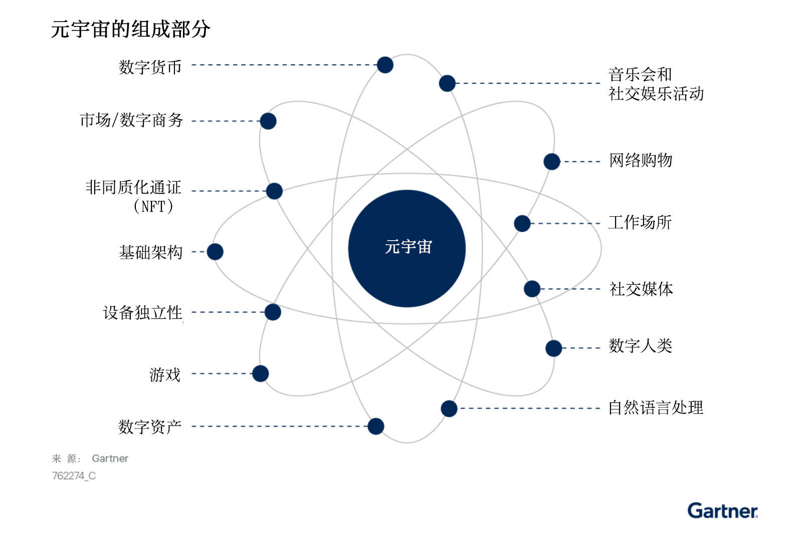

# 新兴技术研究：深入洞悉元宇宙

根据Gartner预测，2026年全球30%的企业机构将拥有[元宇宙](https://www.c114.com.cn/keyword/default.asp?key=%D4%AA%D3%EE%D6%E6)产品和服务。

元宇宙是一个由独立但相互连接的[网络](https://www.c114.com.cn/keyword/default.asp?key=%CD%F8%C2%E7)所组成的持久、沉浸式数字环境，但目前尚未确定这些网络将使用的通信协议。元宇宙能够实现持久、去中心化、可互操作的协作式数字内容，并且这些内容与物理世界的实时、以空间为导向和编入索引的内容相交。

Meta Platforms（以Meta的名义经营，前身为[Facebook](https://www.c114.com.cn/keyword/default.asp?key=Facebook)）、[微软](https://www.c114.com.cn/keyword/default.asp?key=%CE%A2%C8%ED)、NVIDIA、腾讯和Roblox等多家公司一直在设想和建立自己的元宇宙。但实现元宇宙的技术还刚刚萌芽并且早期采用者的数量很少，Gartner预计元宇宙至少要到八年后才会进入早期主流视野。

目前被定位成元宇宙的解决方案虽具有潜在的兼容性，但它们并不符合完整元宇宙的定义。早期解决方案可能具有一个或多个属性（持久性、去中心化、协作性和互操作性），但不具备成熟元宇宙所要求具备的所有属性。早期解决方案包括游戏、虚拟协作、导航应用、社交媒体和非同质化通证（NFT）。Gartner预测成熟的元宇宙将不依赖于设备、不属于任何一家厂商并且将拥有由数字货币、非同质化通证或类似元素所组成的虚拟经济体系（见图一）。

​                                                                     图一、完整元宇宙的组成部分

**阻碍元宇宙取得成功的初步障碍**

构建成熟元宇宙解决方案的过程将有诸多挑战。如果元宇宙保持碎片化并继续提供孤立的体验，完整的元宇宙将永远无法实现。此外，如果每家公司都试图建立自己分化的元宇宙，那么元宇宙的结构就会变得混乱、难以区分，无法发挥组合优势。以下是一些可能阻碍企业机构开发完整元宇宙解决方案的初步挑战。

目前元宇宙的治理还处于萌芽阶段，因此发展元宇宙需要维持社会凝聚力作为共识治理的基础，否则可能会对整个社会造成破坏。

由于数据能够高度贴切地反映现实情况，因此数据安全将变得十分关键，并且需要制定一些基本法规来保护用户信息。为了避免深度伪造、虚拟化身入侵、数据泄露和网络攻击，企业机构必须投资于网络安全的建设。

当数字商务扩展到能够代表一个经济体的规模时，可能就会产生税收和其他监管问题，甚至还需要进一步确定在元宇宙中企业的法律效力。

元宇宙中的每个应用都可能是孤立的应用，这会导致元宇宙变成一个由许多应用组成的混乱世界。

最后，企业机构在产品和服务构建方面的不成熟可能会阻碍元宇宙的普及。

**元宇宙是一项组合趋势，完整的元宇宙需要具备多种技术和趋势**

目前，新兴元宇宙解决方案的创新者和早期采用者正在提供依赖于设备的孤立体验。他们采用基于访问的交付模式，并且所有产品和服务均围绕这种模式设计。由于每家企业都专注于自主开发产品，目前的元宇宙仍然分散且难以分辨。

元宇宙是一项组合趋势，元宇宙中的许多重要、分散、独立发展的趋势和技术会相互作用并产生其他趋势。元宇宙将需要采用多项技术来创造一个能够增强实体和虚拟现实（VR）的平行世界。目前的解决方案（如游戏、VR和导航等）使用增强现实/虚拟现实（AR/VR）、虚拟助手/自然语言处理（NLP）、物联网、多云、环境映射和生物识别来创建初步的新兴元宇宙解决方案，这些解决方案可通过边缘设备或智能设备访问。一些技术联盟可能会推出更多可行的元宇宙解决方案（例如Oasis Consortium）或会议（例如元宇宙峰会（MetaCon）、全球元宇宙大会（Metaverse Global Congress））。

元宇宙预计会在2023或2024年进入更先进阶段。该阶段将需要AR云、空间定位、传感器融合、空间定向和检索、多模态用户界面、高级虚拟助手（例如独立显示）、互操作性、数据整合、5G、分布式账本、物联网、深度神经网络（DNN）以及人工智能（AI）应用，它们将对当前的解决方案进行补充。由于人们需要在不同的应用中无缝进入皮肤（虚拟化身）或持有资产（例如NFT），因此数字人类将发挥关键作用。由于地方政府可能产生的干预，或由于政府对一些与隐私相关的产品/服务可能施加使用限制，该阶段将会持续较长的时间。意大利和爱尔兰曾对Facebook智能眼镜的隐私提出质疑就是一个例子。更多隐忧将随着更先进元宇宙解决方案的出现而逐渐凸显。如果企业机构能够团结一心，那么到2028年就会出现一个不属于任何厂商、可互操作并且可以独立显示的元宇宙解决方案。

随着元宇宙开始迈向成熟（尽管仍需要等待至少七到八年），评估元宇宙的产品负责人必须将产品和服务纳入其未来的路线图。Meta、微软和NVIDIA等主要参与者已经在开发一些初步解决方案，并正在研究支持元宇宙发展的技术，也有一些初创企业在零散地开发各种产品和服务。短期内，元宇宙的应用领域将十分有限，但未来预计会出现更加成熟的解决方案，包括开发元宇宙的企业机构之间将建立更加动态的合作关系、将出现更多的生态系统合作伙伴等。

**元宇宙将取代许多设备依赖的互动，并在多种应用中创造新的互动类型和业务模式**

虽然元宇宙目前还无法带来立竿见影的益处和机会，但新兴元宇宙解决方案预示着各种潜在用例的出现。我们预测向元宇宙过渡的重要性不亚于从模拟向数字化的过渡。元宇宙将为物理世界的各种互动场景提供实时、有趣、可操作的信息，例如企业和个人寻路、工业设备维修任务指导、博物馆交互式演示、知识工作者的动态信息叠加层，以及增强社交网络过滤器。在数字互动中，人们需要跨越不同的虚拟领域的能力，比如通过任何特定的界面/应用从办公室会议“传送”到社交聚会、视频游戏或海底旅行。虽然目前的元宇宙体验无法完全取代通过应用、网站等进行的数字互动，但元宇宙将为进一步优化这些新用例的新型互动和业务模式打下基础。

元宇宙还将对多个行业产生广泛而直接的影响，包括通信和媒体、零售、电子、半导体、制造、工程、教育、银行等。作为在线互动的下一个前沿领域，它还将对企业产品和服务营销、品牌建设和销售岗位产生直接的影响。

由于数字创新组合可能会形成新的趋势，与产品负责人当前业务相邻的领域为元宇宙解决方案提供了大量机会。Grab和Meta等目前的“超级应用”，将商业、社交媒体、私人租赁和在线交付业务模式打包成一个应用，为应用的互操作性要求指明了方向。随着元宇宙对用户设备或应用的依赖日益减少，为了发现跨应用机会，产品负责人绝不能将目光局限于产品的直接应用场景。

元宇宙的早期采用者将会是游戏和导航应用等行业，另一些行业也将很快加入到这个队伍中，例如社交媒体、现场音乐会等线下活动、虚拟现实、工作场所等。产品负责人需要密切追踪每个行业的成功用例，它们将预示该行业成功加入到元宇宙中。