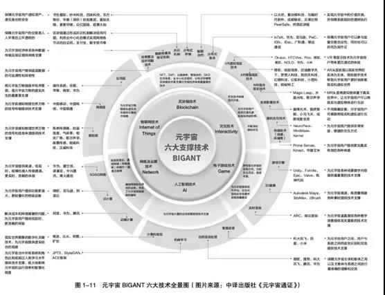
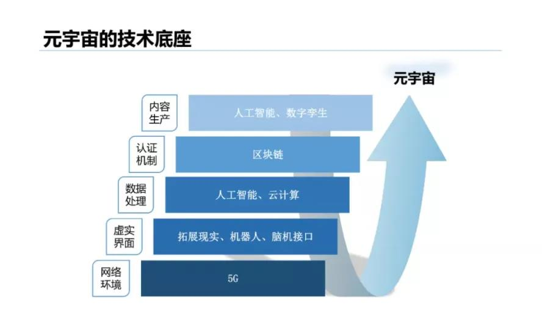
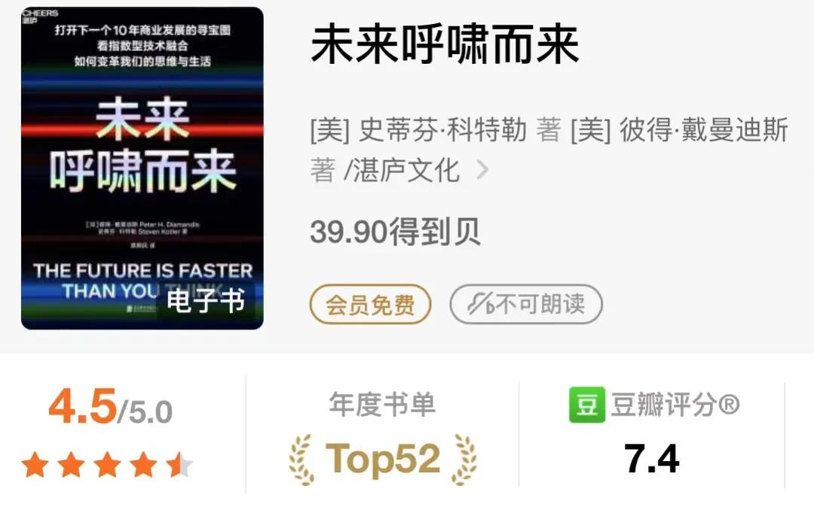
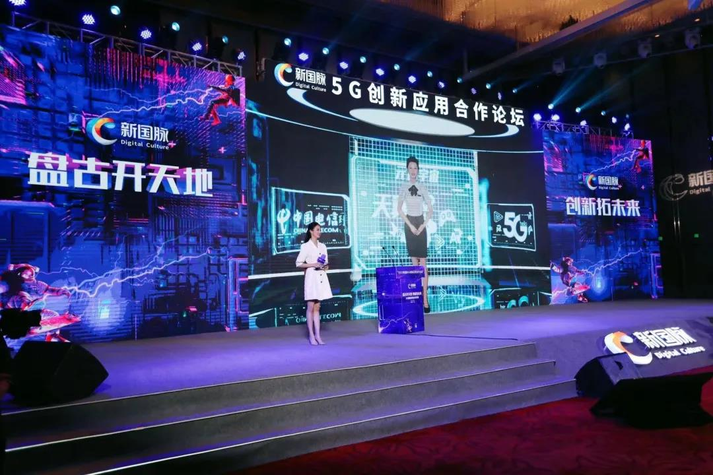
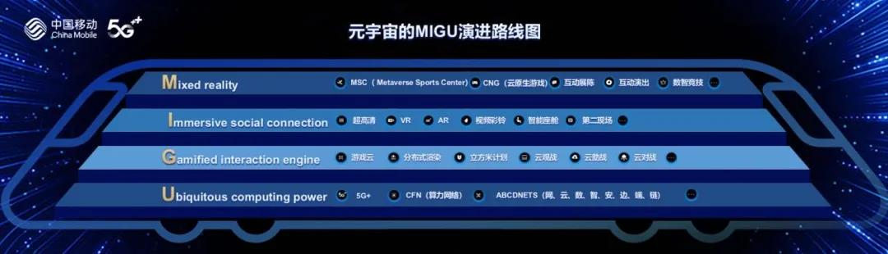

# 程慧谈元宇宙 | 技术融合的“天地有大美”

​     **通信世界网消息**（CWW）就我个人看法，很多古代哲学的观点，都是基于对宇宙运作模式的朴素认知。许多靠谱的科学技术，都来自这种可能粗疏的观察、相对偏主观意识的提炼，看上云里雾里的哲学观念。

说到元宇宙，这并非是一个完全 “虚拟”空间，一系列软硬件搭建起来的技术底座，是其现实基础。

​     **元宇宙是用什么技术实现呢？**

​     中译出版社在2021年8月份，推出了**《元宇宙》《元宇宙通证》**两本书。这可能是国内最早关于元宇宙,比较系统的出版书籍。

其中，《元宇宙》是国内第一本全面介绍“元宇宙”的书籍。《元宇宙通证》在《元宇宙》的基础上，进一步提炼出可操作性的干货，帮助人们更好地在元宇宙中寻找商机。

两本书中，梳理出元宇宙**六大支撑技术**，分别是区块链技术、交互技术电子游戏技术、人工智能技术、网络及运维技术、物联网技术。

​     **清华大学新闻与传播学院新媒体研究中心沈阳团队，**9月份发布了《2020-2021年元宇宙发展研究报告》。把技术底座，按网络环境、虚实界面、数据处理、认证机制、内容生产，梳理出AI、区块链、5G等若干技术。

​     看起来，确实都是当前最热门的技术，但也确实没有什么更新、更玄的技术，是不是？

借用《未来呼啸而来》这本书的**核心逻辑，这叫“技术融合”。**

​                                                           （我看的是“得到”上的电子书）

​     所谓技术融合，就是你看到的所有新产品，本质上都不是单一的技术支撑，而是许多技术相互交融在一起产生的。

​     5G、AR、VR、 AI、区块链等技术，当它们汇聚到一起，跨入颠覆性阶段，就会彻底改变现有的产品、服务和市场。比如“光+灯泡”，点亮了我们的夜晚；“柴油+引擎”联系在一起，产生了汽车。

​     技术融合产生许多根本性的突破，将开创出新的世界。这是我们今天无法想象的。回到技术底座。我们先从大家公认的技术底座区块链说起。我原来做过普及讲座，

​     基础的内容可以看这里：科普讲座：用区块链推进治理体系和治理能力现代化的思考（PPT及要点）。

​     陈序老师在说去中心化的元宇宙时，提出：身份系统是一种全新的社会关系，价值系统则是一种全新的生产关系。

​     在元宇宙里，我们不是用互联网账号，而是以一个相对独立的数字人身份，参与到这个数字世界里。我们用这个身份在元宇宙中发展，享受责任、承担义务、遵守法则。

如此一串代表身份的代码，如果被改了，或消灭了，是件多么可怕的事。

​     元宇宙运用了分布式记账的区块链，依托其去中心化、可追溯等特点，来解决数字身份。

​     当然我们知道，在区块链上，每一个账户都会有两串数字钥匙，一串叫公钥，一串叫私钥。私钥有且只有你一个人拥有，如果我们自己弄丢了元宇宙的个人身份信息，那就真没人知道了。

​     那么价值系统呢？在元宇宙运作中，解决创造价值的问题同样靠区块链。 数字世界的市场交易比较难，是因为物品是由代码构成的，它可以迅速地被复制，甚至可以无限地共享。现在有一个新的名字，叫NFT---元宇宙里的数字版权、数字物权的一个合约。NFT，给数字世界的物品包裹了一层数字代码的合约，这样就解决了数字物品首创性、唯一性等问题。

​     我们再来看硬件设备的技术。

​     元宇宙到底需要什么样的硬件设备？市场有一种观点认为效果越沉浸越好。这也和不少电影描绘的图景相吻合：电影《头号玩家》里，人人都带着VR头盔进入一个叫绿洲的虚拟世界。

​     但并不是感知越沉浸，我们就离元宇宙越近。

​     像Decentraland、The Sandbox、CryptoVoxels这三个被大家公认的早期元宇宙，就不需要借助沉浸式设备，玩家从电脑端就可以进入体验。

​     还有Mete公司现实实验室的一个研究小组，正在着手研发触觉手套，可以在虚拟世界中再现现实生活中的一系列触觉感觉。

​     如果沉浸不是元宇宙硬件设备商追求的唯一目标，硬件行业还在做些什么呢？

​     有一些发展趋势是确定的，比如边缘计算。

​     边缘计算，用一句形容就是“将在外君令有所不从”，不用什么行为都要到基站去转一圈，有些小事，元宇宙人就在自己周围的切片专网里处理就好了。

​     这给硬件产业（包括芯片）带来机会。

​     还有运营商。我们注意到，近期三大运营商，都开始提元宇宙了。

​     中国移动提出要构建算力网络，以算为中心、网为根基，云、网、数、智、安、边、端、链（ABCDNETS）深度融合的新型信息基础设施。达成“网络无所不达、算力无所不在、智能无所不及”的应用服务能力，和元宇宙很搭！

​     未来的元宇宙需要大量的场景和应用，需要软硬件结合，需要内容。

​     中国电信宣布启动2022年“盘古计划”，全面卡位元宇宙赛道，加速5G创新应用融合发展。

​     2021年11月12日举行的中国电信5G创新应用论坛上，以中国传媒大学冯琳为原型，融合多模态AI能力、实时动捕等技术的超写实数字人——“中国电信001号数字员工小琳” ,与现实世界中的冯琳同台主持。

​     **中国移动旗下的咪咕**，则做出了一个世界冠军的数智分身。（看这里：中国移动5G冰雪梦之队正式亮相， “科技+文化”助力冰雪运动“破圈”）

​     就我个人，11月份在参加2021中国移动合作伙伴大会时，是被**咪咕的元宇宙演进路线图**震撼到了。咪咕**在算力网络基础上，结合自己本身的优势，继续聚焦超高清视频、视频彩铃、云游戏、云VR、云AR五大方向，做内容做场景，很体系，也有说服力。**

​     庄子说，**天地有大美**，美不仅在艺术当中，是在天地之间，生活之中。又说，**万物有成理**，万物的存在和变化都遵循现成的规律，只是人们还没有发现而已。
这大概就是元宇宙的目前技术进化的现状和前景。