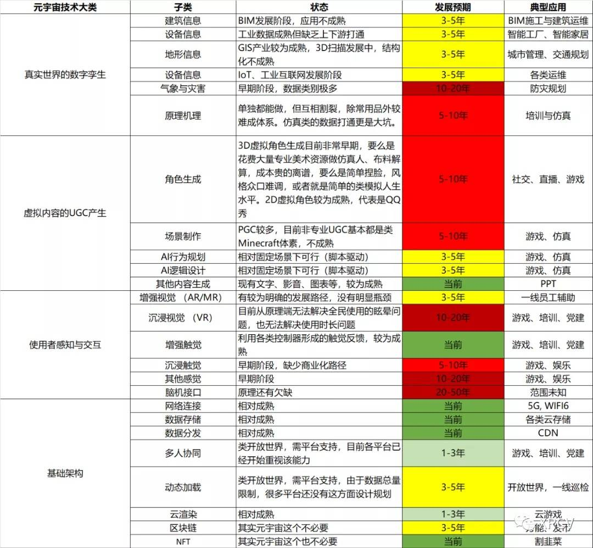

# “元宇宙”技术成熟度到底在什么阶段？

### “元宇宙”相关的各类技术成熟度到底是什么样的？

我们来简单撸一下“元宇宙”相关的各类技术成熟度到底是什么样的。

技术成熟度是元宇宙布道师们很难说清的问题 - 很多布道师们并不是从业者，描述的更多是哲学、经济学甚至是科幻和玄幻，各地雨后春笋一样冒出来的元宇宙研究中心、元宇宙协会让我们想起了90年代的气功和人体特异功能。但是作为工程师角度来建设元宇宙，我们最终是要把它分阶段落地的，实际情况现在大概怎么样了呢？我们选择了部分相关技术做评估，让你可以快速了解当前的发展状态。

注意这些都是我们最乐观的估计，发展预期建立在大厂持续投入底层研发、一级市场投资人持续加注的前提下。如果出现市场突然遇冷、技术投入不足、Meta/微软/苹果等公司的技术架构选择可能比较废柴需要推倒重来等情况，相应还要后移。

注意在虚拟内容一栏，我们主要是在针对UGC（用户生成内容），目前的PGC是相对比较成熟的。另外很多技术都是单独有自己的专业人员应用，但在向普通用户端的打通方面存在严重阻碍，比如说仿真计算这类。

区块链、NFT这类技术，在元宇宙相关应用中，早期不是必要的，未来也许有用，我们无法预测。但是割韭菜是人类永恒的需求，我们坚信在某些元宇宙里割韭菜才是主要玩法。

“元宇宙”只是一个概念，相关的应用会随着时间逐渐成熟，不会一下出现一个《雪崩》或者《头号玩家》里的世界然后所有人就都进去。根据这个技术发展表，你可以大概判断出什么类型的“元宇宙概念”应用在什么阶段可能会有较大的发展，而不是突然到了某一天元宇宙就要实现核聚变。

至于那些把元宇宙搞成气功、特异功能一样的，还是就当玄幻小说看看好了。