# 《元宇宙全球发展报告》：哪些行业率先进入？三大要素阻碍产业发展

> 元宇宙不仅仅是虚拟现实。

Newzoo（伽马数据全球战略合作伙伴）和伽马数据联合发布《元宇宙全球发展报告》，报告对于全球及中国市场元宇宙发展进行了深入分析，并在全球和中国做了大量用户调研。

**报告显示：**

- **元宇宙的框架已经建立，但权威定义尚未形成。元宇宙不仅仅是虚拟现实。**
- **影视、音乐、快消、旅游等领域已经率先进入元宇宙，交通、网络安全、城建、医药等即将进入。**
- **元宇宙将成为游戏发展的下一阶段——从游戏即服务（Games-as-a-Service）到游戏即平台（Games-as-a-Platform）** 
- **全球和中国的用户对元宇宙的认识有所差异（报告中有全球和中国用户调研）**
- **三大障碍阻碍元宇宙产业的发展**

**元宇宙的定义和发展历程**

Newzoo和伽马数据（微信号：游戏产业报告）的研究显示：尽管元宇宙的框架已经建立，但权威定义尚未形成。

元宇宙不仅仅是虚拟现实。
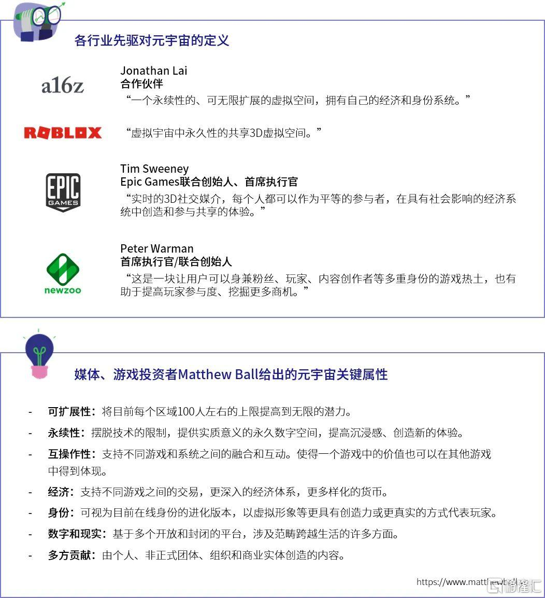

关于元宇宙中外发展历程，详见Newzoo&伽马数据联合发布的《元宇宙全球发展报告》

**哪些行业率先进入了元宇宙**

**哪些行业即将进入？**

Newzoo&伽马数据研究认为：每个行业都有可能在元宇宙中找到合适形态的商业机会。

早期的元宇宙相关活动主要围绕着品牌与游戏合作展开，为玩家提供一种表达自我、或参与喜爱内容的方式。作为回报，品牌可以获得曝光、扩大受众、得到新的收益机会。不过，也有一些企业级应用程序将游戏或游戏技术作为一个平台。 

**率先进入元宇宙的领域包括：**

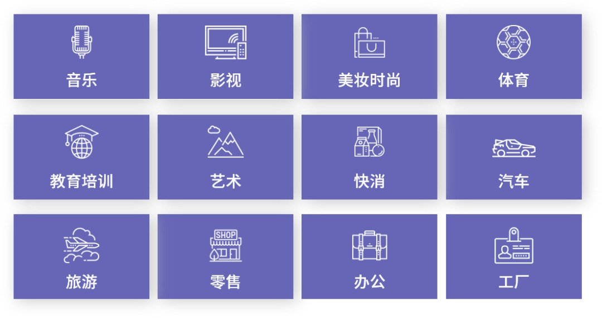

哪些行业即将加入元宇宙？ 

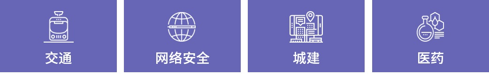

**当游戏遇到元宇宙：**

**一个崭新的阶段拉开帷幕** 

Newzoo&伽马数据研究显示：元宇宙将成为游戏发展的下一阶段——从游戏即服务（Games-as-a-Service）到游戏即平台（Games-as-a-Platform）

- 在过去的十年中，游戏已经演化发展成为一种集游玩、观看和参与于一身的体验。 
- 元宇宙将会成为游戏的下一个阶段，将非游戏体验也整合其中，由技术、消费者与游戏的互动方式来共同驱动。这种演化发展使得游戏成为了一种平台，以便多个利益相关者在其核心产品之外创造和获取价值。 
- 游戏发行商正在通过这些非游戏的体验方式推动人们接纳这种全新的互动体验，例如虚拟音乐会、虚拟时装秀、IP联动，以及媒体/产品联名。非游戏体验有着强大而广泛的吸引力，因为虚拟音乐会和类似的活动也能吸引到非游戏玩家。 
- 同时，玩家也会将游戏视作一个平台，在此进行身份表达、举办社交活动，或者创造自己的游戏模式，从而形成类似于元宇宙的体验。 

元宇宙的短期和长期演变都将带来新的商业模式、内容生产、互动和崭新的参与模式，对玩家和非玩家而言都是如此。

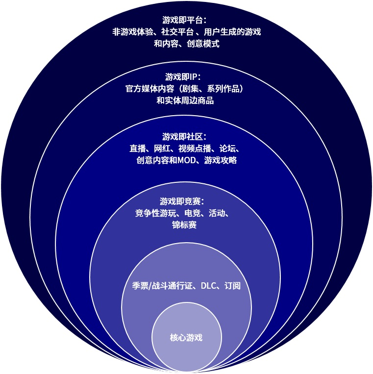

**游戏模拟现实活动？其实早已经开始了** 

一起来看一个例子——游戏内音乐会！！！这是最吸引人的元宇宙活动之一，可同时推动多个社交平台的收视率。

**下图是十大游戏内音乐会（以实时收看时间统计）** 

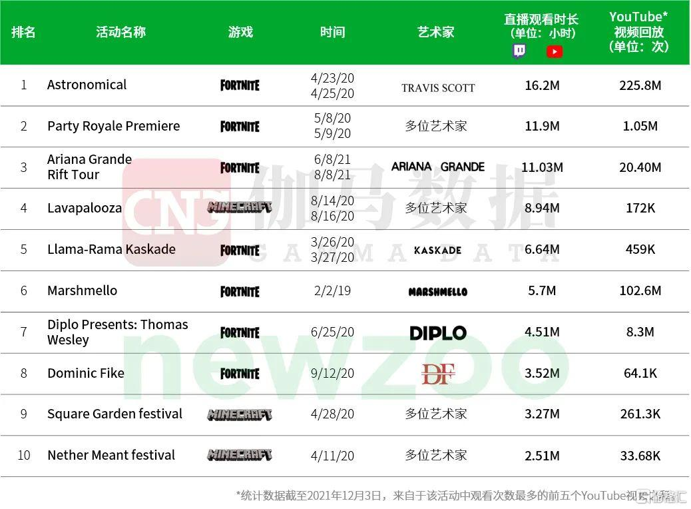

- 得益于《堡垒之夜》虚拟音乐会的影响，在演出结束后，Ariana Grande在《堡垒之夜》内演唱的歌曲在各大音乐、视频平台上的播放量大增。这些增长主要是由她的《Be Alright》曲目带来的，该曲目在2021年8 月 5 日（《堡垒之夜》活动前一天）至 8 日之间的播放量增加了 123%*。
- 与之前的音乐会（例如 《堡垒之夜》 中的Marshmello或《Roblox》中的 Lil Nas X）相比，最近的活动试图为参与者提供越来越多的互动和深度的体验。例如，玩家可以在漂浮的气泡中跟随Ariana Grande，或者乘坐彩虹尾小马在空中“旅行”等等。
- 与此同时，《Roblox》则通过游戏内活动尝试接触年龄较大的受众，例如去年举办了与Lil Nas X、Twenty One Pilots和KSI的合作音乐会。尽管不如《堡垒之夜》或《我的世界》中的活动受欢迎，《Roblox》与Lil Nas X在2020年11月的活动成功吸引了超过3300万名玩家。《Roblox》的首席财务官Mike Guthrie表示，音乐会结束后，13岁以上玩家的游玩量翻了一番。现在，13岁以上用户占游戏日活跃用户的44%。

**两个典型的案例：**

.jpg)

**全球用户对元宇宙的认知度如何？**

**可能超乎你的想象**

人们对类元宇宙的游戏活动的认知度很高，使用情况也是如此。 

目前对传统社交媒体和游戏世界社交聚会的参与度 （14-50岁的消费者）

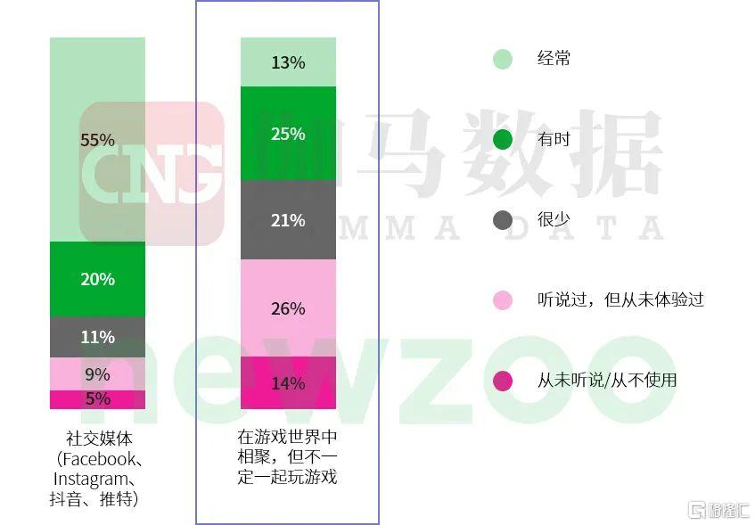

有意思的是，调查显示：18岁以下的消费者的参与度几乎是35岁以上消费者的两倍。 

**各国用户对于元宇宙的态度：中国美国最积极**

当被问及对与在元宇宙类的游戏世界中闲逛和一般社交的潜在兴趣时，消费者，尤其是在中国和美国的消费者们对这个想法多持开放态度。 

您认为，未来自己是否会[在游戏世界中进行社交，包括四处闲逛、与人聊天、分享或观看内容、参加游戏中的音乐会、活动、或者游玩小游戏]？
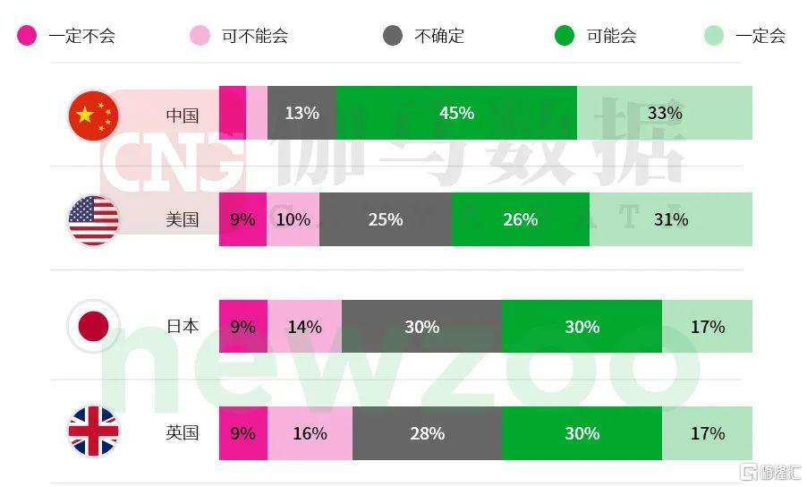

 消费者对元宇宙的态度绝大多数是积极的，也对元宇宙为社交和社区建设提供的机会感到兴奋。 

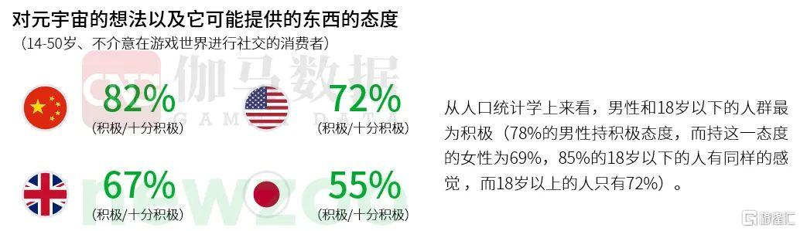

**不玩游戏的用户，对元宇宙的态度如何呢？**

Newzoo和伽马数据的研究显示：游戏玩家潜在的兴趣较高，但类元宇宙的活动也吸引了相当多目前不玩游戏的消费者。

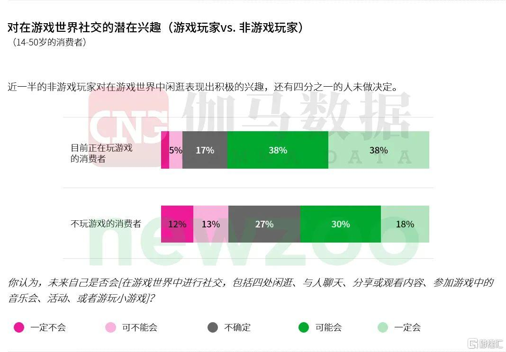

消费者对元宇宙可能提供的一切活动都很有兴趣，不过他们往往最热衷于做现实生活中常见的事情。

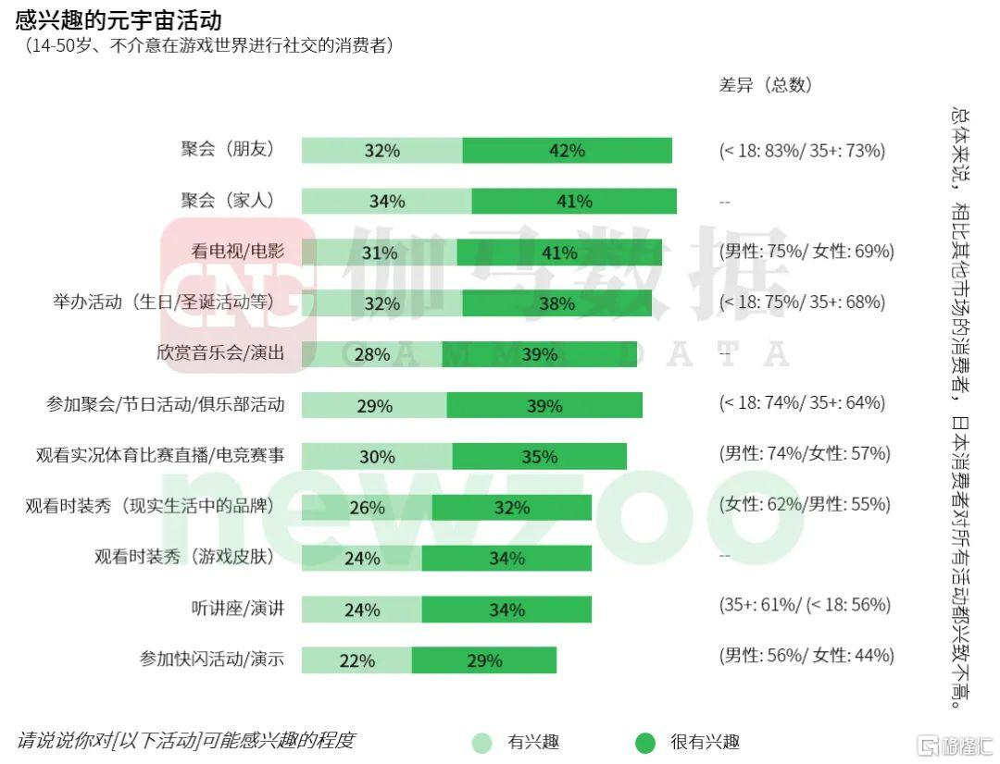

**元宇宙概念将加速跨平台游戏发展**

现阶段，不同游戏平台具备差异性，进而制约开发者生态及用户的游戏体验——而元宇宙的发展核心则是打破平台界限。短期来看，元宇宙的发展有望打破终端平台界限；长期来看，未来将打破空间界限，拉进全球用户的社交距离。

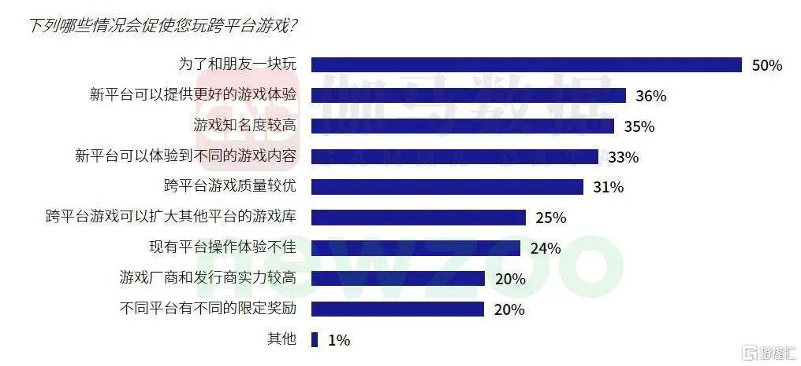

**近4成中国上市游戏企业布局元宇宙**

随着元宇宙概念掀起热潮，游戏行业作为元宇宙生态发展的重要推动方，也在重点参与，众多国内游戏企业纷纷布局元宇宙相关领域，现有布局主要分为四个板块：底层架构（如区块链、NFT）、后端基建（如5G、云化）、前端设备（如AR/VR、可穿戴设备）、场景内容（如游戏内容）。据伽马数据统计，约四成中国上市游戏企业先后已有不同领域的元宇宙业务布局，包括腾讯游戏、网易游戏、世纪华通、中手游等代表性游戏企业，除内容布局外，部分企业在XR、人工智能、云化领域也有显著投入。游戏企业外，部分企业也在技术侧为中国游戏产业元宇宙的发展提供支撑，如元境、Unity等，通过与游戏企业的深入合作推动中国元宇宙的发展。

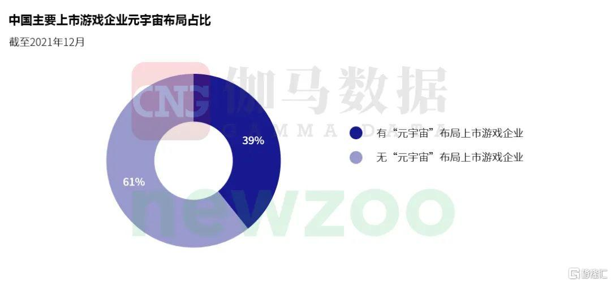

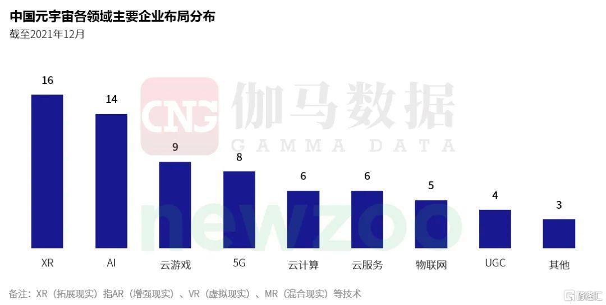

**腾讯游戏**

**未来将布局多个领域**

**现有产品已展开实质性拓展**

在2021年的腾讯年度游戏发布会上，腾讯对元宇宙相关的战略布局占据了较为重要的位置。腾讯将整体布局可以解释为“超级数字场景”，这也是“早期”元宇宙所呈现的趋势。这些趋势包括通过扩展内容、社交互动和增加线下活动来模糊现实和虚拟世界之间的界线。在当前环境下，腾讯比所有西方公司都更加重视线下活动，因而推出了超级数字场景合作开发项目，旨在为玩家提供线下活动中的沉浸式游戏体验。在具体实施策略上，腾讯正在通过近期的一系列联名合作活动，逐步实现《和平精英》中的元宇宙概念，包括增加非游戏目标和引入更多的自定义内容。在即将推出的绿洲启元模式中，玩家将可以自由编辑游戏地图、武器、载具等。

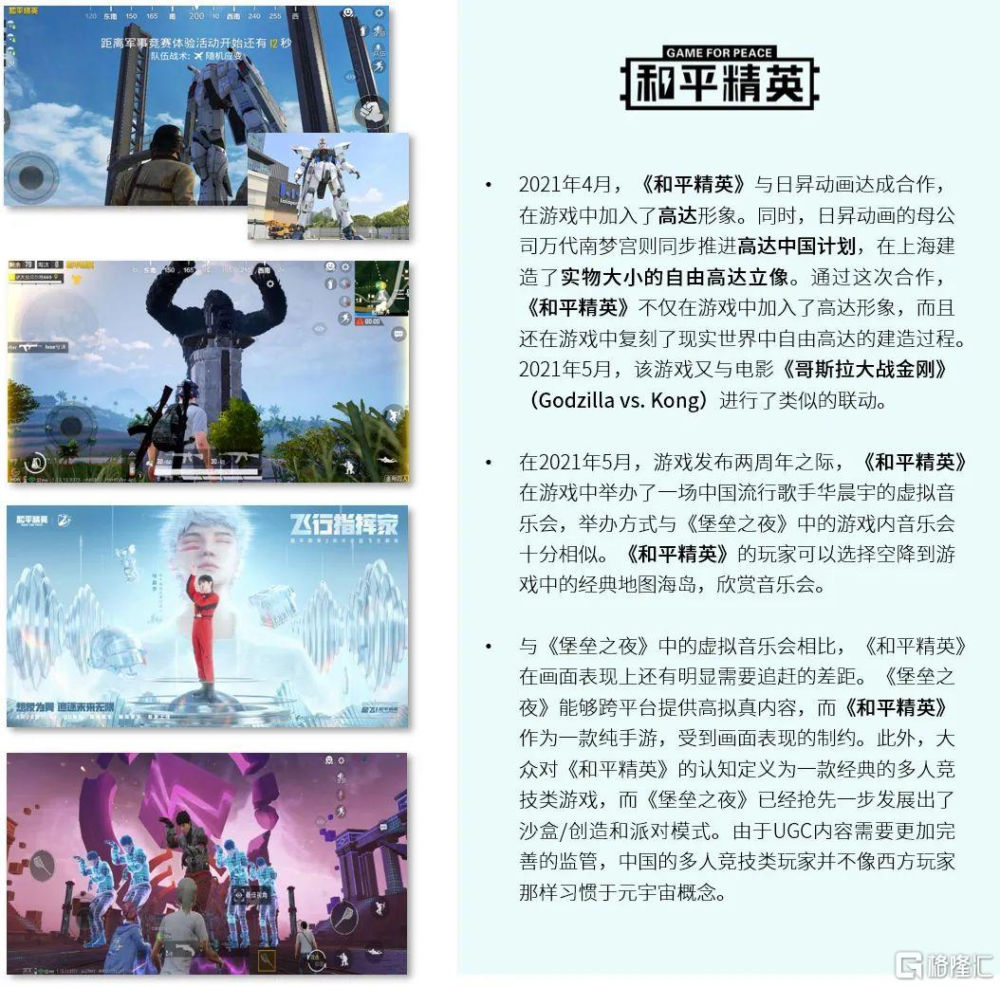

**世纪华通**

**自研元宇宙概念产品已获取亿级用户**

**未来将持续强化产品与多个技术领域融合**

世纪华通在与元宇宙相关的产品内容、脑科学、AR/VR、云游戏等领域均有所布局，为元宇宙生态的发展从技术、商业合作等各层面进行尝试和拓展，触达更多元宇宙领域。在产品内容上，世纪华通强化自研产品《LiveTopia》在全球范围已取得一定成绩；在脑科学层面，世纪华通重点布局“数字孪生”领域，旗下产品在治疗失眠、儿童注意缺陷与多动障碍均获得了阶段性成果；在AR/VR、云游戏等领域，世纪华通通过商业合作的形式链接产业链上下游，借助投资方式扩大元宇宙相关业务布局，以实现全链路的技术输出和多领域技术协同。

2019年世纪华通同中国移动旗下咪咕互娱签订合作框架协议，双方将在游戏联运、5G、云游戏生态建设、版权合作、电竞产业、战略投资、传统文化数字化、海外拓展运营和其他商业合作等方面进行全面战略合作；2021年公司与江西省联合发起设立虚拟现实产业基金，投向虚拟现实产业链。在技术投入的支撑线，未来世纪华通将持续强化产品与多个技术领域的融合。

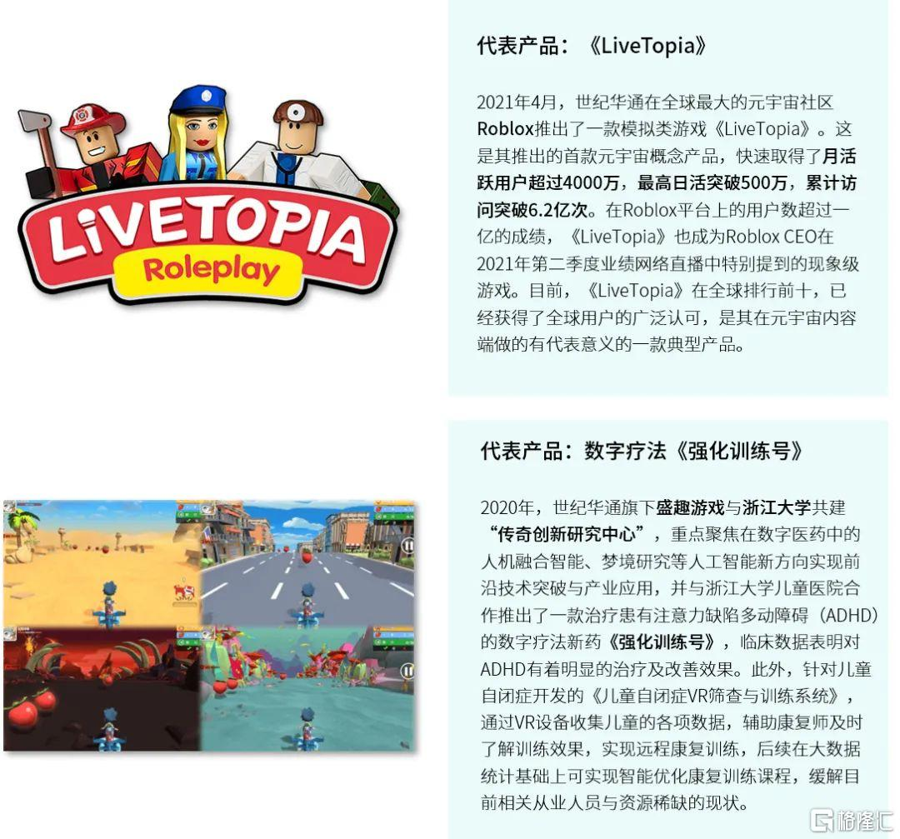

**中手游**

**依托IP打造国风文化元宇宙**

**商业合作将最大化拓展研发技术**

作为以IP战略为核心的游戏企业，中手游也将IP赋能元宇宙的发展，并打造首个国风文化元宇宙“仙剑元宇宙”：《仙剑奇侠传：世界》。该产品按照数字孪生、虚拟原生、虚实融生三步规划，现已经具备了元宇宙的基本核心特征：跨终端随时随地加入、沉浸式体验、虚拟身份、强社交性、自由创造、经济系统。游戏玩法中包括大量UGC生态内容，并向玩家粉丝提供低门槛的UGC编辑器，玩家可以自由创作专属于自己的内容。而玩家在游戏内与社区中的游戏行为与创作所产生的所有内容价值，还都将转化成为虚拟身份的“数字资产”。

.jpg)

**元境**

**通过深耕云游戏技术推动元宇宙相关技术发展**

元境是云游戏领域研运一体化的服务平台，在云游戏领域实现了3D开放世界游戏的跨端发行、头部手游渠道的云化发行、大屏终端厂商的云游戏平台、大型SLG游戏的微端买量等多个头部场景的实践，并积累了丰富的技术应用经验。而云游戏相关技术是元宇宙能够实现的重要技术支撑，构建元宇宙生态的基础离不开云计算、边缘计算、图像渲染、串流等技术的发展，不仅能解决元宇宙对于算力的需求，还可以降低产品延时、提高画面渲染能力进而满足用户对于沉浸感的需求，相关服务的全面完善才能将元宇宙虚拟与现实结合的概念最大化实现。元境在云游戏技术领域深入布局，并沉淀了行业前沿的研发技术和成果，通过对云游戏技术的不断深耕，和对游戏产业支持和服务的不断深化，也推动了元宇宙底层技术的发展，成为未来元宇宙实现的重要推动力量。

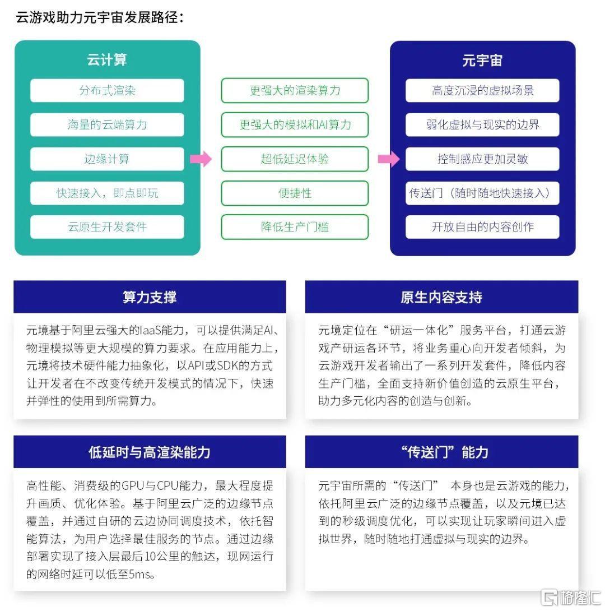

**Unity**

**布局跨平台推动元宇宙发展**

**人才培养、技术支撑帮助更多企业进行内容布局**

Unity在游戏开发技术相关领域深入布局，现阶段已成为中国游戏产业发展的重要参与者。Unity围绕跨平台技术、人才培养、元宇宙架构支撑等层面展开了元宇宙相关布局。

- 在跨平台技术领域，Unity进行了多项内容的创新，包括高清实时渲染技术、一站式跨平台解决方案、云端传输技术等多个领域，进而帮助更多游戏企业解决跨平台痛点。
- 在人才培养领域，Unity持续培养技术性人才，并输送到各个游戏企业，而技术性人才未来也将成为元宇宙发展的关键因素，尤其是随着技术复杂程度的提升与多类技术的融合，技术性人才的重要性将显著提升。
- 在元宇宙架构支持层面，Unity在多个相关维度具备技术支撑，并且持续探索元 宇宙的关键技术，从原生平台开发、接口开放等多维度提供完整的工具链，在XR生态、引擎技术、云端算力等方面提供技术支持。
- 在内容创作方面，Unity是业内第一个将数字人制作流程标准化并分享给所有开发者的公司，同时，Unity近期收购了全球领先的视觉特效团队Weta Digital，将为越来越多的游戏开发者、美术师和潜在的数百万创作者提供更先进的内容创作工具。
- 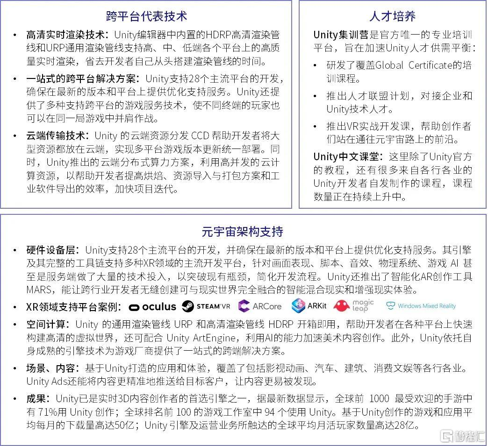

**三大要素阻碍全球元宇宙发展**

Newzoo和伽马数据认为，三大要素阻碍全球元宇宙发展

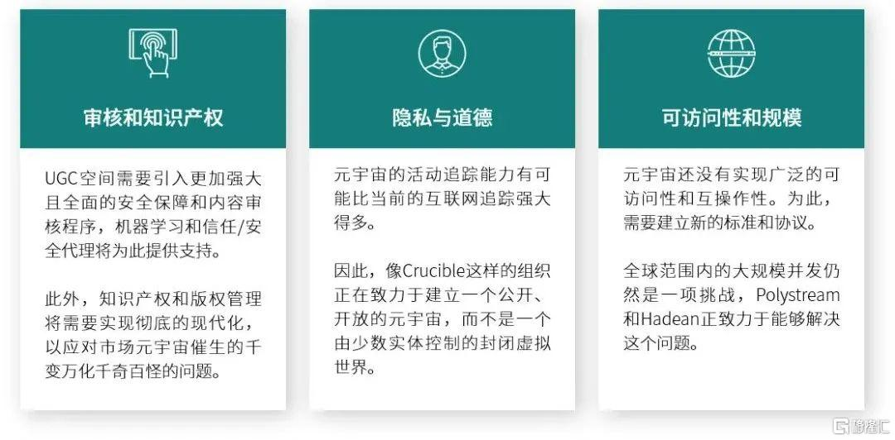