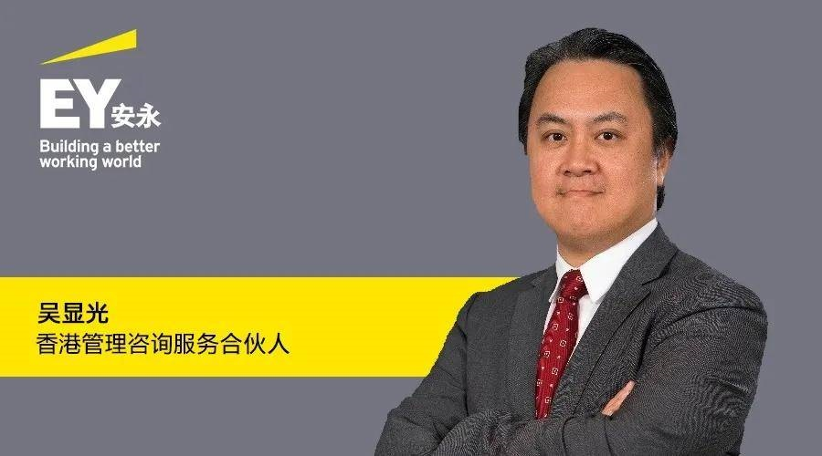

# 安永：元宇宙发展与未来前景速读

安永咨询服务有限公司香港管理咨询服务合伙人吴显光接受电台访问，分享元宇宙的发展和未来前景，以及元宇宙如何融合于现实世界，对智慧城市发展作出贡献。

吴显光表示，元宇宙将真实结合虚拟、新概念、新技术，在自有管道上构建开放平台或以混合模式添加扩增实境（AR）、虚拟现实（VR）、非同质化代币（NFT）等，在虚拟世界再展现实世界的体验，藉此提供更好的客户体验（CX）或数字体验（DX）。

元宇宙这个概念存在已久，但碍于虚拟世界中很难保障版权，亦需要强劲的计算能力才能模仿现实世界的体验，早年的市场缺乏一些硬件配合，其兴起是受益于科技发展成熟，元宇宙备受瞩目。随着区块链等交易手段日渐普及，有效确保虚拟世界中的虚拟物品交易，不容易被盗取，令物品有真实价值，逐渐形成相关的商业运营模式。

# **安永与元宇宙**

现实世界的商业模式如并购、协作，在元宇宙有类似或相同的商业模式运作。这里有两个层次，其一，元宇宙中能大量复制现实世界中的商业模式，其二是元宇宙能使现实世界的商业模式更加丰富，通过构建虚拟的东西使现实世界的体验更为优越，如室内高尔夫球场的运营便是其中一种元宇宙与现实世界交织的应用场景，元宇宙的商业模式能反过来辅助现实世界。

元宇宙的数字化资产具有更高的流动性，被盗取的风险很高，更容易受到网络、运营和监管风险的影响，例如密码被盗取、因网络攻击或使用“认识你的客户”（KYC）程序而导致的资产损失。安永为客户在保障数字化资产方面提供专业意见，协助其建立稳健的网络和监管风险管理机制，协助企业迅速把握市场机遇，赢得优势。

此外，虚拟的场景和生意交易的关键元素就是要能够确立其价值。当一件独一无二的物品产生需求，就会有拍卖，当有人愿意做第一个购买的人，便会有参照物。元宇宙的资产估值与现实世界并非完全相同，由于概念刚出现不久，所以参照物 (reference point）较少，需要使用其他方法，按照其功能及其能带来的商业价值，例如考虑其能不能够创造很多广告收益。由于元宇宙中有新的应用场景，老的估值就不只是看广告收益，反而是按照能不能节省企业的营运费用的形式而进行估值。

安永在估值方面有相当丰富的经验，曾协助多家企业处理估值及并购交易。安永在确立价值方面能提供专业的咨询意见。

# **身份认证 去中心化**

**吴显光说：**“技术与应用突破，令网络虚拟世界更完整。现在开始流行说phygital， 即Physical加Digital，用数字化工具并非将用户彻底带离开真实世界，而是运用这个工具，令真实世界更engaging，更加沉浸式，令用户乐不思蜀，加强用户体验。未来，个人的身份变得独特及十分重要，如何认证一个人的身份会成为重要的一环。”

在元宇宙，由于所有购买的虚拟对象都设有一个独特的密码，不能与别人分享，凭此确认数字化资产的拥有者，如果在元宇宙使用传统查册模式，找一家机构去负责管理所有的登记记录，就会有机会形成市场垄断，有机会洐生很多其他的问题，用户的选择权变得有限。

因此，在元宇宙中使用的认证方法要“去中心化”(decentralisation)，所有参与在元宇宙中的用户都保存每位用户一部份的记录，当有争议或冒认等的情况出现时，由于所有人都会有这个记录，系统能立刻将所有用户的记录看得一清二楚，“去中心化”记录所有用户的交易模式，确保没有人能轻易地盗取他人的密码、资产或伪造记录。

# **元宇宙的三个“浪”**

第一个“浪”是**娱乐**，在线游戏便是元宇宙的其中一种展示模式，我们已经看到其市场发展迅速，也逐渐变得成熟和普及化。

第二个“浪”将会是集中于**商业应用场景**中，全球新冠肺炎疫情是一个加速器，促使人与人交流的模式变得非常数字化，在此前提下，可以应用在虚拟世界中的商业模式就变得多样化。

第三个“浪”是极具潜力的**艺术品交易**，在元宇宙中创造的数字资产离不开两个属性，第一点是其用途、实在性、有价值，第二点是观赏性，两者会产生价值。用户在任何地方都可以与世界各地的人交流有用途有观赏性的物品，以及一些具有收藏或纪念价值的资产。

吴显光形容，近期数字艺术品的交易记录相当有市有价，而且元宇宙的展示和NFT的交易渠道在元宇宙中能为独立的艺术家创造一个新的平台，到达终端用户，而终端用户也能拥有新的选择，选购虚拟的艺术品，极具收藏及投资价值。

元宇宙有利于内容建构和艺术领域，它能加快内容和艺术货币化发展，降低相关贸易的障碍，将有利于香港作为大湾区内知识产权中心的发展，并巩固大湾区创作工厂的地位，例如位于深圳的腾讯便是最大的游戏公司之一。

香港是全亚洲数一数二的艺术品交易地点，税率非常好，没有资本增值税（CGT），很多艺术品的投资者和采购者都愿意在香港进行交易。香港在知识产权保障方面的法例十分透明，给予艺术品投资者庞大的信心，因此从近期的观察可见艺术品的落地在一个兴起的浪潮中，香港的竞争优势将在元宇宙中充分被发挥。

# **数字遗产**

香港以目前的技术去发展元宇宙，必须与邻近的城市或其他一线城市进行协作及整合，才能获得更多资源及人才去建构新模式。

说到资产，也要提及数字遗产，这是一个很热门和新兴的课题，业界正在探讨首先是可否继承的问题。虽然暂时没有一个很清晰的指引，普遍是倾向以传统遗产的方法处理，但数字遗产与传统遗产确实存在很大的区别，数字遗产毕竟是储存在一个服务器（Server），因此涉及更多复杂的因素，保存上的因素也较为复杂，政府及规管者应适时开始探讨如何立法保障数字遗产的继承权。

除数字遗产外，还存在很多有关元宇宙的其他规管讨论，因为在虚拟世界中犯罪门槛比较低 (cyber risk)，在元宇宙中网络罪案 (cybercrime) 比现实世界中更容易发生，因此保护意识需要加强。另一方面，如果现实世界与虚拟世界紧密连接，用户可能在灰色地带中侵犯别人的虚拟资产、拥有权，还会出现网络霸凌、谣言等。在元宇宙发展过程中，虚拟世界的规范和教育变得十分重要。

# **规管标准**

吴显光称，部分业界持分者的想法是需要一个跨国的统一标准，还有些参与者认为未必需要一个完全一致的跨国标准，因为社会需求、经济状况、地区税收等，很难在各地做到完全统一的标准。可以考虑在各国或地区中确定一些基本原则，根据各国或地区适当地配套相对的网上信息安全法规，两者之间取一个平衡，于国际间订立一些基本原则，根据不同地区相应作出调整。

# **有关人才**

元宇宙建设中需要很多的程序、工程人员，中国香港地区的人才储备不足以支持所有领域的发展。中国香港地区可与中国内地南部城市或中国内地其他一线城市合作及共享技术资源；中国内地也可借中国香港的优势，例如知识产权、法例等，互补长短。由于元宇宙的不同领域可以互相连接，香港可能发挥所长成为一个链接点，促进跨境合作，产生群聚效应 (clustering effect)，吸引更多人才、资金及资源投放。

# **元宇宙发展与智慧城市发展相辅相成**

为构建更美好的将来，社会及企业数字转型是必要的。举个有趣的例子，在一个于元宇宙兴建房屋的游戏中，玩家可从中领悟到兴建房屋的秘诀，有大学将概念应用于教学当中，利用游戏教授建筑系的学生如何兴建房屋。

**吴显光补充：**“从长远来看，元宇宙将虚拟世界和现实世界融合，更可将其变成为一个公众参与的设计平台，政府或智慧城市的规划者可利用科技了解市民真正需要，打造利民便商宜室宜居的城市，共创智慧未来。”