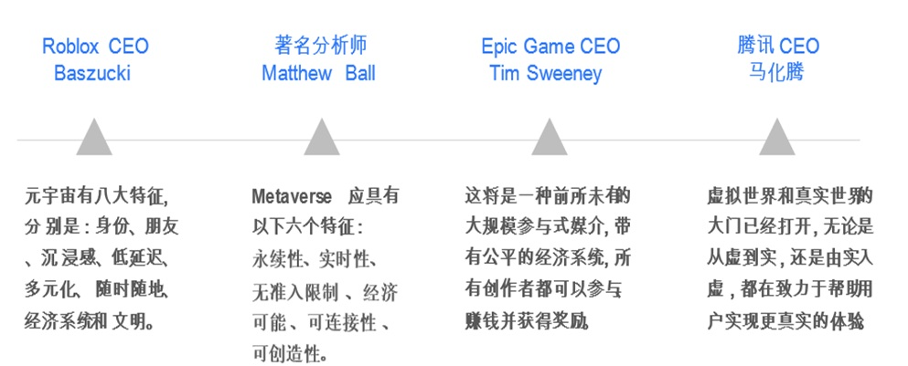
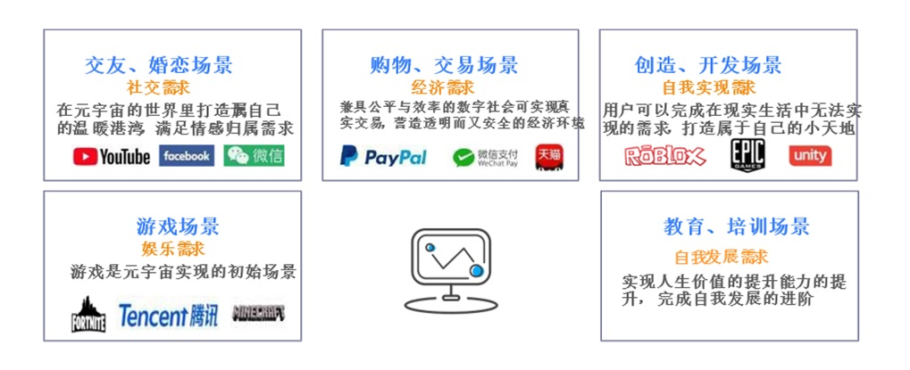

# 新冠疫情期加速元宇宙发展与投资提点

30年前的文学小说《雪崩》中描绘出了一个平行于现实世界的虚拟空间——元宇宙（Metaverse）。在这一空间中，**用户能够以数字代码形成的虚拟化身穿梭自如，构建自己的王国。**

 

30年后的今天，第一个元宇宙概念股 Roblox 诞生自游戏场景，很容易被误认为是游戏平台；用Roblox的官方表述来说，游戏不能被称作游戏，而叫作体验（Experience）。

 

Roblox（上市前的参考价为每股45美元，对应市值为295亿美元）于2021年3月11日在纽交所上市， 首日收盘估值达到400亿美元，元宇宙引发了资本圈和科技圈的投融资热潮。

 

元宇宙的理解各有特色，但对其特征总体可概括为：交互现实、虚拟化身、实时创造、永续存在。

​                                                                资讯整理来源：国盛证券研究所

Roblox提出了通向“元宇宙”的八个关键特征，如下：

 

| 1    | 虚拟身份（Identity）   | 每个人登录这个游戏之后，都会获得一个虚拟身份。               |
| ---- | ---------------------- | ------------------------------------------------------------ |
| 2    | 朋友（Friends）        | 每个虚拟身份的活动、交流都在元宇宙中的社交网络进行。         |
| 3    | 沉浸感（Immersive）    | 在游戏中，玩家对游戏角色的控制以及代入感。                   |
| 4    | 低延迟（Low Friction） | Roblox里的游戏延迟很低，因为都是较低像素级别，颗粒度很粗，这时候的计算量也就小一点。 |
| 5    | 多元化（Variety）      | 虚拟世界有超越现实的自由和多元性。                           |
| 6    | 随时随地（Anywhere）   | 可以利用终端随时随地出入游戏。                               |
| 7    | 经济系统（Economy）    | 在平台上线了虚拟货币Robux的货币交易系统。                    |
| 8    | 文明（Civility）       | 玩家在里边共同生活，演化成一个文明社会。                     |

 

Roblox也是第一家尝试概括描述“元宇宙”特征的商业公司。截至2021年底，Roblox用户已经创造了超过2050万种体验，其中1400种体验已经被更广泛的社区造访探索。

 

这些体验都由用户而非公司创造，又提供创作者游戏开发工具Roblox Studio，同时它有很强的社交属性，玩家可以自行输出内容、实时参与，并且还有独立闭环的经济系统。

 

作为一个兼具游戏、开发、教育属性的在线游戏创建者系统，Roblox里面大部分内容是由业余游戏创作者创建的。为满足游戏社区玩家的整体需求，Roblox的创作者也会对游戏进行快速的更新和调整。正是由于游戏库能不断搭建、变化和扩展，Roblox才如此受欢迎。

## **2022年是中国****的元宇宙发展元年**

2021年Roblox上市，若说成为美国元宇宙的发展元年；中国市场的元宇宙发展元年可说是2022年。随着互联网基础设施逐步实现全面覆盖，中国大陆市场的数字化需求渐增。以Z世代（约出生于1995年到 2010年之间，或可称为Metaverse Generation，M世代）为代表的群体。

 

为M世代梳理出16个亚文化圈层：二次元、国风国潮、 游戏电竞、潮玩酷物、硬核科技、御宅族、偶像圈、快文娱、cosplay、 宠物、新舞音、新健康、新艺术、新教育、新竞技、街头野外）积极拥抱数字化的未来。中国市场的互联网、移动游戏、数字支付、社交电商所建立的广泛用户基础，在很大程度上为元宇宙的建构提供了动力。

 

2021年底，中国大陆移动互联网用户数达13.6亿户，网络游戏用户规模近5.8亿，占网民整体9.9亿人的55%。网络支付用户达8.8亿。移动社交用户规模按照平均月独立设备数统计约为8.7亿，较前一年全年平均水平有6%的增长。

 

互联网行业增速回落，用户规模趋稳，同时商业格局相对稳定，资本正在试图寻找新的盈利增长点。 此外，中国市场的数字经济增速尤为可观，元宇宙便是在这一背景下呈现出发展之势。

 

多家公司相继入局，元宇宙赛道竞争热度只增不减。互联网科技巨头、软硬件服务厂商、内容平台服务商等背景各异的公司（提供UGC支持的Roblox；提供空间计算能力、去中心化服务、人机交互服务及基础设施建设的英伟达;提供在线购物、平台交易的京东、亚马逊；以各类游戏内容提供元宇宙体验的Fortnite、腾讯；通过平台提供探索的 Facebook、Google）。2021年都已相继入局元宇宙赛道，竞争热度只增不减。

元宇宙的表现形式是虚拟的，但实际上囊括了经济、文化、科技等各个方面的内容，是进阶版的数字社会。资讯整理来源：洞见研报游戏场景是元宇宙的雏形，作为现实世界的延伸，元宇宙从满足「娱乐需求」出发，来实现社会功能，并进一步向「社交需求」方向发力，以满足情感归属需求。进一步对于「经济需求」、「自我实现需求」的满足。当下中国大陆市场受政策因素影响，元宇宙的「自我发展需求」反而置后了。

##  

## **中国政策支持，基础技术发展将进一步加快元宇宙发展**   

5G、区块链、物联网、人工智能等新一代信息技术是国家政策的重点支持项目，作为元宇宙支撑基石，有望实现突破创新。

 

**2017年7月《新一代人工智能发展规划》政策**：积极培育人工智能新兴业态，布局产业链高端，打造具有国际竞争力的人工智能产业集群；并制定阶段性发展战略计划。

 

**2021年6月《关于加快推动区块链技术应用和产业发展的指导意见》政策**：大力推动区块链与大数据、云计算等技术的融合发展，到2025年，区块链产业综合实力达到世界先进水平。区块链应用渗透到经济社会多个领域，形成场景化示范应用。

 

**2021年7月《5G应用扬帆行动计划（2021-2023年）》政策**：大力推动5G全面协同发展，着力打通5G应用创新链、产业链、供应链，打造5G融合应用新产品、新业态、新模式，推动5G重点工程建设取得重要进展。

 

**2021年9月《物联网新型基础设施建设三年行动计划（2021-2023年）》政策**：打造支持固移融合、宽窄结合的物联网接入能力，加速推进全面感知、泛在连接、安全可信的物联网新型基础设 施建设。以关键技术创新为牵引，重点支持物联网产业培育。

 

从政策支持、产业布局、区位优势等视角， 以北京、上海、杭州、深圳为中心的城市群经济更为发达，基础设施齐备更具发展优势。

 

**2021年8月《北京市“十四五”时期高精尖产业发展规划》政策**：重点布局石景山中关村虚拟现实产业园， 做优做强“虚拟现实+”产业。代表企业：润尼尔网络科技、小鸟看看、七鑫易维、未来黑科技。

 

**2021年5月：**上海市虚拟与现实融合创新联盟、华为数字化转型创新体验中心（黄浦）在黄浦区揭牌。通过打造数字内容与真实世界高度融合的创新应用场景，实现虚拟与现实交互，有效带动实体商家、文化创意、内容制作等产业链上下游企业共同发展。代表企业：曼恒数字技术、塔普翊海、乐相科技、 叠境数字科技（上海）公司。

 

杭州市全面推进“三化融合”打造全国数字经济第一城行动计划（2018—2022年）：推动虚拟现实核心软硬件产品的研发及产业化，加快内容制造和分发平台培育， 大力推进在动漫游戏、影视娱乐、协同设计等领域的广泛应用。代表企业：阿里巴巴、海康威视、网易、凡聚科技、顺网科技。（代表企业_资讯来源：洞见研报）

##  

## **元宇宙概念股，现阶段泡沫的概率仍高**

在中国大陆社交平台目前有多款所谓“元宇宙区块链游戏”涉嫌违法犯罪。在现实中对元宇宙的内涵和外延没有清晰的界定。给炒作、投机、金融诈骗、违法交易等活动留下了很大空间。

 

在中国大陆，从事虚拟货币发行、兑换等活动涉嫌违法犯罪。2021年9月，中国人民银行等10部门联合发布《关于进一步防范和处置虚拟货币交易炒作风险的通知》，进一步明确“虚拟货币相关业务活动属于非法金融活动”。

 

今年2月，中国银保监会发布《关于防范以“元宇宙”名义进行非法集资的风险提示》，披露了编造虚假元宇宙投资项目、打着元宇宙区块链游戏旗号诈骗、恶意炒作元宇宙房地产圈钱、变相从事元宇宙虚拟币非法牟利等违法手段。

 

今年全国两会期间，高钰代表提交的《关于加强对“元宇宙”产业前瞻性监管的建议》呼吁加强元宇宙炒作风险监测预警。