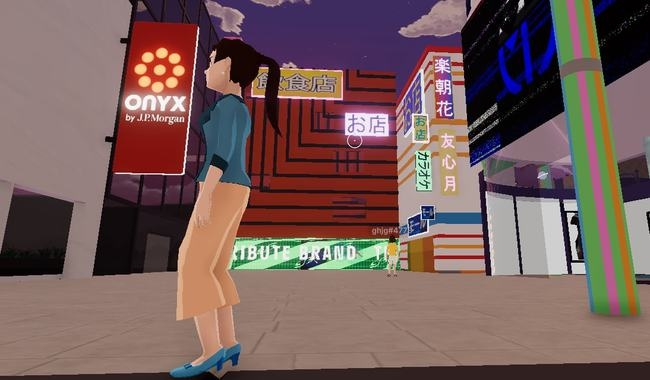
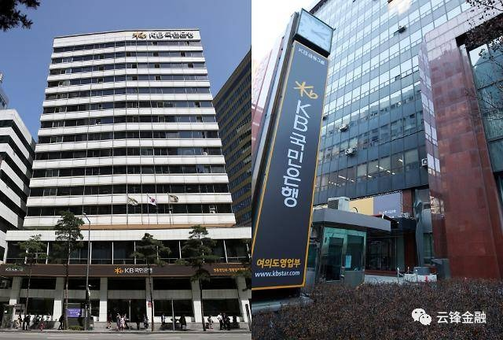
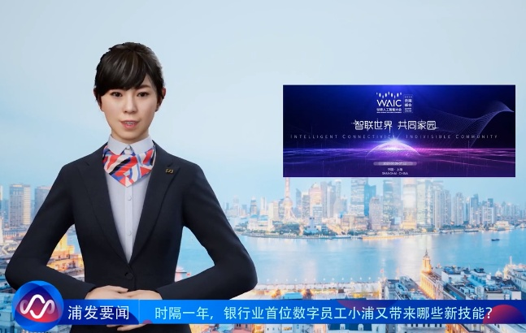

# 浅谈元宇宙发展及未来银行的机会

元宇宙（Metaverse）是最近几年走入大众视野的一个新兴概念，这个概念是区块链、交互技术、电子游戏、人工智能、网络技术及物联网技术等技术的集合体现，因此出现的一种新型互联网社会生态，为用户提供沉浸式体验。尽管元宇宙目前大多停留在初步尝试阶段，但对于银行来说，可借鉴其创新思维，未雨绸缪，对“元宇宙里的银行”功能进行先期探索。比如，推进数字化转型和传统资源重构，对金融产品进行数字化组装，通过虚拟人加强元宇宙中客户生态的数字化连接等。

**元宇宙与银行创新**

2021年被公认为是元宇宙的元年，很多人把元宇宙与20世纪90年代的互联网以及十年前的区块链相比较，认为元宇宙将成为这几年间科技界和投资界炙手可热的新宠。元宇宙是利用科技手段进行链接与创造的、与现实世界映射与交互的虚拟世界，具备新型社会体系的数字生活空间。元宇宙这个概念诞生于1992年美国科幻作家尼尔·斯蒂芬森撰写的《雪崩》一书，里面描述了一个平行于现实世界的虚拟世界——“元界”，它拥有现实世界的一切形态，在这里，人们用数字化身出现。眼下，越来越多的公司开始涉足元宇宙这个领域，2021年3月，被称为元宇宙第一股的Roblox在纽约证券交易所上市，在其招股书中对元宇宙的描述是，一个真正的元宇宙产品应该具有：身份、朋友、沉浸感、低延迟、多元化、随时随地、经济系统与文明；2021年10月，Facebook的首席执行官扎克伯格宣布将其平台改名为“Meta”，并进军元宇宙产业；中国的社交平台“soul”紧随其后，将宣传语改成了“年轻人的社交元宇宙”；2021年12月，百度发布了首个国产元宇宙产品“希壤”并正式开放内测；2021年12月，百信银行也推出了虚拟人AIYA，将其打造成一位未来银行探索者与品牌理念传播者的形象。有学者认为，元宇宙时代，是现实世界探路虚拟世界的大航海时代。银行业也可提前探讨如何涉足元宇宙领域，开拓新业态。

资源的数字化重构。“元宇宙中的银行”应该怎么开？需要思考的是如何将现实中的各部门职能平移并适配于元宇宙，这项融合工作包括但不限于前台经营体系、中台市场环境分析和策略制定以及后台的业务处理等。

银行的首要目标就是需要将其各个要素在数字孪生的环境中重塑。有研究认为，人力资源、算力、产品组件、技术能力、业务流、生态角色等基本银行资源要素都需要进行重构，使其成为适配于元宇宙的数字化原生要素，并可以根据场景、监管规则、业务经营策略等因素进行合适的数字化拼装、分发与部署。目前元宇宙还是一个初创的空间，其大方向是打造一个平行于现实世界且与之高度互通的虚拟世界，但每个细分领域的发展方向还是未知数，这意味着想要进入元宇宙的机构，其技术系统和业务模式要拥有较强的优化跟进功能，才能及时跟上更新迭代的步伐。

产品的数字化组装。基于银行所重构的各部分数字孪生要素的情况，可以组装设计出更加灵活的金融产品，借此来满足元宇宙用户们的资产配置及管理需求。届时，银行需要思考的是产品数字化组装的具体流程以及如何嵌入银行虚拟人等相关新技术。比如，法国巴黎银行最近推出了一款VR应用程序，客户们可以在虚拟环境下访问自己的账户并完成一些基础业务，比如存取款与转账，就像人们在现实中前往ATM进行操作一样。另据报道，摩根大通于2021年2月宣布在元宇宙中开设了一个“Onyx休息室”，该“休息室”由摩根大通的区块链部门Onyx建立，用户可以使用以加密货币购买虚拟土地，当前，虚拟土地的价格正呈上涨趋势。

摩根大通于2021年2月宣布在元宇宙中开设了一个“Onyx休息室”(图片来源：财联社）

考虑到元宇宙的发展方向，数字产品的创造、交换、消费等所有环节都可以在数字世界中进行，人们可以在元宇宙中创造收入，并使用虚拟资产互相兑换，或将虚假资产兑换为现实货币，这就需要对银行产品进行数字化组装，为客户提供更适合虚拟场景需求的个性化服务。

建立与客户的“数字化连接”。不管在现实世界还是元宇宙世界，用户都是不可或缺的一部分，并且在元宇宙世界中，虚拟商品与数字资产的产权会更加明确，银行应探索成为“泛在银行”并与客户保持紧密的联系。在精准匹配客户需求的同时，还需要更多地涉足日常活动，围绕客户生活拓展业务场景。

比如，韩国国民银行2021年在元宇宙平台“gather”上搭建了一个虚拟城镇，其中不只包括银行本身，还有一家远程办公中心和一个游戏场。在与客房进行“数字化连接”的过程中，虚拟客服的作用显得格外重要。虚拟客服当前在银行业已经有所发展，但发挥的作用仍有限，有时只是作为转接媒介存在，大量复杂的业务咨询及问题处理很大程度地还依赖人工客服。

韩国国民银行大楼

2019年12月，浦发银行(600000)数字员工“小浦”正式上岗，无独有偶，光大银行(601818)也在同月推出了虚拟银行员工——金融理财顾问“阳光小智”。作为银行虚拟人，其最闪亮之处是AI人工智能技术，基本上能够在同一时间服务所有的客户，并且会针对客户的习惯来调整其服务。而未来“元宇宙里的银行”无疑对虚拟客服、虚拟员工的要求更高，他们可以在客户初入元宇宙生态时提供指导服务，带领客户们熟悉元宇宙中的各项业务分布，甚至可与在游戏场中成为客户们的搭档共同娱乐。

浦发银行数字员工“小浦”（图片来源：新华网(603888)）

另外，处于创立初期的各种元宇宙平台，还存在资本操纵、舆论泡沫和经济风险等风险，银行虚拟人在设计时就应考虑加强专业的风险提醒能力，防止客户因新出现的诈骗手段而损失财产。

通过银行虚拟人宣传使用数字货币。在未来的元宇宙生态中，数字货币将是国家间重要竞争领域，当前各国都在积极研发自己的数字法币。我国央行法定数字货币已经取得阶段性进展，其使用场景及形式也会不断扩大。而在元宇宙这种国际生态中，银行可通过虚拟人宣传使用数字人民币，并探索创新其虚拟使用场景。

进入元宇宙的难点及对策设想

目前元宇宙这一概念刚刚兴起，平台搭建仍处于初期，所需的技术种类繁多，未来元宇宙能否普及以及银行在其中能发挥哪些功能还是未知数。可以预测的是，如果银行进入元宇宙，将至少面临以下几大困难：

场景搭建障碍。在元宇宙的搭建中，无法避开的几项重要技术包括5G、AI、区块链等，而这些技术也处于发展初期。要符合元宇宙的需求，不是短短几年时间内就能够完成的。而这也同样成为银行创新的难关。

场景运用障碍。有专家认为，元宇宙中银行的角色难以成为用户们的刚需。就像前文提到的法国巴黎银行所尝试搭建的生态，实际上只是现实银行网点的一种场景延伸。如果元宇宙实现普及后，仍不能够做出有效的创新，将很难以吸引客户。

被誉为Web3.0的元宇宙距离发展成熟还需要很长的时间，但从发展的眼光看，未来或可成为人们的新型生活方式之一。而银行可主要围绕客户关系变革与技术革新两方面进行探索，可考虑从以下几方面着手，准备在未来的元宇宙中占据一席之地。

跨界合作解决设计难题。技术上创新不可能一蹴而就，除自主创新外，银行可与科技互联网类公司达成战略合作，有针对性地攻破技术难关，正所谓术业有专攻，通过双方合作有利于减少人力和资源的消耗，并有助于实现创新效果。

培养多元化新型人才。目前已经布局的元宇宙场景主要体现为游戏和社交等。元宇宙需要包括网络算力、人工智能、游戏技术、显像技术（AR、VR）以及区块链技术等共同支撑，而这些岗位对银行科技部门来说往往存在很大缺口。此外，还需要美术人才与程序员们进行观点碰撞，以便实现视觉效果。比如在虚拟人设计上，需要画师及模型师等，而这些人才以往集中在动画或游戏公司，未来有可能会流向元宇宙相关行业。这些也是银行所缺少的新型人才，可考虑通过市场化招聘、内部培养以及外部人才合作等形式弥补短板。

拓展银行虚拟人业务范围。虚拟员工依靠人工智能可能通过不断学习来承担越来越多的职能，银行虚拟人将在元宇宙中吸引更多客户。比如，百信银行的虚拟品牌官AIYA目前活跃在短视频、虚拟直播、APP等场景，与用户进行交流互动，在未来还会不断学习进化，提升AI算力和财商智慧。因此，创新拓展银行虚拟人的业务范围也将成为银行未来在元宇宙生存的必须技能。

微信征稿启事

《中国银行(601988)业》由中国银保监会主管、中国银行业协会主办，是目前唯一一本带有全行业性质的公开刊物，是沟通监管部门和机构的纽带，是行业交流的平台，也是社会了解银行业的窗口。目前《中国银行业》杂志微信公众号已开通征稿邮箱，面向广大读者征稿。我们期待您的稿件。