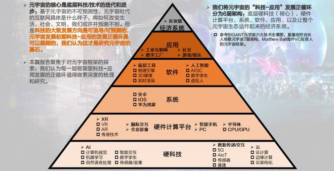
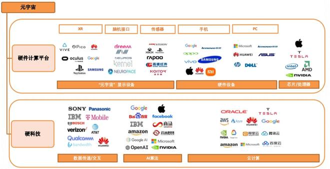
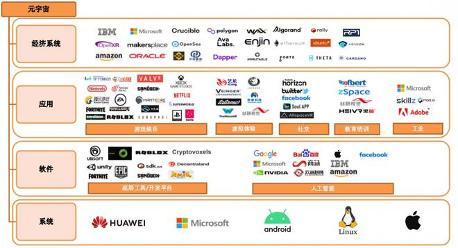
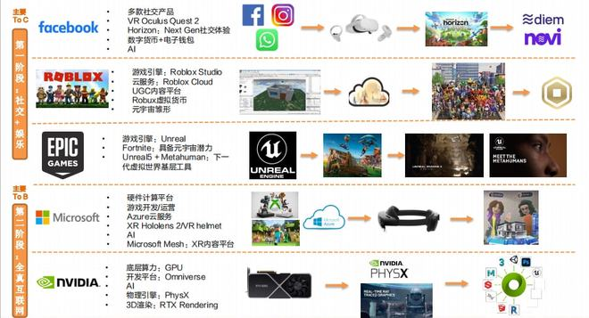
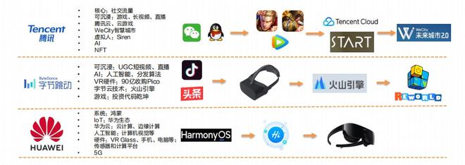
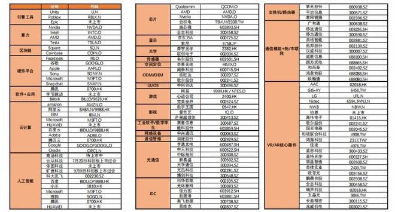

# 元宇宙：6层框架和3个核心底层技术

​     什么是元宇宙？在全球互联网渗透率已达较高水平的情况下，移动互联网时代的用户红利或趋于瓶颈，元宇宙概念的出现是人们对移动互联网继承者的展望：它是互联网的下一个阶段，是新时代的流量环境。

为什么元宇宙概念这么火？海外科技/互联网巨头前瞻布局，Facebook、Microsoft、Nvidia、Roblox、Unity等；

元宇宙或是工业和互联网的下一次大变革方向：每一次大革新都划分一个时代，推动整个文明发展。人们的生活、体验、价值认知均发生天翻地覆的改变。

元宇宙的变革是由无数技术/应用落地的节点们组成的，而我们现在已处于元宇宙时代的早期阶段，但元宇宙仍离我们很远。

已步入元宇宙时代科技/技术和应用的自循环中：时代的变革/或科技的迭代，是底层技术推动应用/软件的迭代，然后市场需求的提升反哺底层技术，科技持续进步迭代，这是一个循环。不是先有鸡还是先有蛋的问题，应用/或软件在一个时代发展初期就是科技进步的催化剂。

元宇宙的不可预测性，技术迭代的可预测性：正如同19世纪无法预测电力将如何彻底改变世界，早期互联网时代的我们无法预测移动互联网时代具体的模样。

元宇宙的核心是底层科技/技术的迭代和进步：基于元宇宙的不可预测性，元宇宙时代的互联网具体是什么样子，将如何改变生活、社会、文明，我们或许并预测不到。但是科技的大致发展方向是可追寻/可预测的，元宇宙发展初期科技-应用的发展正循环是可以跟踪的，我们认为这才是研究元宇宙的基石。

我们将元宇宙的“科技-应用”发展正循环分为6层架构：底层硬科技（核心）、硬件计算平台、系统、软件、应用、以及让整个元宇宙生态运作起来的经济系统。

**元宇宙的6层架构**

元宇宙的核心是底层科技/技术的迭代和进步：基于元宇宙的不可预测性，元宇宙时代的互联网具体是什么样子，将如何改变生活、社会、文明，我们或许并预测不到。但是科技的大致发展方向是可追寻/可预测的，元宇宙发展初期科技-应用的发展正循环是可以跟踪的，我们认为这才是研究元宇宙的基石。

6层架构：底层硬科技（核心）、硬件计算平台、系统、软件、应用、以及让整个元宇宙生态运作起来的经济系统。

我们将元宇宙的“科技、应用”发展正循环分为6层架构：底层硬科技（核心）、硬件计算平台、系统、软件、应用、以及让整个元宇宙生态运作起来的经济系统。

元宇宙的6层架构全景图

在元宇宙的第二阶段，它可能是一个始终在线且实时渲染的3D互联网（虚拟世界），将现实和虚拟连接在一起。那个时候互联网将对人类生活达到100%的渗透，而每日使用时长提升至24小时（全时性）。覆盖To B、To C、To G，且随着技术突破不断迭代，成为元宇宙诞生的需求端驱动因素。

​                                
​                                 

相比海外，国内科网巨头的布局更多为底层技术如5G、云计算、AI等领域，还没看到如Facebook、Nvidia、Roblox等清晰的元宇宙路径。

同时，我们认为元宇宙在国内的机会和空间仍很广阔。如爱奇艺和哔哩哔哩拥有大量视频版权内容，布局虚拟人技术/虚拟偶像，且已尝试接入VR应用；两者都具备一定的VR内容产出能力（PGC/UGC）。其余互联网巨头如阿里巴巴，在流量、生态、云技术、数字金融等领域深耕，也具备元宇宙趋势下较强的竞争力。

​                                   
​                                     

在关注巨头企业元宇宙布局的同时，也建议关注元宇宙概念下的更细分的赛道如VRAR、游戏、虚拟社交、虚拟人等的发展、变化以及机会。

元宇宙概念下的底层技术，虚拟人技术三大发展趋势：高保真（在视觉表现层面，做出从外形、表情到动作都1：1还原真实人的高保真虚拟人），智能化（运用语音识别、自然语言处理、语音合成等技术赋予虚拟人智能和情感表达），工具化（开发更轻量、便捷的工具，让艺术家和普通用户都能快速生产高品质美术资产）。