# 元宇宙未来发展的有力技术支撑

> *元宇宙是描述未来互联网迭代发展的一个概念，是一个将现实世界和虚拟世界相互融合的一个可感知的持久、共享的3D虚拟空间组成的世界。*

## 一、什么是元宇宙？

引用维基百科中的概念，元宇宙是描述未来互联网迭代的概念，由连接到一个可感知的虚拟宇宙的持久、共享的3D虚拟空间组成。广义上的元宇宙不仅指虚拟世界，还指整个互联网，包括增强现实的整个范围。

《需崩》这本小说中为我们描述了一个平行于现实世界的虚拟数字世界，在这里，人们用数字化身来控制并互相竞争以提高自己的地位。只要带上耳机和目镜，找到一个终端，就可以通过连接进入由计算机虚拟的另一个三维现实世界，每个人都可以在这个与真实世界平行的虚拟空间中拥有自己的分身。这个虚拟空间，就是我们说的“元宇宙”。目前看来，小说里描述的依然是超前的未来世界场景。

### 1. 从电影角度理解“元宇宙”

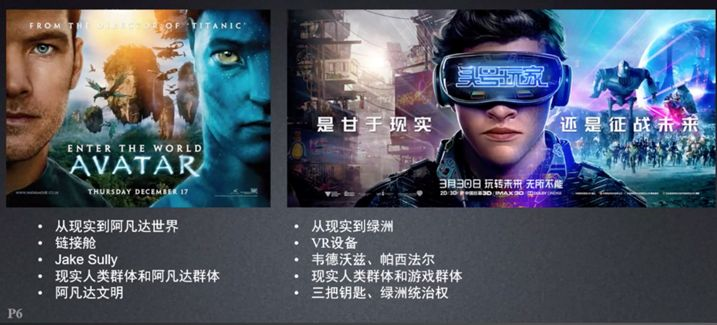

元宇宙的概念因人而异，一千个人眼中，就有一千种“元宇宙”。《阿凡达》和《头号玩家》两部电影都描述未来元宇宙的应用场景。比如《头号玩家》中，现实世界中的韦德沃兹通过VR设备就可以从现实世界进入到绿洲世界，变身成帕西法尔这个人物，然后和其他一些一样进入游戏的小伙伴去争夺三把钥匙和绿洲的统治权。《阿凡达》中的男主通过链接舱从现实世界进入到阿凡达世界进行采矿作业和战争搏杀，也是同样的道理，在一定程度上实现了人类群体和阿凡达群体的共生形态。

### 2. 从游戏角度（Reblox）理解元宇宙游戏

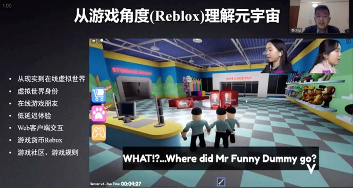

现在火热的 Reblox 游戏中也涉及到现实世界到在线虚拟世界的关联关系，在线游戏的小伙伴通过Web客户端进行虚拟世界的游戏体验，大家遵守一定的社区和游戏规则，在这个过程中也会涉及到一些经济因素，比如游戏货币Rebux。Reblox 的 CEO ：Metaverse 归纳总结了元宇宙的8个特点是：身份、朋友、沉浸感、低延迟、多元化、随地、经济系统和文明。

## 二、元宇宙生态系统

元宇宙生态系统，由各种投资者、软件开发者、硬件开发商、服务运营商、系统集成商、产品生产商组成。而生态系统中又包含很多基础概念，下面具体介绍一下这些概念的基础情况。

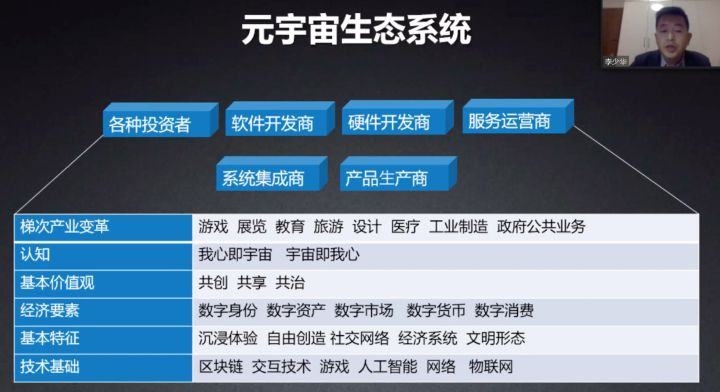

梯次产业变革涉及到非常多的行业，包括游戏、展览、教育、旅游、设计、医疗、工业制造、政府公共业务。认知，我心即宇宙、宇宙即我心。基本价值观，共创、共享、公治。经济要素，数字身份、数字资产、数字市场、数字货币、数字消费。基本特征，沉浸体验、自由创造、社交网络、经济系统、文明形态。技术基础，区块链、交互技术、游戏、人工智能、网络、物联网。

### 1. 元宇宙的领军企业

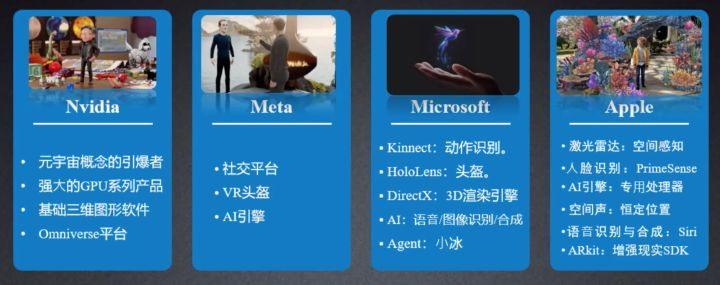

英伟达是元宇宙概念的引爆者，强大的GPU系列产品、基础三维图形软件和Omniverse平台为元宇宙奠定了技术基础。

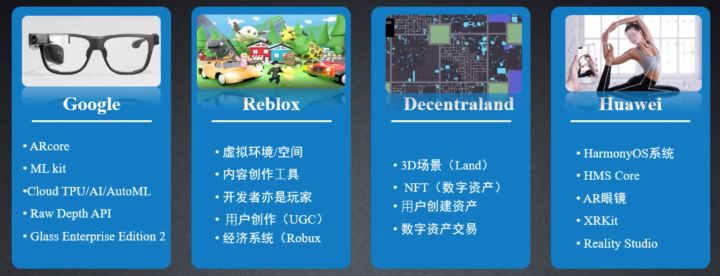

华为利用鸿蒙系统也创造了很多元宇宙的应用设备和软件，比如 AR 眼镜、XRKit 等。

### 2. 元宇宙的七层要素

构成元宇宙需要七层要素，接下来按照从下到上的顺序进行介绍，最底层的是基础设施，比如5G网络，wifi 6，6G，Cloud，7nm to 1.4nm工艺，MEMS，GPUs，芯片材料等。第二层是人机交互，人类可以通过移动设备、智能眼镜、可穿戴设备、触觉、手势、声音识别系统、神经接口等与元宇宙进行连接。第三层是去中心化，依赖边缘计算、AI代理、微服务、区块链等技术作为支撑。第四层是空间计算，基于 3D 引擎、VR、AR、XR、多任务处理UI、地理信息映射等模块。第五层是创作者经济，依赖设计工具、资产市场、工作流、商业等内容。第六层是渠道，比如广告网络、社交、内容分发、评级系统、应用商店、中介系统等。第七层是体验，用户可以在游戏、社交、电子竞技、剧院、购物时进行元宇宙的真实体验。

## 三、GIS是什么？

GIS 主要是空间相关的技术，通过地图的形式展现空间位置和空间数据，比如我们定外卖、查看物流、打车等。

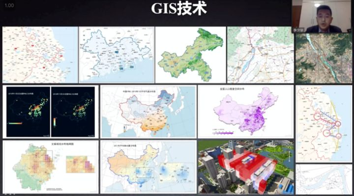

不仅是对普通用户，GIS 更多是行业应用，在整个产业链中，都有自己的角色用途。比如在产业链上游，GIS 可以应用到GNSS（全球导航卫星系统）、RS（遥感）、工程测绘（新型基础测绘）、IoT、移动互联网等众多场景中。再比如在产业链下游，GIS 可以应用到军事（军委、战区、军种）、企业（石油、银行、保险、烟草、水务、燃气、机场、物流、厂区、矿区、电信、电力等）、政务（公安、消防、应急、安监、地震、交通、农业、邮政、卫生、教育、文化、旅游、考古等）。

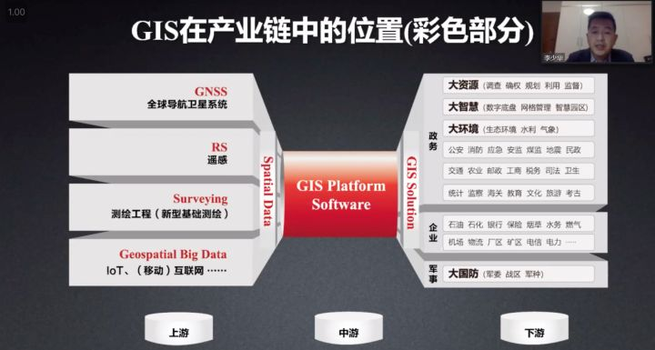

### 1. 新一代 GIS 技术

早起的 GIS 技术，包括数据接入、处理、存储、编辑、制图、分析、出图等流程，但是随着时代的发展和技术的迭代，GIS 在原生技术的基础之上又融合了很多先进技术，比如云计算GIS、大数据GIS、AI GIS、三维GIS、AR GIS、区块链GIS、5G GIS。

元宇宙六大技术（BIGANT，大蚂蚁）全景图，包括 BlockChain（区块链）、Interactivity（交互技术）、GIS和Game（地理信息和游戏技术）、AI（人工智能）、Network（网络技术）、IoT（物联网技术）。今天的主要内容就是 GIS 如何为元宇宙未来发展提供技术支撑。

### 2. 数字孪生

数字孪生是通过地理数据、空间参考允许人们在真实世界和数字世界之间进行移动。现在大多数城市已经具备了全空间、全要素的虚拟城市的三维模型基础。

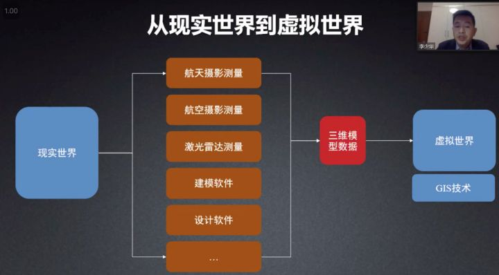

如何实现从现实世界向虚拟世界的进化？首先，现实世界通过航天摄影测量、航空拍摄测量、激光雷达测量、建模软件、设计软件等技术，构建成三维模型数据，进而形成虚拟世界的基础数据。从宏观视角来看，构建自然资源体系，比如耕地数据、环保指数等；从中观视角来看，通过数字建模、无人机航拍等技术，倾斜摄影表达孪生城市，并且基本上大多数城市已经具备了这样的能力；从微观视角来看，基于BIM的建筑内部表达，让我们可以更加精细化的展示建筑物的内部布局，比如把手、贴图等非常细微的细节。

### 3. 空间计算

空间计算的概念是指通过算法、算力提升驱动渲染模式升级，提升孪生世界的可触达性。然而，GIS 最核心的内容就是空间计算。

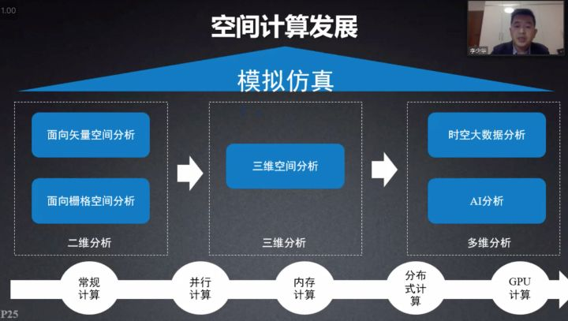

空间计算的发展进程，第一阶段是常规计算，然后发展为并行计算-内存计算-分布式计算，再到CPU计算，也可以从维度上进行划分，从二维分析，利用面向矢量空间分析、面向栅格空间分析到三维分析，再到多维分析，利用时空大数据和AI进行分析。

如何利用矢量数据呢？可以进行缓冲区分析、合规性分析、差异性分析、专题图制作、叠加分析、OD分析，比如我们可以根据矢量数据信息判断五公里范围内，有没有咖啡馆供我们去聊天和商务洽谈。

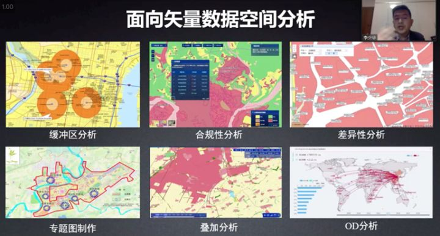

面向栅格影像分析的具体用途有邻域统计、等值面分析、坡向分析、可视性分析、坡度分析、NDVI等，比如我们依据坡度分析可以判断地质灾害发生时的预防策略。时空大数据分析也在实际生活中有广泛的应用，比如疫情发生时，总是会找出病例的时空伴随者，进行跟踪防护，甚至隔离。

不仅仅在二维数据方面存在应用，在三维数据中也有非常多的应用场景，比如通视分析、三维体空间分析（阴影体）、坡度坡向分析、街廊比动态计算、红线检测、控高分析、地下建筑范围分析、天际线分析、开敞度分析、沿街建筑贴现率、分户日照市场分析、容积率动态计算。

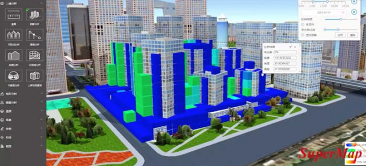

### 4. 人机交互

人机交互，通过XR等交互技术提升数字世界的沉浸感，其中会涉及三维可视化技术的应用。接下来，介绍一下三维可视化技术的发展，从最初的贴图、纹理、烘培，衍生出纹理动画、高动态光照、OIT、泛光、PBR、粒子特效，这些都属于 GIS 引擎的范畴。后来，GIS 引擎结合游戏引擎，融合进化出了更多的内容，比如着色器品质、天气特效、虚光效果、光影效果、环境光遮蔽、场景边纹、实时光线追踪、镜头眩光、环境光立方体贴图。

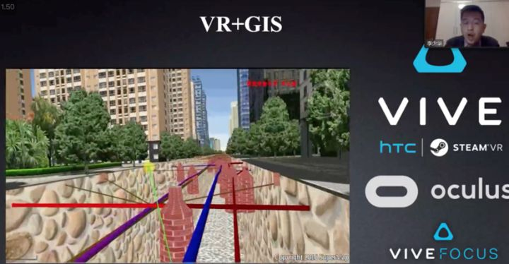

大概在2019年，GIS 引擎和游戏引擎进行了正式融合，在游戏中 GIS 引擎可以展现地理和位置信息，但是天气和光照等信息无法进行满足，此时就需要游戏引擎进行补充融合，起到锦上添花的效果。

### 5. 去“中心化”

在元宇宙的概念中，也存在去“中心化”的说法，一般认为通过5G/6G、云计算技术支撑大规模用户同时在线，提升数字世界的可进入性。这里的去“中心化”更多的是利用区块链技术，比如在游戏中，涉及到土地的买卖。现实生活中房屋的不动产登记，利用区块链技术也能非常方便的完成在线登记和受理。
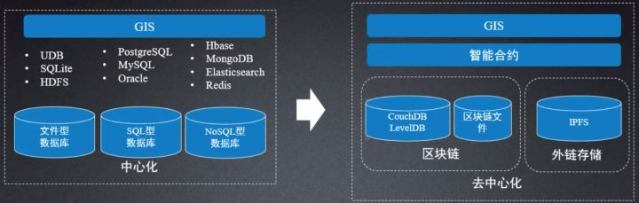

除此之外，还会涉及到高并发和低延时的问题，不管是 to B，还是 to C，服务云原生化也在助力区块链技术和云原生的发展。

## 四、GIS 赋能 Metaverse

GIS 最新的一些技术，元宇宙代表 SandBox 游戏，GIS 可以为元宇宙提供技术、数据和模型，还有虚拟地址空间和地理资源信息。

现实世界如何转化成元宇宙世界，一般可以分为三种模式，第一种模式是孪生现实世界，也就是完全复制现实世界，以现实物理世界为数字框架构架一个一摸一样的虚拟世界；第二种模式是虚拟混合实现世界，也就是一种平行连接的世界，现实世界和虚拟世界相互结合叠加，衍生出一个虚实混合的元宇宙世界；第三种模式是完全虚拟次元空间，构建一个几乎和现实世界没有关系的全新的理念数字世界，创造一个全新的元宇宙世界。

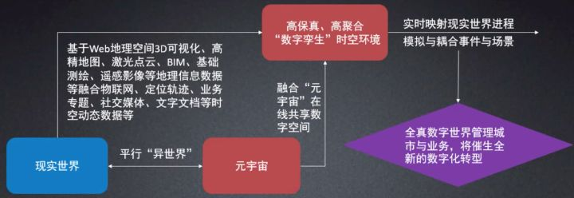

基于Web地址空间3D可视化、高精地图、激光点云、BIM、基础测绘、遥感影像等地理信息数据等融合物联网、定位轨迹、业务专题、社交媒体、文字文档等时空动态数据等信息构建一个高保真、高聚合的“数字孪生”时空环境，同时，通过实时映射现实世界进程，模拟与耦合事件与场景，可以实现全真数字世界管理城市与业务，将催生全新的数字化转型。

不仅仅是游戏娱乐，元宇宙也可以应用到其他场景，比如疫情下，大家可以虚拟现实进入到其他城市的景点进行观光浏览，而不用亲自到达目的地。尽管如此，元宇宙也存在一些现实的问题，一般有一下几点。

\1. 地理信息数据的安全性、保密性；

\2. 地理信息数据获取的成本；

\3. 地理信息数据从获取到应用需要一系列流程操作；

\4. 地理信息数据具备5V特征，如何高效管理。

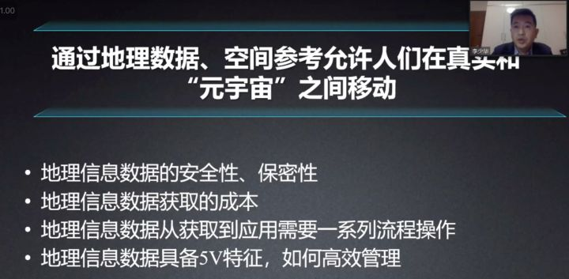

除此之外，元宇宙还涉及到算法问题，其算法也有一些现实问题。

\1. 当前算法多面向传统需求设计；

\2. 空间计算算法门槛比较高；

\3. 空间计算算法依赖数据；

\4. 模拟仿真需要更多专业知识。

另外，还有 XR 设备问题。

\1. 可穿戴设备价格比较贵，体验时可能存在眩晕问题，目前更多的是手机设备，眼镜设备比较少；

\2. 用户习惯和应用场景，更多的时候 XR 设备对用户而言可有可无，只能算是锦上添花，还有就是从数据到应用到打通。

## 五、Metaverse 赋能 GIS

元宇宙也可以为 GIS 的发展做一些助力，元宇宙交互设备创新，比如一体式VR头显、腕带式AR传感器、触觉手套、电子皮肤等；元宇宙也可以推动地理设计，让地理从业人员可以像设计师一样制作地理效果图；元宇宙推动VR/MR/AR等设备和三维技术快速发展，有利于GIS应用构建，比如微软的风场实验，模拟洋流的变化。元宇宙还可以应用到很多其他的场景中，比如应急救灾、仿真培训、虚拟现场。

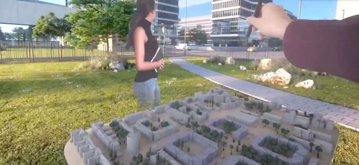

## 六、总结

创新应用，从天地图到元宇宙，基于天地图中国、天地图河南、天地图湖南出现元宇宙中国、元宇宙河南、元宇宙湖南，在元宇宙技术的催生下，GIS 迎来更多发展机遇和创新，产生更多新的业态。

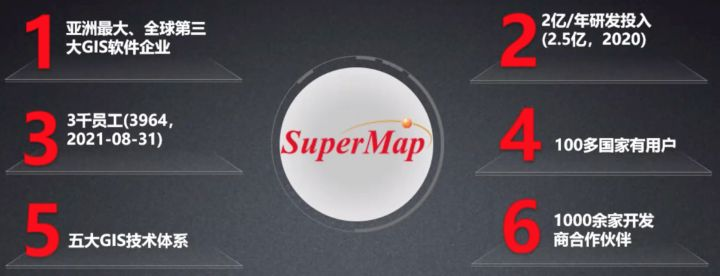

