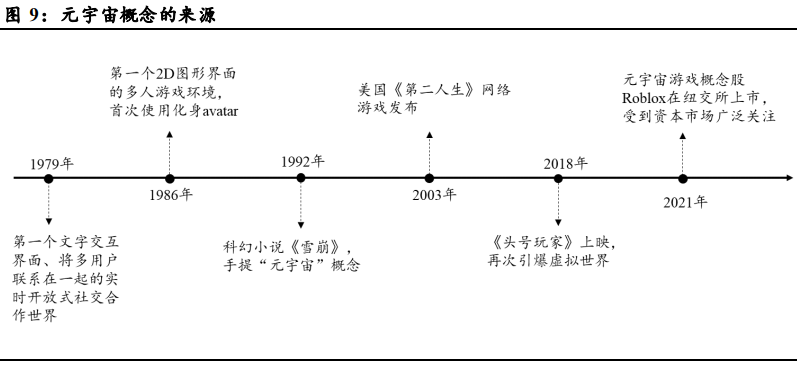
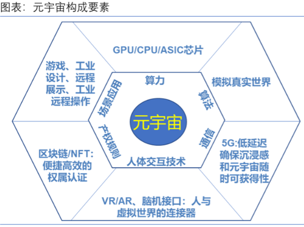
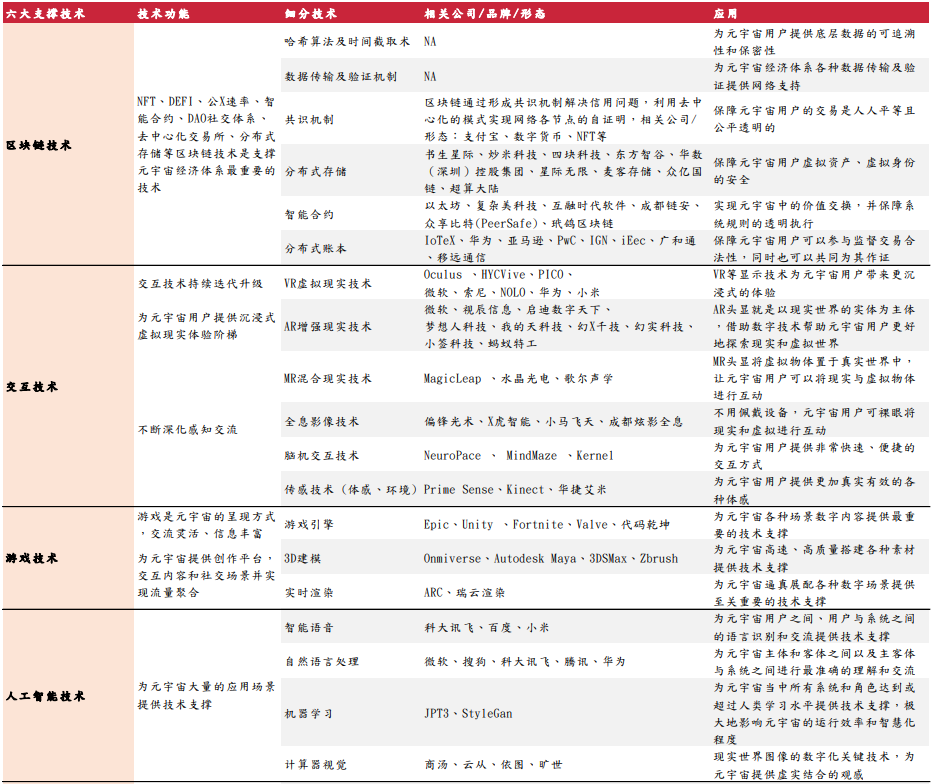

# 元宇宙概念是什么意思？核心要素有哪些？特征及技术介绍

**1、元宇宙概念是什么意思?**

当前学术界对元宇宙并没有进行统一定义。我们认为，元宇宙是一个不断演进、多元解读的概念。元宇宙是人使用数字人的身份参与、生活到虚拟世界当中。元宇宙是现实生活的延伸与补充、赋予活力，而非与现实世界完全平行。通过技术突破物理空间的界限，元宇宙能够实现线上线下、现实生活和数字世界全面无缝链接、有机耦合，达到弥补现实不足、生活娱乐极致健康体验、社会效率提升。除此之外，基于各国政治环境及平台差异，我们倾向认为良性健康的元宇宙(区别于极致理想形态下的元宇宙)是一个有限开放的生态 (开放与封闭体系共存)，虽然基于区块链技术搭建经济体系，但允许存在部分中心化形态。在元宇宙中，每个用户可有多个数字身份 (区别于数字账号，不可被元宇宙公司销毁)，同时可自由生产、编辑、参与和创造虚拟世界，进行数字资产消费循环。

Meta的Mark Zuckerberg认为，元宇宙是下一个科技前沿领域，是移动互联网的升级版，是融合虚拟现实技术，用专属的硬件设备打造一个具有超强沉浸感的社交平台。

Roblox公司的Dave Baszucki认为，元宇宙是持久的，共享的3D虚空间，人们在元宇宙拥有自己的虚拟身份的形象，可以进行娱乐、工作和创造。未来的元宇宙应该是由用户所创造的，Roblox公司则是工具、技术和平台的提供者。

微软的Satya Nadella认为，随着虚拟世界和物理世界的融合，由数字孪生、仿真环境和混合现实组成的元宇宙正在成为人类的应用画布。

英伟达的黄仁勋认为，随着科技不断发展，虚拟世界与现实世界将产生交叉融合，现在正是元宇宙世界的风口浪尖，而NFT也将在其中扮演主要角色。

Epic Games的Tim Sweeney认为，元宇宙将是一场前所未有的大规模参与的实时3D媒介，带有公平的经济系统，所有创作者可以参与、赚钱并获得奖励。

腾讯马化腾认为，移动互联网十年发展，即将迎来下一波升级，我们称之为全真互联网。虚拟世界和真实世界的大门已经打开，无论是从虚到实，还是由实入虚，都在致力于帮助用户实现更真实的体验。

华为胡厚崑认为元宇宙代表了人类社会对于虚拟与现实进一步融合的一种期待和向往。在这种高沉浸度、低时延的数字世界里，我们要更大程度地去还原，并且去构建一种超越物理世界的体验，这是一个充满想象力的方向。但同时，也对我们当前的网络技术、计算技术等等，提出了更高的要求。

**2、元宇宙核心要素有哪些?**

元宇宙起于游戏，但不止于游戏。游戏满足了部分沉浸式体验(元宇宙要素之一)，但要提供一个去中心化的、不依赖于现实身份的、能够实现经济交换的元宇宙，我们还需要身份系统和价值系统两大核心要素。元宇宙的身份系统主要对应区块链产业，如基于区块链技术的NFTs头像、数字钱包等。元宇宙的价值系统对应数字内容创意类产业，如数字艺术品、元宇宙房地产等。沉浸式体验对应消费硬件产业，包括智能眼镜、VR头显、电子皮肤、脑机接口等。区块链、数字内容创意和消费硬件，是观察元宇宙未来能否实验的三个有效抓手。

**3、元宇宙的特征**

Roblox的CEO认为元宇宙有八大关键特征，分别是身份、社交、沉浸式体验、低延时、多样性、随时随地、经济体系、文明。

身份：平台允许用户创建和个性化他们独特的3D身份。

社交关系：用户在平台可以通过各种方式进行连接，包括检测附近的玩家，或在虚拟场景见面。

沉浸式体验：平台允许开发人员构建深度沉浸式3D环境，用户可在其中与他人共享同步体验。

低延迟：能够在无人数限制环境下通过网络与其他用户实现实时互动，无延迟感知。

内容多样：开发者和创作者为元宇宙构建了大量差异化、丰富的内容。

随地：平台服务于全球受众，且满足用户可以随时随地进入。

经济：拥有独立稳健的数字货币和经济体系，支撑交易、消费、生产。

文明：元宇宙最终拥有数字文明，以及符合人类发展的社会形态和人文精神。

**4、元宇宙技术(六大核心技术)**

人工智能(AI)、交互技术(AR/VR/MR)、区块链、网络及运算技术、物联网(IoT)、游戏是构成元宇宙的六大核心技术。

AI为元宇宙提供基础设施建设、数据分析与学习、海量内容生产;交互技术提供沉浸式体验与虚拟世界镜像，帮助实现虚实互通、感知交流;区块链为用户提供底层数据的追溯性和保密性，支撑经济体系的构建和完善;网络及运算技术提供算力及流畅、低延迟的网络环境;物联网为万物链接、虚实共生提供技术支持。游戏为元宇宙提供创作、社交、内容等应用场景，包括引擎、3D建模、渲染等技术。目前这些底层技术仍在发展早期。

