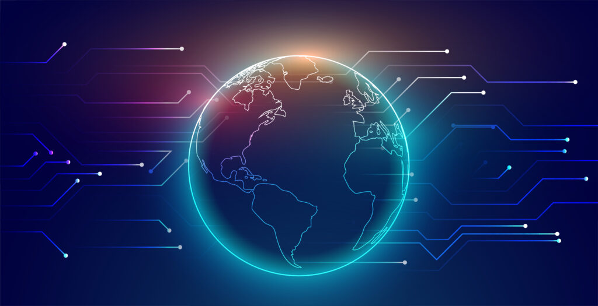

# 展望未来：元宇宙的发展与区块链技术

> **近期在比较低迷的市场里，有一个低迷已久的板块终于爆发了，它的名字就叫做元宇宙。**

​     近期在比较低迷的市场里，有一个低迷已久的板块终于爆发了，它的名字就叫做元宇宙。对于元宇宙这个概念，大部分人还是比较陌生。Metaverse的英文本意就是虚拟实境或者虚拟世界，其实本意理解起来才更通透，也许“元宇宙”这个词更加高大上，在国内也都就这么流行起来了。元宇宙不是特指某一款应用或产品，它是一个概念，通过数字化形态承载的平行宇宙，并且我们一定要明确，Metaverse不是游戏，只是目前都在用游戏的形态去承载而已，维基百科对元宇宙的描述是通过虚拟增强的物理现实，呈现收敛性和物理持久性特征的，基于未来互联网，具有链接感知和共享特征的3D虚拟空间。它的本质是平行宇宙，Metaverse是现实与虚拟之间的桥梁，通过信息技术（5G/6G）、网络技术（IPFS)、显示技术（VR、AR、MR）、人工智能、区块链技术等多方面超前科技打造的全新世界。我们可以想象的任何事物都可以在这里实现。在这个共享的虚拟空间中，每一个人都可以理解为一组数字信息，可以再一次重新体验生命的过程。

​     游戏模拟人生就是个很好的例子，只不过Metaverse更加强大，我们身边出现的不再是NPC，而是真实存在与“元宇宙”之中的。如果没有区块链这门技术，Metaverse可能永远都是一种游戏形态。但是区块链打通了这个虚拟世界和现实的桥梁，让“虚拟世界”变成了“平行宇宙”。Web3.0、DeFi、NET会是元宇宙的重要组成部分，在Metaverse中人们的信息是不受中心化制约的。我们可以根据自己的意愿去打造一个自己喜欢的生活方式，Web3.0是实现Metaverse的重要保障。如果Metaverse存在于Web2.0的环境中，Facebook和Google等大型机构可以控制用户数据并以此盈利，他们可以对用户的内容进行删除以及管控。用户的自由和权利必会受到侵犯，Web3。0的用户拥有了自己的数据所有权，能够掌握自己的数据，在加密、主中心化、分布式数据中个人数据和隐私得到了充分的保障，Defi去中心化金融更为公平、有效、稳定，保障了我们在虚拟世界中资产的安全，让Token在Metaverse中真正的流畅起来，在Metaverse中强大的社区内部会流通属于自己的Token，这也是Metaverse的巨大潜力。早期参与者成立自己的社区，让其发行的Token拥有着强大的金融属性，社区与社区之间的交易往往还是通过BTC、ETH这类主流资产实现的。

​     NET具有不可分割、不可代替、独一无二等特点，这也是Metaverse得以建立的重要保障，如在Metaverse中的土地、房屋、宠物、个人数据等。如何辨别虚拟世界中它们的归属权、NEF在其中发挥着重大的作用。

​     元宇宙领域还处于发展的最早期，大多数还是以区块链游戏的形态展现，想要达到我们理想中的元宇宙还差得远，目前元宇宙的概念已经开始逐渐普及，近期大火的AXS、SAND、CHR、SLR、TLM都是基于区块链游戏板块的元宇宙生态系列，元宇宙领域无疑将是未来区块链虚拟世界的一大产业领域，非常有潜力。投资区块链两条路是最为有效的，一条是坚守主流币，例如比特币或以太坊这样的主流资产，让时间复刻创造奇迹；另一条就是追上区块链领域的创新，在创新的早期投资，抓住创新领域爆发的机会，例如前期的Defi和NET，元宇宙可能就是另一个类似的奇迹，至于追热点什么的其他方式，那都是彻底的短期投机，都不是投资的主流。真实推进过程中还会遇到很多问题，需要在科技创新领域有更多的创新，例如感知形式目前还只是视觉，要完全真实还需要引入体感、脑机等等，通信基础。如果未来人们都同时在Metaverse里面生活，那么整体的带宽应该还需要进行多次迭代。

​     总的来说，区块链提供了Metaverse成为平行宇宙的底层理论基础。离这个概念完整的改变我们的生活还有很长的路要走，需要不断地探索。元宇宙Metaverse作为一个全新的概念，让我们对未来虚拟世界的建立，有了全新的憧憬。目前的元宇宙尚在概念阶段，多映射在区块链游戏这一板块，但后续有巨大的潜力。把握区块链创新领域的早期投资，关注最新的前沿知识也极为重要。

​     元宇宙是利用科技手段进行链接与创造的，与现实世界映射与交互的虚拟世界，具备新型社会体系的数字生活空间。元宇宙本质上是对现实世界的虚拟化、数字化过程，需要对内容生产、经济系统、用户体验以及实体世界内容等进行大量改造。但元宇宙的发展是循序渐进的，是在共享的基础设施、标准及协议的支撑下，由众多工具、平台不断融合、进化而最终成形。它基于扩展现实技术提供沉浸式体验，基于数字孪生技术生成现实世界的镜像，基于区块链技术搭建经济体系，将虚拟世界与现实世界在经济系统、社交系统、身份系统上密切融合，并且允许每个用户进行内容生产和世界编辑。

​     对于元宇宙的形成，我相信一定会和区块链技术想结合，并且通过多种交互方式让元宇宙内虚拟资产可以使用NFT的形式进行链上交易。 Algorand作为一条优秀的公链，具备了快速、安全和稳定的特性，我相信在元宇宙的世界一定会大放异彩，与其他公链一起组件平行宇宙。